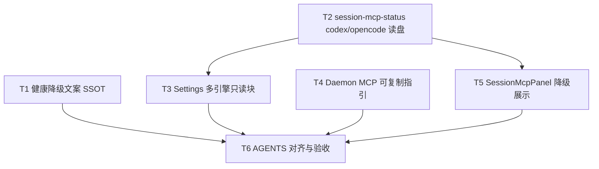

# 多引擎MCP设置实质化 - 任务分解

> **来源**：`/kb-plan`（基于 `01-proposal.md`、`02-design.md`）
> **任务数**：6（T1–T6）
> **前置依赖**：`20260712144931-斜杠执行模式稳态收尾`（已归档）
> **Ponytail**：禁止新建多引擎 Settings 策略类/服务层；健康文案可选 `src/shared` 纯函数；`session-mcp-status` 超限才拆文件

## 一、执行计划

### （一）依赖图

**CodeGraph 核实**（`projectPath=/home/suveng/doger/cursor-claw`）：

| 符号/文件 | 现状 | 任务 |
|-----------|------|------|
| `formatMcpHealthLabel` | `daemon-http-mcp-admin.ts:74` 空 status→「未知」 | T1 |
| `formatMcpHealthStatus` | `daemon-slash-mcp.ts:35` 同上 | T1 |
| `formatMcpHealthStatus` | `command-handler.ts:478` 同上 | T1 |
| `getSessionMcpStatus` | 仅 CC/SDK；无 codex/opencode | T2 |
| `readCodexMcpServers` | `codex-mcp-loader.ts:175` 已存在 | T2 复用 |
| `readOpencodeMcpServers` | `opencode-mcp-loader.ts:50` 已存在 | T2 复用 |
| `SettingsMcpCodexPlaceholder` | 仅占位文案 | T3 删除/替换 |
| `SettingsMcpOpencodePlaceholder` | 无 list IPC | T3 |
| `getMcpViewConfig("codex")` | `supported:false` | T3 |
| `buildMcpServers` | `workspace-injector.ts:34` 指引 SSOT | T4 |
| `createAdminMcpServer` | `daemon-http-mcp.ts:97` | **不改** |

**01 验收追溯**：

| 01 验收 | 主责任务 |
|---------|----------|
| §6.1.1 占位消除 / R1 | T2、T3 |
| §6.1.2 健康非静默未知 / R2 | T1、T5、T6 |
| §6.1.3 指引可用 / R3 | T4、T6 |
| §6.1.4 文档/UI 一致 / R5 | T6 |
| §6.2 边界 / R4 R6 | T3（不改布局）、T6 |

### （二）分组调度

| 轮次 | 任务 | 说明 |
|------|------|------|
| **第一轮（并行）** | T1、T2、T4 | 不同目录：daemon+electron scheduling / session / renderer 新组件 |
| **第二轮** | T3 | 依赖 T2 IPC 读盘 |
| **第三轮** | T5 | 依赖 T2 + T1 文案口径 |
| **第四轮** | T6 | AGENTS 与手动验收 |

**同文件冲突（禁止并行 apply）**：

| 文件 | 任务（顺序） |
|------|----------------|
| `SettingsMcpEngineBlock.tsx` | T3（T4 若挂同文件则 T3→T4） |
| `session-mcp-status.ts` | T2 only |

## 二、任务清单

## T1: 健康降级文案 SSOT

### 背景

agent-api 未就绪时，`formatMcpHealthLabel` 在空 status 时输出「未知」，违反 01 R2。须在 Daemon admin、斜杠 `/mcp`、`command-handler` 三处统一为可读降级句。

### 上下文文件

- CodeGraph: `formatMcpHealthLabel` `fetchElectronMcpStatusMap` — 健康链路
- 必读: `src/daemon/daemon-http-mcp-admin.ts` — `formatMcpHealthLabel`、`buildMcpServerInfo`
- 必读: `src/daemon/daemon-slash-mcp.ts` — `formatMcpHealthStatus`
- 必读: `electron/scheduling/command-handler.ts` — `formatMcpHealthStatus`（`/mcp` 子命令）
- 参考: `02-design.md` §八·（二）工程补充验收项

### 实现范围

- 新建（可选）: `src/shared/mcp-health-label.ts` — `formatMcpHealthDisplay(status?: string, healthError?: string): string`
- 修改: `src/daemon/daemon-http-mcp-admin.ts` — 使用 SSOT；`healthError` 优先于空 status
- 修改: `src/daemon/daemon-slash-mcp.ts` — 对齐；`fetchElectronMcpStatusMap` 失败时 ls/info 展示原因
- 修改: `electron/scheduling/command-handler.ts` — 对齐斜杠输出

### 接口契约

- `formatMcpHealthDisplay(status?, healthError?)` — 有 `healthError` → `暂不可查（{healthError}）`；无 status 无 error → `暂不可查（依赖未就绪）`；保留 ready/disabled/needs_login 映射；**禁止**返回裸「未知」
- `buildMcpServerInfo` 返回 `health` 字段须反映降级语义

### 验收标准

- [ ] `agent-api-port.json` 不可读时，`POST /api/mcp` info 与 IM `/mcp ls` 健康列含中文原因，非「未知」
- [ ] `healthError` 为 `应用未运行…` 类文案时 UI 可见
- [ ] 三处实现无文案漂移（共用 shared 或复制后注释对齐）
- [ ] 无 `02`/`03` 未要求的抽象层或未批准新依赖（Ponytail）

### 依赖

- 前置任务: 无
- 后续任务: T5、T6

---

## T2: session-mcp-status 扩展 Codex/OpenCode 读盘

### 背景

Settings 与 Session 面板经 `getAgentMcpStatus` 取数，但无 session 时 codex/opencode 恒空态。须复用既有 loader 提供磁盘列表。

### 上下文文件

- CodeGraph: `getSessionMcpStatus` `readCodexMcpServers` `readOpencodeMcpServers`
- 必读: `electron/session/session-mcp-status.ts` — dispatch 顺序与 CC fallback 模式
- 必读: `electron/mcp/loaders/codex-mcp-loader.ts` — `readCodexMcpServers`
- 必读: `electron/mcp/loaders/opencode-mcp-loader.ts` — `readOpencodeMcpServers`
- 必读: `electron/main.ts` — `agent:mcp-status` handler
- 参考: `electron/session/AGENTS.md` Session MCP 取数器

### 实现范围

- 修改: `electron/session/session-mcp-status.ts` — 在步骤 3 后增：`engineType==="codex"` → `readCodexMcpServers(ws)`；`engineType==="opencode"` → `readOpencodeMcpServers(ws)`；返回 `source:"disk"`，`statusMap` 用 `buildDiskStatusMap` 或空
- 新建（仅超限）: `electron/session/session-mcp-disk-fallback.ts` — 抽离 codex/opencode/cc 无 session 读盘
- 不改: CC/SDK 既有 session 路径

### 接口契约

- `getSessionMcpStatus(sessionKey, force?, engineType?, workspaceDir?)` — `engineType` 为 `codex`|`opencode` 且无对应 session 时返回磁盘 `McpServerEntry[]`
- `workspaceDir` 空时仍可读 global 配置（loader 已支持）

### 验收标准

- [ ] `getAgentMcpStatus("", false, "codex", ws)` 返回 `~/.codex/config.toml` 条目
- [ ] `getAgentMcpStatus("", false, "opencode", ws)` 返回 opencode.json 条目
- [ ] 文件总行数 ≤300（超限已拆）
- [ ] 中文注释说明分支语义
- [ ] Ponytail：无新仓储/策略类

### 依赖

- 前置任务: 无
- 后续任务: T3、T5

---

## T3: Settings Codex/OpenCode 只读块

### 背景

`SettingsMcpEngineBlock` 中 Codex 为占位、OpenCode 无列表。须在 T2 读盘可用后，对称 CC 只读 UI 实质化展示。

### 上下文文件

- CodeGraph: `SettingsMcpCcReadonly` `SettingsMcpCodexPlaceholder`
- 必读: `src/renderer/components/SettingsMcpEngineBlock.tsx`
- 必读: `src/renderer/lib/mcp-view-strategy.ts`
- 必读: `src/renderer/components/AGENTS.md` — Settings MCP 分块规矩

### 实现范围

- 修改: `mcp-view-strategy.ts` — `codex`: `supported:true`；`unsupportedMessage` 改为「设置页不提供 TOML 编辑」类说明；`emptyHint` 含 global/project 路径
- 修改: `SettingsMcpEngineBlock.tsx` — 删除 `SettingsMcpCodexPlaceholder`/`SettingsMcpOpencodePlaceholder`；新增 `SettingsMcpCodexReadonly`/`SettingsMcpOpencodeReadonly`（复用 CC 模式：`getAgentMcpStatus` + 刷新 + 路径头）
- 不改: `SettingsMcpSdkSection` CRUD；`SettingsEngineShell` 布局

### 接口契约

- 组件 props 不变：`{ engineType, workspaceDir }`
- Codex/OpenCode 块顶部须标明配置文件路径（TOML / JSON）与「请直接编辑文件」

### 验收标准

- [ ] Settings 绑定 codex/opencode 通道时 MCP Tab 可见非占位列表或空态路径引导
- [ ] 无「该引擎 MCP 查看尚未支持」静默占位（除非产品明确标不支持）
- [ ] `SettingsMcpEngineBlock.tsx` ≤300 行（超限拆 `SettingsMcpReadonlyBlocks.tsx`）
- [ ] Ponytail：不新建引擎策略框架

### 依赖

- 前置任务: T2
- 后续任务: T6

---

## T4: Daemon MCP 可复制指引

### 背景

自动 MCP 注入已废弃（`injectMcpGlobal` no-op）。用户须手动配置 Cursor MCP 指向 Daemon；产品需提供可复制片段（01 R3）。

### 上下文文件

- CodeGraph: `buildMcpServers` `CLAW_MCP_KEYS`
- 必读: `electron/agent/shared/workspace-injector.ts` — url 形态 SSOT
- 必读: `electron/config/config-store.ts` — `daemonPort` 默认 19528
- 必读: `src/renderer/pages/Settings.tsx` — MCP Tab 挂载点
- 参考: `knowledge/变更/归档/20260712144931-斜杠执行模式稳态收尾/05-summary.md` — `/mcp-admin` 废弃

### 实现范围

- 新建: `src/renderer/components/SettingsMcpDaemonGuide.tsx` — 展示说明 + 可复制 `mcp.json` 片段（`cursor-claw` url）；`navigator.clipboard` 或按钮复制
- 修改: `SettingsMcpEngineBlock.tsx` 或 `SettingsEngineShell.tsx` — SDK 引擎块上方挂 Guide（全引擎可见则挂 Shell MCP 区顶部）
- 脚注: 管理工具经 IM `/mcp` 或 `POST /api/mcp`；**不**指引 `/mcp-admin`

### 接口契约

- 组件 props: `{ workspaceDir?: string }` 或零 props（端口仅来自 `getConfig().daemonPort`）
- 片段格式: `{"mcpServers":{"cursor-claw":{"url":"http://127.0.0.1:{port}/mcp"}}}`

### 验收标准

- [ ] 用户一键复制后可为合法 JSON 片段
- [ ] Daemon 未运行时仍展示默认/配置端口与说明
- [ ] 文案与 `buildMcpServers` 一致，不含 `cursor-claw-admin` 注入
- [ ] 新文件 ≤300 行，含中文注释
- [ ] Ponytail：单组件，无「指引服务层」

### 依赖

- 前置任务: 无
- 后续任务: T6

---

## T5: SessionMcpPanel 健康空态降级

### 背景

Dashboard 会话 MCP 面板在 `statusMap` 无条目时显示「—」，与 Settings/admin 健康降级口径不一致。Codex 启用后须走统一取数。

### 上下文文件

- CodeGraph: `SessionMcpPanel` `getAgentMcpStatus`
- 必读: `src/renderer/components/SessionMcpPanel.tsx` — `statusLabel` 渲染
- 必读: `src/shared/mcp-health-label.ts`（若 T1 已建）或 T1 文案约定
- 参考: `02-design.md` S6

### 实现范围

- 修改: `SessionMcpPanel.tsx` — `codex`/`opencode` 经 `viewConfig.supported` 加载；空 `rawStatus` 且 `source==="disk"` 时展示「未探测」或「磁盘配置」而非误导性 ready；若扩展 IPC 返回 `probeError` 则展示（可选，非必须）
- 不改: OAuth/login 流程；CC/SDK 既有逻辑

### 接口契约

- 空 status 展示：`—` 改为 `未探测` 或复用 `formatMcpHealthDisplay` 的 disk 语义（与 T1 不冲突）

### 验收标准

- [ ] Codex/OpenCode 会话 Dashboard MCP 面板可加载磁盘列表（T2 后）
- [ ] 空 status 不无说明（非静默）
- [ ] CC/SDK 行为无回归
- [ ] Ponytail 口径满足

### 依赖

- 前置任务: T2、T1（文案对齐时）
- 后续任务: T6

---

## T6: AGENTS 对齐与验收记录

### 背景

实现完成后须同步工程 AGENTS、满足 01 全量验收，并为 archive 准备知识库清单。

### 上下文文件

- 必读: `01-proposal.md` §六验收
- 必读: `02-design.md` §八·（二）、§十
- 必读: `src/renderer/components/AGENTS.md`
- 必读: `electron/session/AGENTS.md`
- 必读: `src/daemon/AGENTS.md`

### 实现范围

- 修改: 上述 AGENTS.md — Settings MCP 多引擎只读、健康降级、Daemon 指引
- 新建（可选）: `06-automation-test.md` + 契约脚本（健康降级 mock agent-api 不可用）
- 不改: `knowledge/工程平台/` 业务域正文（归 librarian archive）

### 接口契约

- 无代码接口；文档字段与实现一致

### 验收标准

- [ ] 01 §6.1.1–6.1.4 手动走查通过
- [ ] 01 §6.2 边界满足（无整页重做、无协议变更、无微信）
- [ ] `tsc --noEmit` 通过
- [ ] AGENTS 与代码一致
- [ ] Ponytail 口径满足

### 依赖

- 前置任务: T1–T5
- 后续任务: 无（下一步 `/kb-apply` 或按任务调度 implement）
