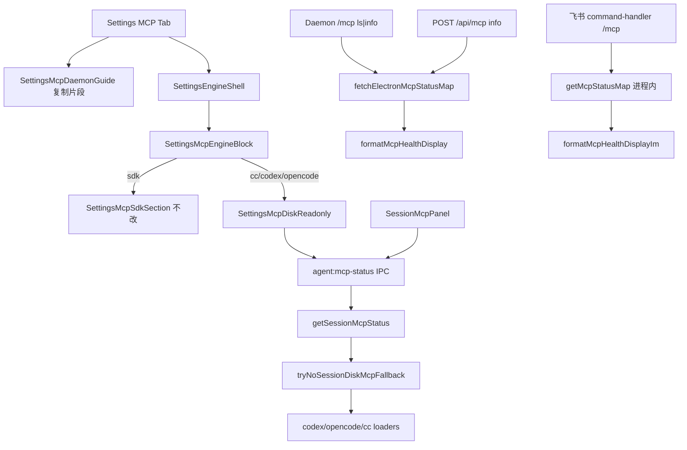

# 多引擎MCP设置实质化 - 代码评审报告

## 1、审查范围

- **变更类型**：apply 产出（`stage=applied` → `reviewed`）
- **评审等级**：full-review（多引擎 Settings MCP、健康降级 SSOT、Daemon 指引；无 proto/DB/权限变更）
- **涉及文件**：11 个实现文件（manifest 登记）+ `Settings.tsx` 挂载
- **设计文档**：`02-design.md`、`03-tasks.md`（对照基准）
- **评审方法**：git diff（限定本变更 manifest 实现清单）+ 源码通读 + `tsc --noEmit`

## 2、严重（必须处理）

无

## 3、警告（建议处理）

无

## 4、设计偏差

无

- **T1 / S8**：`src/shared/mcp-health-label.ts` 抽取 `formatMcpHealthDisplay` / `formatMcpHealthDisplayIm` / `formatMcpPanelStatusLabel`；`daemon-http-mcp-admin`、`daemon-slash-mcp`、`command-handler` 三处已对齐，裸「未知」已消除。
- **T2 / S4·S7**：`session-mcp-disk-fallback.ts` 承载 codex/opencode/cc 无 session 读盘；`session-mcp-status.ts` 292 行 ≤300。
- **T3 / S2·S3**：`SettingsMcpEngineBlock` 统一 `SettingsMcpDiskReadonly`；`mcp-view-strategy` codex `supported:true` + TOML 编辑引导文案。
- **T4 / S5**：`SettingsMcpDaemonGuide` 挂 MCP Tab 顶部；片段与 `buildMcpServers` 一致（仅 `cursor-claw`）；脚注不含 `/mcp-admin`。
- **T5 / S6**：`SessionMcpPanel` disk 空 status 标「未探测」；codex/opencode 经 `viewConfig.supported` 走 `getAgentMcpStatus`。
- **显式不改**：Daemon MCP 协议、`SettingsMcpSdkSection` CRUD、微信通道 — diff 无触及（工作区其他未提交变更不在本评审范围）。

## 5、验收标准检查

| 任务 / 01 验收 | 验收条件 | 状态 |
|----------------|----------|------|
| T1 | agent-api 不可用时 admin/斜杠健康列含中文降级句，非「未知」 | ✅ `daemon-slash-mcp` ls/info 传 `healthError`；`buildMcpServerInfo` 用 SSOT |
| T1 | 三处无文案漂移 | ✅ 共用 `mcp-health-label.ts` |
| T1 | Ponytail 无多余抽象 | ✅ 纯函数 ≤40 行 |
| T2 | codex/opencode 无 session 读盘 | ✅ `tryNoSessionDiskMcpFallback` 复用 loader |
| T2 | 文件 ≤300 行 | ✅ status 292 + fallback 127 |
| T3 | Settings codex/opencode 非占位 | ✅ 只读列表 + 路径头 |
| T3 | `SettingsMcpEngineBlock` ≤300 | ✅ 134 行 |
| T4 | 可复制合法 JSON 片段 | ✅ `buildCursorMcpSnippet` |
| T4 | 与 `buildMcpServers` 一致 | ✅ 仅 `cursor-claw` url |
| T5 | Session 面板 disk 空 status 非静默 | ✅ `formatMcpPanelStatusLabel` |
| T5 | CC/SDK 无回归 | ✅ 取数路径未改 session 分支语义 |
| 01 §6.1.1 R1 | 占位消除 | ✅ |
| 01 §6.1.2 R2 | 健康非静默未知 | ✅ |
| 01 §6.1.3 R3 | 指引可用 | ✅ |
| 01 §6.2 | 无整页重做 / 无协议变更 / 无微信 | ✅ |
| §八·（二） | `tsc --noEmit` | ✅ 通过 |
| §八·（二） | `/mcp-admin` 410 无回归 | ✅ 本 diff 未改 |
| T6 | AGENTS 与工程平台 KB 同步 | ⚠️ 任务仍 `pending`；归 `/kb-archive` + librarian（`02` §十） |

## 6、调用链与回归风险

| 回归点 | 结论 |
|--------|------|
| SDK MCP CRUD / `mcp-manager` | ✅ 未改 |
| CC session runtime/snapshot 路径 | ✅ fallback 仅抽离 CC 无 session 分支 |
| Daemon `createAdminMcpServer` / `POST /mcp` Agent 工具 | ✅ 未改 |
| 飞书 `/mcp` 与 Daemon `/mcp` 健康口径 | ✅ 空 status 均降级为「暂不可查（依赖未就绪）」；Daemon 路径额外带 `healthError` 原因 |
| Codex TOML 无 Settings 编辑 | ✅ 文案已标明「请直接编辑文件」 |
| `daemonPort` 与实跑不一致 | ⚠️ 指引脚注已说明默认端口；属产品已知边界（`02` §八·（一）） |

## 7、遗留债务

无

## 8、修复任务建议

| 问题 ID | 建议动作 | 关联任务 |
|---------|----------|----------|
| — | 无 open 问题 | — |

## 9、结论

**通过**，可进入 `/kb-archive`。

T1–T5 实现与 `01`/`02`/`03` 一致：多引擎 Settings 只读实质化、健康降级 SSOT、Daemon 可复制指引均已落地；工程补充项 `tsc` 通过。T6（AGENTS + 工程平台 KB）为文档收口任务，按设计在 archive 阶段由 librarian 处理，不阻断评审通过。
