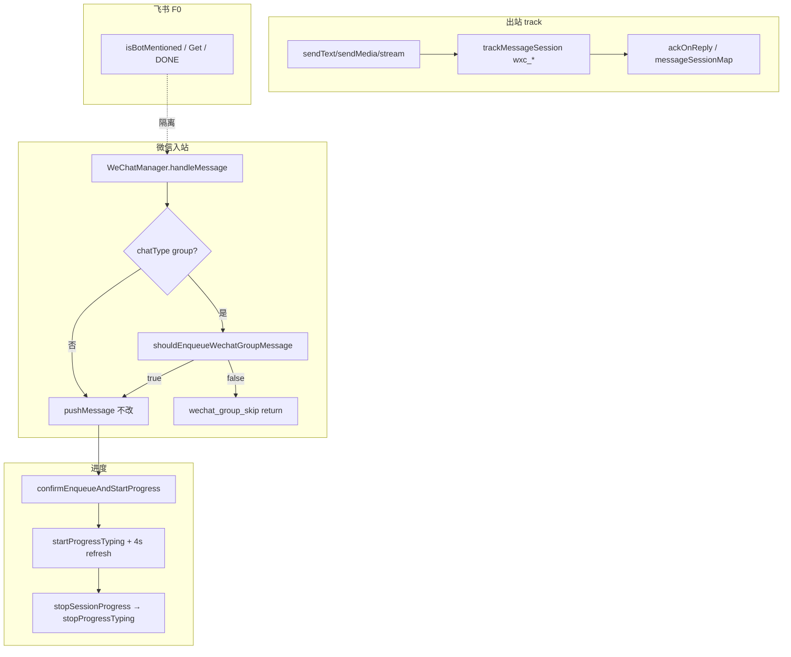

# 微信通道入队与进度对齐 - 代码评审报告

## 1、审查范围

- **变更类型**：apply 产出的未提交变更（`git diff`，对照 `00-manifest.json` 文件清单）
- **评审等级**：full-review（次通道入队 gate + typing 续期 + 出站 track；无 proto/DB 变更）
- **涉及文件**：manifest 登记 17 个代码/约定文件 + 本评审报告
  - 配置三端：`channel-types.ts`、`preload.ts`、`env.d.ts`、`ChannelPanel.tsx`、`daemon-manager.ts`
  - 入站 gate：`wechat-group-enqueue-gate.ts`、`daemon.ts`
  - bridge：`wechat-manager.ts`、`bridge/AGENTS.md`
  - 出站/进度：`daemon-http-routes-send.ts`、`daemon-presentation-handlers.ts`、`daemon-presentation-stream.ts`、`daemon-presentation-ordering-release.ts`、`daemon-presentation-types.ts`、`daemon-presentation-ordering.ts`、`daemon-http-non-api-routes.ts`、`daemon/AGENTS.md`
- **设计文档**：`02-design.md`、`03-tasks.md`（对照基准）
- **范围外**：工作区另有 MCP 设置相关 diff（`SessionMcpPanel.tsx` 等），**不在**本 manifest 登记，未纳入本评审

## 2、严重（必须处理）

无

## 3、警告（建议处理）

无（评分 ≥75 项）

**Ponytail 精简检查**（不阻断）：

1. **Lean already. Ship.** — 仅新增 `wechat-group-enqueue-gate.ts`（47 行）纯函数 SSOT；未建跨通道 Notifier 框架；typing/track 复用既有 `sessionProgressMap` / `trackMessageSession`，与 `02` §2 最小方案三问一致。
2. **native:** `WeChatSendResult` + `buildWechatBotAliases` — 设计批准的结构化返回与别名 helper，非未批准抽象。
3. **shrink（可选）:** `startProgressTyping` 的 `setInterval` 未 `.unref()`（`02` §六 S4 字面提及）— daemon 长驻、`stopProgressTyping` 必 `clearInterval`；与改前 typing 同级，仅影响孤立退出场景，非功能偏差（见 manifest `R-02` false_positive）。

## 4、设计偏差

无（阻断级）

实现与 `02-design.md` 逐步对照：

| 设计步骤 | 预期 | 实际 | 结论 |
|---------|------|------|------|
| W1a / S2 | 群聊 gate 纯函数 + `initWeChatChannel` 接线 | `shouldEnqueueWechatGroupMessage` + `wechat_group_skip` 日志 | ✅ |
| S1 | `wechatGroupEnqueueMode` / `wechatBotDisplayName` 三端同步 | `channel-types`、preload、env.d.ts、ChannelPanel 下拉、daemon-manager 缺省 `mention_required` | ✅ |
| W4/W7 / S4 | typing 4s 续期直至 stop | `TYPING_REFRESH_MS=4000`、`wechat_typing_refresh` 日志、重复 stop 安全 | ✅ |
| W6 / S5 | `wxc_<clientId>` track + send-text `message_id` | `WeChatSendResult`、send/stream/handlers/ordering-release/image/file 接线 `trackMessageSession` | ✅ |
| F0 / R6 | 飞书路径零触碰 | `startFeishuChannel` / `isBotMentioned` 无 diff | ✅ |
| 合并决策 | gate 独立文件；typing 留 manager | gate 47 行；typing 与 ticket Map 内聚 | ✅ |

## 5、验收标准检查

| 任务 | 验收条件 | 状态 |
|------|---------|------|
| T1 | 微信通道默认「群聊须 @」、可切全量；Daemon cfg 含 mode | ✅ 静态核对 |
| T1 | 飞书配置 UI/JSON 无回归 | ✅ ChannelPanel 仅 `type===wechat` 扩展 |
| T1 | 三端类型一致 | ✅ |
| T2 | gate 纯函数表驱动语义 | ✅ `mention_required`/`all`、`@所有人`、别名 regex |
| T2 | 无 daemon/bridge 环引 | ✅ 仅导出纯函数 |
| T2 | ≤120 行 | ✅ 47 行 |
| T3 | 群未 @ 不入队 + `wechat_group_skip` | ✅ `daemon.ts` L356–364 |
| T3 | `all` 模式全量；私聊/斜杠不变 | ✅ gate 仅 `chatType==="group"` |
| T4 | 4s 续期 + stop 清 timer | ✅ |
| T4 | `wechat_typing_refresh` 日志 | ✅ |
| T4 | `wechat-manager.ts` ≤300 行 | ⚠️ 387 行 — **false_positive**，见 manifest `R-01` |
| T5 | `POST /api/send-text` 返回 `wxc_` message_id | ✅ |
| T5 | 全调用方适配 `WeChatSendResult` | ✅ grep 8 处均已判 `.ok` |
| T5 | 飞书 send-text/track 不变 | ✅ 仅微信分支扩展 |
| T6 | `tsc --noEmit` | ✅ 通过 |
| T6 | AGENTS 沉淀 gate/typing/track | ✅ bridge + daemon AGENTS |
| T7 | 契约脚本 + `06-automation-test.md` | ✅ `/kb-test` 已执行，ST-W1～W4 + ST-F1 全绿 |

**01 §6.1 运行时验收**（S1–S4 联调、ST-F1 飞书冒烟）：静态评审无法替代；已纳入 T7，由 `/kb-test` 执行。

## 6、调用链与回归风险

| 回归点 | 风险 | 评审结论 |
|--------|------|----------|
| 飞书 @/Get/DONE/track | 中 | 共享 presentation 仅扩展微信分支类型；飞书逻辑无 diff |
| @ 启发式误判 | 中（设计已知） | `all` 模式回退 + 联调日志；`02` §八·（一）已记载 |
| `sendText` 破坏性返回类型 | 低 | 全仓调用方已适配；`tsc` 通过 |
| typing timer 泄漏 | 低 | stop 必清；重复 start 先 clear |
| `clientId` 非服务端 id | 低（文档边界） | `wxc_` 前缀 + AGENTS 约定；符合 01 §6.1-3 等价方案 |
| 工作区 MCP 并行 diff | 低 | 不在本 manifest；合并时注意冲突 |

## 7、遗留债务

无

`reviews[]` 零 **open** / **accepted_debt**；`wechat-manager.ts` 行数与 `timer.unref` 字面见 manifest **false_positive** 登记。

## 8、修复任务建议

无 open 问题，无需 `T-FIX-*`。

| 问题 ID | 建议动作 | 关联任务 |
|---------|----------|----------|
| — | — | — |

## 9、结论

**通过**，可进入 `/kb-test`。

- T1–T6 实现与 `02-design.md` / `03-tasks.md` 一致；`tsc --noEmit` 通过；01 R1–R6 静态覆盖完整。
- T7（契约脚本、`06-automation-test.md`、知识库三文件）契约验收已完成；知识库三文件仍待 `/kb-archive`。
- 评审等级：**full-review**；严重 0、警告（≥75）0；Ponytail：**Lean already. Ship.**
