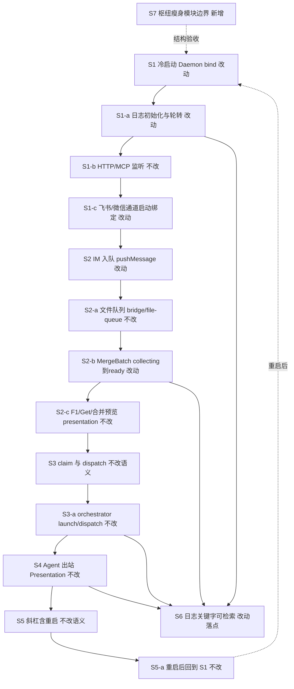
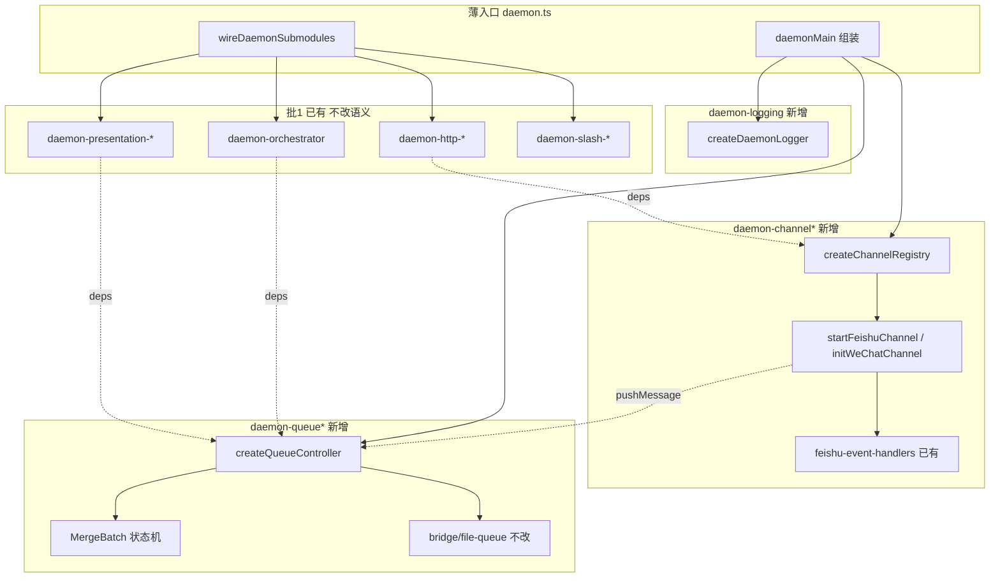

# Daemon 批二拆分 - 实现设计

> **业务 PRD**：见同目录 `01-proposal.md`（验收标准以 01 为准）
> **承接**：`20260711203953-巨型单体拆分` 批 1 归档 accepted_debt **R1**（queue / channel / logging）
> **现网锚点（CodeGraph + `wc -l`，2026-07-12）**：`src/daemon/daemon.ts` **1901 行**；批 1 子模块均 ≤300；`@ts-nocheck` 已清零；`bridge/file-queue` 已由 `20260712145152` 拆完，本变更**只改调用接线、不重拆 file-queue**。

## 一、业务流程与改动范围

> 业务口径以 `01-proposal.md` 场景 **S1～S7** 与验收 §六为准；下图覆盖冷启动 → 入队/合并 → 调度 → 出站 → 斜杠重启主路径，以及通道/日志旁路。本变更为**结构搬迁**，用户可见语义不变。

### （一）业务流程图

**图例**：`不改` 行为与现网契约一致（仅可能改 import/deps 注入点）；`改动` 源码从 `daemon.ts` 迁出或接线调整；`新增` 本变更新建 `daemon-queue*` / `daemon-channel*` / `daemon-logging` 等模块；`删除` 枢纽内大段实现（迁出后删除原内嵌体）。

### （二）流程步骤与改动对照

| 步骤 ID | 业务含义 | 改动 | 落点（模块/文件） | 01 验收关联 |
|---------|----------|------|-------------------|-------------|
| S1 | 应用冷启动 → Daemon 就绪 bind | 改动 | `daemon.ts` `daemonMain` 瘦身为组装；调用 `createDaemonLogger` / `createChannelRegistry` / `createQueueController` / 既有 `wire` | §六·6.1-1；场景 S1 |
| S1-a | 日志目录、写入、2MB 轮转 | 改动 | **新增** `daemon-logging.ts`：`createDaemonLogger` → `log` / `ensureLogDir` / `rotateLogIfNeeded`；`DAEMON_LOG_PATH` 不变 | §六·6.2-1；场景 S6 |
| S1-b | HTTP/MCP 监听、lock、健康 | 不改 | 既有 `daemon-http-server.ts` / `daemon-http-*.ts`；仅 deps 中 `log`/`channels`/`pushMessage` 改指向新模块 | §六·6.1-1 |
| S1-c | 飞书/微信通道启动与绑定 | 改动 | **新增** `daemon-channel.ts`（+必要时 `daemon-channel-feishu.ts` / `daemon-channel-wechat.ts`）：`ChannelRuntime`、`channels`、`startFeishuChannel`、`initWeChatChannel`、`resolveChannel`；复用 `feishu-event-handlers.ts`、`wechat-group-enqueue-gate.ts` | §六·6.1-3；场景 S4 |
| S2 | IM 消息入队 | 改动 | **新增** `daemon-queue.ts`：`pushMessage` / `initQueue` / `broadcastQueueEvent` / `sseClients` | §六·6.1-2；场景 S2 |
| S2-a | 磁盘队列 claim/ack/release | 不改 | `src/bridge/file-queue.js` 及已拆子模块；**禁止**本变更再改 file-queue 内部 | §六·6.1-2 |
| S2-b | MergeBatch 状态机与合并卡控制 | 改动 | **新增** `daemon-queue-merge.ts`（+必要时 `daemon-queue-types.ts`）：`MergeBatch`、`onMessageEnqueued`、`performClaimAndMerge`、`handleMergeBatchAction`、`flushReadyMergeBatches` | §六·6.1-2；场景 S3 |
| S2-c | F1/Get、合并预览、排队文案 | 不改 | 既有 `daemon-presentation-enqueue.ts` / `daemon-presentation-merge-preview.ts`；经 deps 回调 queue | §六·6.1-2 |
| S3 | 调度门控与 claim | 不改语义 | 既有 `daemon-orchestrator.ts`；`mergeBatchBySession` / `performClaimAndMerge` 改由 queue 模块经 deps 注入 | §六·6.1-1～2；场景 S2 |
| S3-a | launch/dispatch / busy 重试 | 不改 | `daemon-orchestrator.ts`、`daemon-orchestrator-retry.ts`；日志关键字 `dispatch_failed` 等保留 | §六·6.2-1 |
| S4 | Presentation / stream 出站 | 不改 | 既有 `daemon-presentation-*.ts`；`ackOnReply` 改指向 queue | §六·6.1 |
| S5 | 授权斜杠（含重启类） | 不改语义 | 既有 `daemon-slash-executor.ts` / `daemon-merge-command.ts`；枢纽内残留 `handleCommand` / slash TTL **须迁入 slash 侧**以满足枢纽 ≤200（见 §六） | §六·6.1-4；场景 S5 |
| S5-a | 重启后再走 S1～S4 | 不改 | Electron `daemon-manager` **不改**（01 非目标） | §六·6.1-4 |
| S6 | 运维日志关键字可检索 | 改动 | 关键字字符串与字段不变；仅 `log` 实现落点迁至 `daemon-logging.ts`；`merge_action` / `presentation_failed` / `dispatch_failed` 等仍可 grep | §六·6.2-1；场景 S6 |
| S7 | 枢纽仅为组装；单文件 ≤300 | 新增 | 新建 queue/channel/logging 簇；`daemon.ts` 目标 **≤200**；迁出后删除枢纽内大段实现 | §六·6.2-2～3；场景 S7；R1～R4、R7 |

### （三）改动汇总

- **改动**：
  - `src/daemon/daemon.ts`：删除 queue / MergeBatch / channel / logging 大段实现；`wireDaemonSubmodules` / `daemonMain` 改为调用新 `create*`；枢纽收敛为薄组装（目标 ≤200 行）。
  - 既有批 1 子模块（orchestrator / presentation / http / slash）：**仅**更新 deps 注入来源（`log`、`channels`、`pushMessage`、`mergeBatchBySession`、`ackOnReply` 等），不改对外 HTTP/语义。
  - `src/daemon/AGENTS.md`：模块表改为批 2 边界（apply 阶段维护；知识库正文 archive 由 librarian 同步）。
- **新增**：
  - `daemon-logging.ts`
  - `daemon-queue.ts`、`daemon-queue-merge.ts`（必要时 `daemon-queue-types.ts`）
  - `daemon-channel.ts`（必要时 `daemon-channel-feishu.ts` / `daemon-channel-wechat.ts`）
  - 枢纽瘦身所需的 slash/HTTP 辅助迁入：优先并入既有 `daemon-slash-executor.ts` / `daemon-http-*.ts`；仅当并入后必超 300 行时再新建单文件（禁止预建通用层）。
- **不改（显式列出）**：
  - `electron/daemon/daemon-manager.ts`、`src/bridge/lark-core.ts`、Electron `command-handler` / `session-dispatcher`
  - `src/bridge/file-queue*.ts` 内部实现与磁盘格式
  - 调度并发模型、T7 `dispatchSessionAgents` 空实现填补、日志双写统一（Daemon 文件 + Electron stderr）
  - 对外 HTTP 路径、MCP 工具名、MergeBatch phase 语义、斜杠产品行为、用户可见 UI/配置迁移

## 二、整体思路

**根因**：批 1 已抽出 HTTP / orchestrator / presentation，但 `daemon.ts` 仍 **1901 行**，内嵌 logging、ChannelRuntime（飞书/微信）、文件队列编排与 MergeBatch（单簇约 390+ 行）等，违反单文件 ≤300，且为批 1 明确登记的 R1 债。

**方案要点**（延续批 1 垂直切 + deps 注入，不引入新框架）：

1. **按职责迁出**：`logging` → `daemon-logging`；`channel` → `daemon-channel*`；`queue`（含 MergeBatch / SSE / ack 衔接）→ `daemon-queue*`。
2. **行数硬门槛本轮一次达标**：MergeBatch 簇现约 392 行、channel 簇合计约 350+ 行——**本变更内必须再垂直切分到各文件 ≤300**，不得留「先单文件再下期切」或 ponytail 超限。
3. **枢纽 ≤200**：组装 + 启动顺序 + 信号处理；残留的 slash TTL / `handleCommand` 壳 / presentation 类型残片 / HTTP 小工具须迁出或并入既有文件，否则达不到 01「枢纽瘦身」目标。
4. **行为等价**：纯搬移与 deps 重接；保留诊断关键字与 `DAEMON_LOG_PATH` / `MERGE_QUIET_MS` 等环境语义。
5. **依赖方向**：`daemon.ts` → 各 `daemon-*` → `bridge/*` / `shared/*`；子模块之间**禁止**互 import，仅经 `wireDaemonSubmodules` 注入（与批 1 / `src/daemon/AGENTS.md` 一致）。

**与 01 追溯**：覆盖 R1～R7、场景 S1～S7、§六验收；关闭批 1 R1 debt。

**最小方案三问**：

1. **能否复用现有模块/符号？** 能。复用批 1 的 `create*` + `*Deps` 模式、`feishu-event-handlers`、`wechat-group-enqueue-gate`、`file-queue` 公共入口、既有 presentation/orchestrator/http/slash；不新建 DaemonContext barrel / index.ts。
2. **拟新增抽象/依赖是否被 01 要求？** 否。不新增第三方包、不建通用 Queue 框架 / Channel 插件体系；仅按领域 `createQueueController` / `createChannelRegistry` / `createDaemonLogger` 工厂（与批 1 design §四示意一致）。多文件拆分**仅**因 ≤300 硬约束，非预建扩展点。
3. **能否合并到已有文件？** logging/queue/channel 体量无法并入既有 ≤300 文件而不混责，故新建域文件。slash TTL、`handleCommand`、HTTP `readBody`/`json`/lock 辅助优先**并入**既有 slash/http 文件；仅超限时再拆单文件。

## 三、分层设计

- **端点层**：HTTP/MCP 仍在 `daemon-http-*`；通道 WS/iLink 生命周期在 `daemon-channel*`。
- **服务层**：queue 编排 + MergeBatch；orchestrator dispatch；slash 执行；presentation 出站。
- **数据层**：文件队列仍 `bridge/file-queue`；会话路由仍 `daemon-session-routing*`；无新持久化格式。

## 四、接口设计

无对外 HTTP/MCP/Proto **契约变更**。新增**内部**工厂（供 `daemon.ts` 组装；名称可在 apply 微调用词，职责不变）：

| 模块 | 导出 | 关键 deps / 返回 | 说明 |
|------|------|------------------|------|
| `daemon-logging` | `createDaemonLogger()` → `{ log, ensureLogDir }` | 读 `DAEMON_LOG_PATH` / `APP_DATA_DIR`；2MB 轮转 | 关键字字符串不变 |
| `daemon-channel` | `createChannelRegistry(deps)` → `{ channels, startFeishuChannel, initWeChatChannel, resolveChannel, pickChannel, getChannelStatusList, … }` | `log`、`pushMessage`、`handleCommand`、`FeishuEventHandlerDeps` 回调 | 含微信 gate 接线 |
| `daemon-queue` | `createQueueController(deps)` → `{ pushMessage, initQueue, onMessageEnqueued, performClaimAndMerge, handleMergeBatchAction, ackOnReply, broadcastQueueEvent, mergeBatchBySession, … }` | `log`、`scheduleAgentDispatchRef`、`resolveChannel`、presentation 确认/停进度回调、`file-queue` API | MergeBatch 实现可在 `daemon-queue-merge.ts`，由 facade 组装 |
| 既有模块 | `createOrchestrator` / `createPresentationHandlers` / `createAdminApiHandler` / `startDaemonHttpServer` | deps 字段类型不变，**实现引用**改指向新模块 | 禁止子模块互 import |

错误码与 JSON 形态保持现有 `json(res, { ok: false, error })` 语义。

## 五、数据结构

无新增持久化表 / Proto。**内存态随模块搬迁，字段与语义不变**：

| 结构 | 现位置 | 目标 | 备注 |
|------|--------|------|------|
| 日志路径/轮转计数 | `daemon.ts` | `daemon-logging` | `MAX_LOG_SIZE=2MB` |
| `ChannelRuntime` / `channels` | `daemon.ts` | `daemon-channel*` | 含 `cfg`/`sender`/`wechat` |
| `MergeBatch` / `mergeBatchBySession` / `mergeCardRegistry` | `daemon.ts` | `daemon-queue*` | phase 状态机不变 |
| `sseClients` | `daemon.ts` | `daemon-queue*` | SSE `queue-update` |
| `activeSessionMap` 等路由 Map | `daemon.ts` | 优先随 queue/channel 读写归属迁出；或继续由 `daemon-session-routing*` + 枢纽注入持有（二选一，以无环 + 枢纽 ≤200 为准） | persist 逻辑不改语义 |
| `sessionProgressMap` | `daemon.ts` 声明、presentation 使用 | 声明迁出或保留组装注入；类型残片并入 `daemon-presentation-types.ts` | 禁止在枢纽残留大段 presentation 类型 |
| 文件队列磁盘格式 | `bridge/file-queue*` | **不改** | |

## 六、实现步骤

每步可回溯「一·（二）」步骤 ID。

1. **抽出 `daemon-logging.ts`**（S1-a、S6）：搬迁 `escapeLogContentSingleLine` / `ensureLogDir` / `rotateLogIfNeeded` / `log`；全库 Daemon 侧经工厂或导出函数替换直接引用；确认关键字抽样仍可检索。
2. **抽出 queue 类型 + MergeBatch**（S2-b）：新建 `daemon-queue-types.ts`（若需要）+ `daemon-queue-merge.ts`；搬迁 MergeBatch 全族与 `handleMergeBatchAction`；**单文件必须 ≤300**（现簇约 392 → 至少两文件）。
3. **抽出 `daemon-queue.ts` facade**（S2、S2-a、S6）：`initQueue`、`pushMessage`、`ackOnReply`、`broadcastQueueEvent`、`sseClients`、与 merge 组装为 `createQueueController`；`scheduleAgentDispatchRef` 仍用 ref 回调避免 queue↔orchestrator 环引。
4. **抽出 `daemon-channel*`**（S1-c、S4）：`ChannelRuntime`、绑定/状态、`startFeishuChannel`、`initWeChatChannel`、`resolveChannel`；与 `feishu-event-handlers` / gate 用 deps 接线；**合计超 300 则按飞书启动 / 微信启动再切**，本轮一次达标。
5. **枢纽残留清理（S5、S7）**：将 slash TTL / `handleCommand` 壳并入 `daemon-slash-executor`（或超限时新建单文件）；HTTP `readBody`/`json`/lock 辅助并入既有 http 文件；presentation 类型残片并入 `daemon-presentation-types.ts`。
6. **重接 `wireDaemonSubmodules` + `daemonMain`**（S1、S3、S7）：启动顺序保持：`initQueue` → session-routing load → `wire*`（orchestrator/presentation/http/slash）→ 通道 start → `startDaemonHttpServer` → scheduled tasks；目标 `wc -l daemon.ts` **≤200**。
7. **更新 `src/daemon/AGENTS.md` 模块表**：标明 queue/channel/logging 新落点与「负责/不负责」。
8. **回归**（对齐 01 §六）：冷启动、入队/合并卡、飞书/微信收发、斜杠重启、日志关键字、纳入范围 `wc -l` ≤300；**不**改调度并发与日志双写。

## 七、参考实现

> CodeGraph（`projectPath=/home/suveng/doger/cursor-claw`）+ 源码核对。批 1 design 中部分行号已漂移；以下以现网为准。

| 符号 | 现路径 | 职责簇 | 目标 |
|------|--------|--------|------|
| `log` / `rotateLogIfNeeded` | `daemon.ts` ~L162–193 | logging | `daemon-logging` |
| `ChannelRuntime` / `channels` | `daemon.ts` ~L194–211 | channel | `daemon-channel*` |
| `initWeChatChannel` | `daemon.ts` ~L330 | channel | `daemon-channel*` |
| `broadcastQueueEvent` / `sseClients` | `daemon.ts` ~L380–387 | queue | `daemon-queue` |
| `MergeBatch` / `onMessageEnqueued` / `performClaimAndMerge` / `handleMergeBatchAction` | `daemon.ts` ~L411–802 | queue-merge | `daemon-queue-merge` |
| `ackOnReply` / `initQueue` / `pushMessage` | `daemon.ts` ~L951–1077 | queue | `daemon-queue` |
| `startFeishuChannel` | `daemon.ts` ~L1133 | channel | `daemon-channel*`（caller：`daemonMain`） |
| `wireDaemonSubmodules` | `daemon.ts` ~L1585 | 组装 | 保留并瘦身 |
| `daemonMain` | `daemon.ts` ~L1765 | 启动 | 保留并瘦身 |
| `createOrchestrator` | `daemon-orchestrator.ts` | dispatch | 不改语义，改 deps 来源 |
| `createPresentationHandlers` | `daemon-presentation-handlers.ts` | 出站 | 不改语义 |
| `onFeishuMenuV6` | `feishu-event-handlers.ts` | 菜单 | channel 注入 |
| `shouldEnqueueWechatGroupMessage` | `wechat-group-enqueue-gate.ts` | 微信 gate | channel 复用 |
| `pushToFileQueue` / `ackMessages` / `releaseClaimedMessages` | `bridge/file-queue*.ts` | 磁盘队列 | **不改** |

批 1 模式参考：同目录归档 `20260711203953-巨型单体拆分/02-design.md` §三～§六；T-FIX-01 超限再切先例（http/presentation 多文件）。

## 八、技术影响

### （一）影响范围

- **涉及模块**：`src/daemon/daemon.ts` 及新建 `daemon-logging` / `daemon-queue*` / `daemon-channel*`；既有 orchestrator / presentation / http / slash / session-routing **仅 deps 接线**；`src/daemon/AGENTS.md`。
- **接口/proto**：无对外变更。
- **数据变更**：无磁盘格式变更。
- **风险**：
  1. deps 遗漏导致运行时 `undefined`（尤其 `scheduleAgentDispatchRef`、`ackOnReply`、`resolveChannel`）。
  2. 子模块互 import 形成环——须坚持仅枢纽注入。
  3. 与并行变更抢改同一枢纽：`会话路由TTL脏键修复`（routing-persist）、`微信通道体验对齐`（channel/wechat）、`多会话并发调度`（orchestrator，依赖本变更）、`超限模块拆分续`（明确不做 daemon.ts）。**本变更文件白名单**见下；建议批 2 优先合并枢纽相关 PR。
- **文件白名单（拟改）**：`src/daemon/daemon.ts`；新建 `daemon-logging.ts`、`daemon-queue.ts`、`daemon-queue-merge.ts`、（可选）`daemon-queue-types.ts`、`daemon-channel.ts`、（可选）`daemon-channel-feishu.ts` / `daemon-channel-wechat.ts`；必要时微调 `daemon-slash-executor.ts`、`daemon-presentation-types.ts`、个别 `daemon-http-*.ts`、`src/daemon/AGENTS.md`。
- **明确不改路径**：`electron/daemon/*`、`src/bridge/lark-core.ts`、`src/bridge/file-queue*.ts` 内部、渲染端 UI。

### （二）工程补充验收项

- [ ] `wc -l src/daemon/daemon.ts` ≤ **200**；本变更新建/纳入改动的各 `src/daemon/daemon-*.ts` ≤ **300**（含 queue-merge / channel 再切后）
- [ ] 无 `daemon-queue` ↔ `daemon-presentation` / `daemon-orchestrator` 直接 import（仅 deps）
- [ ] 冷启动后 `/health`（或等价）可用；飞书/微信入队 → 合并卡（若启用）→ dispatch → 回复与拆分前一致
- [ ] 授权斜杠（含重启）可用；重启后主路径仍成立
- [ ] `grep` 仍能命中：`dispatch_failed`、`merge_action`、`presentation_failed`（及既有 retry/busy 关键字）
- [ ] 中文注释覆盖迁出模块公共导出与非显而易见分支
- [ ] **未**改调度并发策略、**未**做日志双写统一、**未**改 file-queue 磁盘语义
- [ ] 批 1 R1（queue/channel/logging 仍驻枢纽）在本变更完成后可勾销

## 九、知识库影响

- `knowledge/工程平台/Daemon守护进程/01-概览.md`、`03-进程模型与部署.md` — 枢纽/日志/模块阅读路径若仍写「逻辑在 daemon.ts」需更新。
- `knowledge/业务域/消息桥接/00-README.md`、`04-消息队列与路由.md`、`02-飞书通道.md`、`03-微信通道.md` — 源码锚点自 `daemon.ts` 迁至 queue/channel 新文件。
- `knowledge/业务域/Agent调度/00-README.md` — 薄组装锚点更新。
- `src/daemon/AGENTS.md` — 批 2 模块表 SSOT（工程内文档，apply 维护）。
- 批 1 归档 `05-summary` / debt R1 — archive 本变更时勾销说明。

## 十、知识库更新计划

### （一）必须更新

- `knowledge/工程平台/Daemon守护进程/01-概览.md` — 架构落点：queue/channel/logging 子模块
- `knowledge/业务域/消息桥接/00-README.md` — 去掉「queue/MergeBatch 仍驻 daemon.ts（批2）」注记，改为新路径
- `knowledge/业务域/Agent调度/00-README.md` — Daemon 薄组装锚点
- `src/daemon/AGENTS.md` — 目录职责表（apply 同步；archive 核对）

### （二）可能更新（视实现结果）

- `knowledge/工程平台/Daemon守护进程/03-进程模型与部署.md` — 若日志章节绑定旧函数名
- `knowledge/业务域/消息桥接/02-飞书通道.md`、`03-微信通道.md`、`04-消息队列与路由.md` — 若正文写死 `daemon.ts` 行级锚点
- `knowledge/工程平台/Daemon守护进程/00-README.md` — README 是否需增子模块链接（若拆出独立知识叶子则由 librarian 评估）

### （三）不需要更新

- 用户可见产品文案 / Figma / Proto
- 日志双写统一、调度并发、Electron daemon-manager、lark-core 拆分（本变更未做，另立变更）
- `bridge/file-queue` 知识（本变更不改其内部；已由消息队列模块拆分归档）
