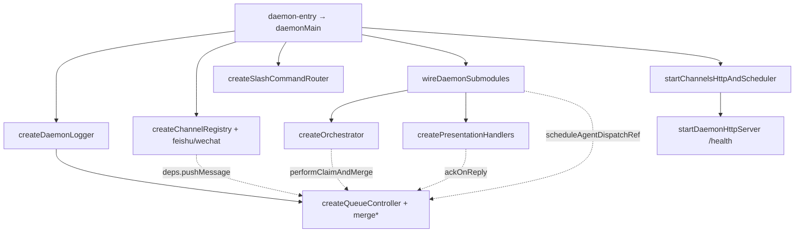

# Daemon批二拆分 - 代码评审报告

## 1、审查范围

- **变更类型**: apply 产出的未提交变更（`src/daemon/daemon.ts` 瘦身 + 新建 `daemon-*` 簇；`src/AGENTS.md` / `src/daemon/AGENTS.md`）
- **评审等级**: focused-review（结构债清偿、消息主路径高回归面；无 proto/资金/权限契约变更，故不升 full-review 六角并行）
- **涉及文件**: 枢纽 1 + 新建 14（logging / queue* / channel* / slash-router / http-utils / session-maps / wire / bootstrap）+ AGENTS 2
- **设计文档**: `01-proposal.md` §六、`02-design.md`（含八·（二））、`03-tasks.md` T1–T7
- **CodeGraph**: `codegraph_context`（组装工厂）、`codegraph_impact`（`wireDaemonSubmodules` / `pushMessage` / `handleMergeBatchAction` / `startFeishuChannel` / `activeMcpConnections`）、`codegraph_explore`（MergeBatch / 枢纽组装）。索引对新工厂符号略滞后，已用 `wc`/`rg`/源码交叉复核。

## 2、严重（必须处理）

无

## 3、警告（建议处理）

无（评分 ≥75 项为空）

Ponytail 精简轴（不阻断 archive，评分 <75）：

1. `shrink:` `daemon.ts:185` → `as unknown as DaemonWireDeps` 掩盖类型差 → 对齐 `DaemonWireDeps` 与注入实参类型后去掉双重断言
2. `shrink:` `MERGE_EDIT_MAX_CHARS` 同时存在于 `daemon-queue-types.ts` 与 `daemon-presentation-types.ts`（值均为 30000）→ 可择一 SSOT，非本变更必改
3. Lean already. Ship.（≤300 / 枢纽 ≤200 硬门槛下的垂直切分为 `02`/`03` 要求，非预建通用层）

## 4、设计偏差

无

- `wireDaemonSubmodules` 迁至 `daemon-wire.ts`、`daemonMain` 后半段迁至 `daemon-bootstrap.ts`：符合枢纽 ≤200 与「组装+接线」目标，属 `02` §六允许的瘦身落点。
- T5 新建 `daemon-slash-command-router.ts` / `daemon-http-utils.ts`：slash 并入 executor 必超 300；HTTP 小工具独立文件在行数门槛内可接受。

## 5、验收标准检查

| 任务 | 验收条件 | 状态 |
|------|---------|------|
| T1 | `daemon-logging.ts` ≤300；枢纽无内嵌轮转/`appendFileSync` 日志体；关键字调用点保留；中文注释；未做双写统一 | ✅ |
| T2 | 各 `daemon-queue-*.ts` ≤300；`merge_action` 字段仍含 action/session_key/ok/source；无 merge↔presentation/orchestrator 直引；未改 file-queue | ✅ |
| T3 | `daemon-queue.ts` ≤300；`createQueueController` 组装 merge；SSE `queue-update`；无 queue↔presentation/orchestrator 直引 | ✅ |
| T4 | 各 `daemon-channel*.ts` ≤300；飞书/微信启动与 gate/`wechat_group_skip` 保留；无 channel↔queue/presentation/orchestrator 直引 | ✅ |
| T5 | 斜杠 TTL/`handleCommand` 迁出；HTTP `readBody`/`json` 迁出；枢纽无大段 presentation 类型残片；相关文件 ≤300 | ✅ |
| T6 | `daemon.ts` ≤200；相关 `daemon-*.ts` ≤300；`AGENTS.md` 批2 负责/不负责表已更新；无环引；未改并发/双写/file-queue | ✅ |
| T7 / 01§六 / 02八·（二） | 结构与关键字 grep 通过；冷启动顺序 logger→queue→routing→wire→channel/http/scheduler；批1 R1 具备勾销条件 | ✅（行为主路径为结构搬迁+接线复核；未做实机飞书/微信联调） |
| 01 R1–R7 | queue/channel/logging 迁出；枢纽薄组装；行为/关键字/行数 | ✅ |

结构抽检：`wc -l` 枢纽 **200**；新建最高 `daemon-channel.ts` **296**、`daemon-wire.ts` **295**、`daemon-queue-merge.ts` **280**，均 ≤300。

## 6、调用链与回归风险

| 风险点 | 说明 | 缓解 |
|--------|------|------|
| deps 遗漏 | `scheduleAgentDispatchRef` / `ackOnReply` / `resolveChannel` / `handleCommand` | 枢纽箭头延迟绑定；wire 后写回 `presentationApi`/`slashExecutorDeps`/`phase` |
| 子模块环引 | queue↔presentation/orchestrator | `rg` 无直引；仅 deps / ref（CodeGraph + 源码） |
| 通道启动时序 | 须在 wire 之后 | `daemonMain`：wire → `startChannelsHttpAndScheduler` |
| 索引滞后 | CodeGraph 对新 `create*` 符号未全量入库 | 已用文件级/符号级源码复核 |

## 7、遗留债务

无（不阻断 archive）

说明（既有、非本变更引入，不记 `reviews.open`）：`activeMcpConnections` / `lastMcpRequestTime` 以 number 快照注入 HTTP 与 `/api/status`，HTTP 侧自增不回写 admin deps——批1 枢纽 `let` 时代亦为按值拷贝，属既有观测精度问题，可另立变更用共享 ref 修复。

## 8、修复任务建议

| 问题 ID | 建议动作 | 关联任务 |
|---------|----------|----------|
| — | 无 open 项；无需 T-FIX | — |

## 9、结论

**通过**，可进入 `/kb-archive`（archive 时勾销批1 R1 debt，并按 `02` §十同步知识库模块锚点）。本轮 `reviews` 为空（零 open、零 debt）。
