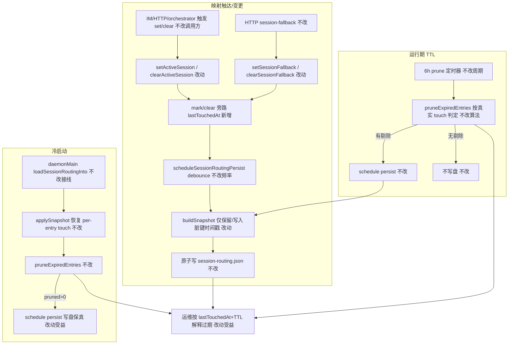
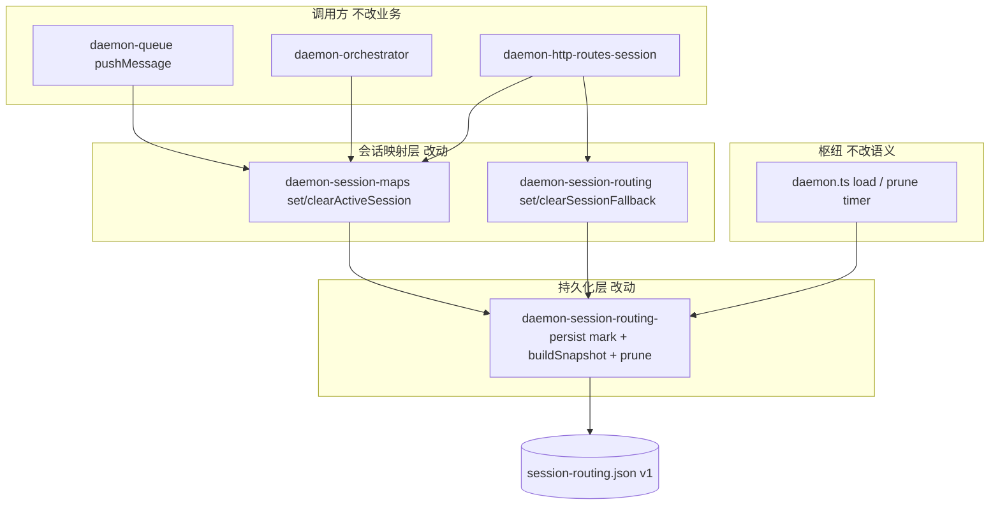

# 会话路由TTL脏键修复 - 实现设计

> **业务 PRD**：见同目录 `01-proposal.md`（验收标准以 01 为准）
> **变更 ID**：`20260712170533-会话路由TTL脏键修复`
> **workflow_version**：v2.6
> **依赖**：`20260712113356-Agent标识跨重启持久化`（已归档；本变更为其 accepted_debt R2 / T11-R2 纠偏）；批二拆分已 archived，落点以现盘 `daemon-session-*` 为准

## 一、业务流程与改动范围

> 业务口径以 `01-proposal.md` §四场景 S1～S6、§五 R1～R6、§六验收为准。下图覆盖写盘触达、运行期 prune、冷启动 load+prune 三条路径。

### （一）业务流程图



**图例**：`不改` 行为与现网一致；`改动` 需改代码；`新增` 触达 mark/clear API；`删除` 无用户路径删除（仅去掉全量刷新副作用）。

### （二）流程步骤与改动对照

| 步骤 ID | 业务含义 | 改动 | 落点（模块/文件） | 01 验收关联 |
|---------|----------|------|-------------------|-------------|
| S1 | 单会话活跃写盘；空闲会话时间戳保真 | 改动 | `daemon-session-routing-persist.ts` `buildSnapshot`；`daemon-session-maps.ts` set 路径 mark | §六·6.1-1；场景 S1；R1/R2 |
| S2 | 运行期 prune 不因他人写盘续命 | 改动 | 同上（写盘保真后 `pruneExpiredEntries` 自然正确） | §六·6.1-2；场景 S2；R3 |
| S3 | 冷启动 load+prune 不退化 | 不改接线 / 改动受益 | `daemon.ts` load/prune 接线保持；persist 写盘语义修正 | §六·6.1-3；场景 S3；R4 |
| S4 | 映射变更仅续期本键 | 改动 | `daemon-session-maps.ts` `setActiveSession`；`daemon-session-routing.ts` set/clear fallback | §六·6.2-1；场景 S4 |
| S5 | 多会话交错活跃互不污染 | 改动 | 各 mutation 只 mark 本键 | §六·6.2-2；场景 S5 |
| S6 | 清除映射时移除旁路 touch，防脏键残留 | 新增 | persist `clearActiveTouched` / `clearFallbackTouched`；maps/routing clear 调用 | R2；内存旁路与 Map 对齐 |
| S7 | prune/load 后仅重写快照、不刷新未变键 | 改动 | `buildSnapshot` 读取既有 `activeTouchAt`/`fallbackTouchAt` | S2/S3；R3/R4 |
| S8 | TTL 时长 / schema / sessionKey 契约 | 不改 | `SESSION_ROUTING_TTL_MS`、v1 schema、路由键 | R5；§六·6.2-3 |
| S9 | 可观测关键字保留 | 不改 | `session_routing_load_failed` / `session_routing_pruned` / `[session-routing]` | R6 |
| S10 | 历史磁盘同戳脏数据 | 明确残差（本变更可设计、不可无害回溯） | 见 §二 / §八；**不**在 load 强行改写历史戳 | 01 §八「历史脏数据」；禁止 defer |

### （三）改动汇总

- **改动**：`buildSnapshot` 停止对全部在册键写入同一 `now`；mutation 路径在 schedule 前对本键 mark touch。
- **新增**：persist 模块导出（或同文件内供 maps/routing 调用的）`markActiveTouched` / `clearActiveTouched` / `markFallbackTouched` / `clearFallbackTouched`（命名以实现为准，语义固定）。
- **不改（显式列出）**：`SESSION_ROUTING_TTL_MS`（30d）、6h prune 周期、debounce 500ms、schema v1 字段名、`daemon.ts` 启动顺序、IM/队列/orchestrator 业务逻辑、写盘触发点集合（仍仅 set/clear active|fallback）、工作流 sessionKey。

## 二、整体思路

见 01 §一。根因（现盘核实）：`daemon-session-routing-persist.ts` 的 `buildSnapshot` 在每次写盘时对 **全部** active/fallback 键执行 `activeTouchAt.set(chatId, now)`，使 TTL 退化为「任意会话最后一次写盘时间」。上游归档 `20260712113356` 已记 accepted_debt R2 / 知识库 T11-R2；升级路径即「脏键 touch」。

**方案要点**：

1. **旁路表为 SSOT**：继续用模块内 `activeTouchAt` / `fallbackTouchAt`；Map 仍不存时间戳。
2. **触达事件清单（闭合 01「触达判定边界」）**：仅下列操作更新/清除 touch——`setActiveSession`（含同键重绑，视为触达续期）、`clearActiveSession`（删键+清 touch）、`setSessionFallback`、`clearSessionFallback`。纯消息且未调用上述 API 的路径**不**刷新路由 TTL（与现网「仅映射写路径 persist」一致，本变更不扩大写盘面）。
3. **`buildSnapshot`**：对每个在册键取旁路既有 `lastTouchedAt`；缺失则补 `now`（防御：未 mark 的新键）。**禁止**再无条件全量 `set(..., now)`。
4. **历史脏数据（本变更必须定案，禁止 defer）**：**不在 load 时纠偏**历史同戳。理由：磁盘上已膨胀的时间戳无法恢复真实空闲起点；若把同戳批量压旧，可能误删仍在用的活跃映射（违反 R4）。修复后 **forward** 行为正确：未再被触达的键保留磁盘/内存原戳并按 TTL 过期；被再次 set 的键获得真实续期。运维残差：修复前已连带续命的条目，过期窗口从膨胀戳起算，最长多「虚增」一段空闲窗口，属不可无害回溯的一次性残差，写入 §八，**不**另开变更。
5. **批二后落点**：`setActiveSession` 在 `daemon-session-maps.ts`（非巨石 `daemon.ts`）；fallback 仍在 `daemon-session-routing.ts`；枢纽只保留 load/prune 接线。

**最小方案三问**：

1. **能否复用现有模块？** 能。根因与旁路表均在 `daemon-session-routing-persist.ts`；mutation 已集中在 maps/routing 两文件。
2. **拟新增抽象是否 01 要求？** 否。不新建 Service/类/依赖；仅补 4 个薄 mark/clear 函数（或等价私有+导出）。
3. **能否合并到已有文件？** 能且必须：全部改动落在既有 persist + maps + routing；**不**新建文件。

## 三、分层设计



- **端点层**：HTTP `/api/active-session*`、`/api/session-fallback*` 不改契约；经既有 helper。
- **服务层**：maps/routing 在 schedule 前 mark/clear。
- **数据层**：persist 旁路表 + `buildSnapshot` 保真写盘；TTL/schema 不变。

## 四、接口设计

无对外 HTTP/MCP/proto 变更。沿用既有：

- `scheduleSessionRoutingPersist` / `flushSessionRoutingPersist` / `loadSessionRoutingInto` / `pruneExpiredEntries` / `startSessionRoutingPruneTimer`
- 进程内新增（仅 Daemon 域 import）：`markActiveTouched(chatId)`、`clearActiveTouched(chatId)`、`markFallbackTouched(sessionKey)`、`clearFallbackTouched(sessionKey)`（名称可微调，须中文注释标明语义）

## 五、数据结构

无 schema 变更。继续 v1：

```json
{
  "version": 1,
  "activeSessions": { "<chatId>": { "sessionKey": "...", "lastTouchedAt": 0 } },
  "fallbackSessions": { "<sessionKey>": { "fallbackSessionKey": "...", "lastTouchedAt": 0 } }
}
```

语义纠偏：`lastTouchedAt` = **该键最后一次映射触达/变更时刻**，而非「全局最后一次任意写盘时刻」。

## 六、实现步骤

1. **修正 `buildSnapshot`（S1/S2/S7）**：循环内读取旁路既有时间戳；缺失才 `now`；删除「全量 `set(key, now)`」。
2. **导出 mark/clear（S1/S4/S6）**：在 persist 模块实现四函数；clear 与 Map.delete 对齐，避免旁路孤儿键。
3. **接线 mutation（S1/S4/S5/S6）**：`daemon-session-maps.ts` 的 set/clear；`daemon-session-routing.ts` 的 set/clear；均在 `scheduleSessionRoutingPersist` **之前**调用。
4. **回归契约（S1～S5、S8/S9）**：在本变更 `auto_test/`（plan 阶段落任务）扩展上游契约：两键 load → 仅 mark/set 一键 → flush → 断言另一键 `lastTouchedAt` 不变；再造「空闲键超 TTL + 活跃键写盘」→ `pruneExpiredEntries` 仍剔除空闲键；保留 C1～C5 既有 load/损坏/flush 用例。
5. **行数闸门**：`daemon-session-routing-persist.ts` 现约 251 行，改后须 ≤300；超限则仅抽极薄 touch 辅助到同目录单文件（须 plan 注明，默认不拆）。
6. **知识勾销准备（S10）**：实现注释标明「禁止全量刷新」；archive 时由 librarian 勾销 T11-R2（本 design 已定案历史残差口径）。

## 七、参考实现

- **现盘根因**：`src/daemon/daemon-session-routing-persist.ts` `buildSnapshot`（约 L137–153）全量 `activeTouchAt.set(..., now)`。
- **旁路与 prune**：同文件 `activeTouchAt`/`fallbackTouchAt`、`pruneExpiredEntries`、`loadSessionRoutingInto`、`startSessionRoutingPruneTimer`。
- **mutation 落点（批二后）**：`daemon-session-maps.ts` `setActiveSession`/`clearActiveSession`；`daemon-session-routing.ts` set/clear fallback；调用方 `daemon-queue.ts`、`daemon-orchestrator.ts`、`daemon-http-routes-session.ts`（**不改**调用方，只改 helper 内 mark）。
- **枢纽接线**：`daemon.ts` `loadSessionRoutingInto` + prune 后 `scheduleSessionRoutingPersist` + `startSessionRoutingPruneTimer`（语义不改）。
- **上游债务与升级路径**：归档 `20260712113356` 的 `04-review` R2、`05-summary`、知识 `Agent调度/02-多会话模型.md` T11-R2。
- **契约样板**：归档同变更 `auto_test/run-session-routing-persist-contract.mts`（C1～C5）。
- **CodeGraph 备注**：检索时索引仍偏旧（`setActiveSession` callers 指向批二前 `daemon.ts:942`；`scheduleSessionRoutingPersist` 未入符号表；`codegraph_files` 未列 `daemon-session-maps.ts` / `daemon-session-routing-persist.ts`）。本设计以**现盘 Read/Grep + 上游归档**为准；plan/apply 前建议刷新索引后再做 impact。

## 八、技术影响

### （一）影响范围

- **涉及模块**：`daemon-session-routing-persist.ts`（主）、`daemon-session-maps.ts`、`daemon-session-routing.ts`；契约测试；archive 时知识勾销。
- **接口/proto 变更**：无。
- **数据变更**：无字段增删；既有文件中历史同戳条目 forward 消化（见下）。
- **风险**：
  1. mutation 漏 mark → 新键依赖「缺失则 now」尚可；**更新已有键**若漏 mark 则续期失败（空闲判定偏严）——用对照表 S4/S5 + 契约覆盖。
  2. clear 漏清 touch → 旁路孤儿（内存胀）——S6 必做。
  3. 与并行变更抢改同一 persist 文件——白名单见下；建议本 P0 优先合入。
  4. 历史膨胀戳：最长延迟过期至「膨胀时刻+TTL」，**已定案接受**，不 load 纠偏。

**文件白名单（实现）**：

| 路径 | 动作 |
|------|------|
| `src/daemon/daemon-session-routing-persist.ts` | 改 `buildSnapshot` + mark/clear |
| `src/daemon/daemon-session-maps.ts` | set/clear 接线 mark/clear |
| `src/daemon/daemon-session-routing.ts` | set/clear fallback 接线 |
| `knowledge/变更/进行中/20260712170533-…/auto_test/*` | 扩展契约（plan/apply） |
| `src/daemon/AGENTS.md` | 可选一句 TTL 触达语义（archive/librarian） |

**禁止改**：`daemon-queue.ts` / `daemon-orchestrator.ts` / `daemon-http-routes-session.ts` 业务逻辑（除非 mark 无法在 helper 完成——预期不需要）；TTL 常量；schema。

### （二）工程补充验收项

- [ ] 两键并存：仅 set/mark 键 A 后 flush，磁盘上键 B 的 `lastTouchedAt` 与写盘前一致（01 §六·6.1-1）。
- [ ] 键 B 的 touch 造为超 TTL，期间仅键 A 写盘；调用 `pruneExpiredEntries` 后 B 被剔除、A 保留（01 §六·6.1-2）。
- [ ] load 过期/未过期混合快照行为与现网 C2 一致（01 §六·6.1-3）。
- [ ] setActiveSession / setSessionFallback 后该键 `lastTouchedAt` 更新为近时刻（01 §六·6.2-1）。
- [ ] `SESSION_ROUTING_TTL_MS`、schema `version===1`、字段名无改动（01 §六·6.2-3）。
- [ ] 既有日志关键字 `session_routing_load_failed` / `session_routing_pruned` / `[session-routing]` 仍可 grep（R6）。
- [ ] `buildSnapshot` 源码无「遍历全量 `set(touch, now)`」回归；文件 ≤300 行；中文注释。
- [ ] 不新增与 TTL 无关的 persist 触发点或缩短 debounce（01 §六·6.3-2）。

## 九、知识库影响

- `knowledge/业务域/Agent调度/02-多会话模型.md` — **必须**：勾销 T11-R2，改写「写盘 per-entry 触达」语义，并一句说明历史同戳残差。
- `knowledge/工程平台/Daemon守护进程/02-HTTP与MCP服务.md` — **可能**：若仅有「TTL 30d」一句且无脏键描述，可不动；若有写盘语义则对齐。
- `src/daemon/AGENTS.md` session-routing 小节 — **必须**（工程约定，archive 时同步）：写明 mark 触达与禁止全量刷新。
- 上游归档 `20260712113356` summary/debt — **低**：本变更 `05-summary` 勾销 R2 即可，不改归档正文强制。
- `知识索引.md` / 领域 README — **低**：无新子模块文件则通常不改。

## 十、知识库更新计划

### （一）必须更新

- `knowledge/业务域/Agent调度/02-多会话模型.md` §六/§九：T11 写盘语义 + 删除/勾销 T11-R2。
- `src/daemon/AGENTS.md`：session-routing 持久化触达/TTL 口径（与代码一致）。

### （二）可能更新（视实现结果）

- `knowledge/工程平台/Daemon守护进程/02-HTTP与MCP服务.md` 会话路由一句。
- `knowledge/工程平台/Daemon守护进程/00-README.md` 变更记录一行。

### （三）不需要更新

- IM 通道、MergeBatch、Presentation、工作流 sessionKey 专章。
- Proto / 客户端文档（无契约变更）。
