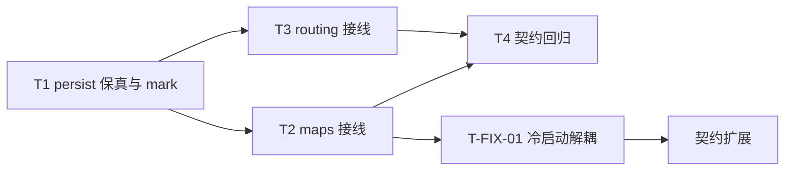

# 会话路由TTL脏键修复 - 任务分解

> **来源**：`/kb-plan`（基于 `01-proposal.md`、`02-design.md`）

## 一、执行计划

### （一）依赖图



```
T1 ──→ T2 ──→ T4
  └──→ T3 ──┘
T2 ──→ T-FIX-01（R1 复评前）
```

### （二）分组调度

| 轮次 | 并行任务 | 说明 |
|------|----------|------|
| 第一轮 | T1 | 仅改 `daemon-session-routing-persist.ts`；导出 mark/clear 与修正 `buildSnapshot` |
| 第二轮 | T2、T3 | 分别改 maps / routing，互不冲突；均依赖 T1 导出 |
| 第三轮 | T4 | 本变更 `auto_test/` 契约；覆盖 01 §六 与 02 八·（二） |
| 第四轮 | T-FIX-01 | R1：load 与 mark 解耦 + 契约 onActiveSet |

**冲突文件**：T1 独占 `daemon-session-routing-persist.ts`；T2/T3 不得改该文件。禁止改 `daemon-queue.ts` / `daemon-orchestrator.ts` / `daemon-http-routes-session.ts` / TTL 常量 / schema。T-FIX-01 可改 maps / `daemon.ts` / 契约。

## 二、任务清单

## T1: persist 模块 buildSnapshot 保真与 mark/clear

### 背景

根因是 `buildSnapshot` 每次写盘对全部在册键执行 `activeTouchAt.set(..., now)`，使 TTL 退化为「任意会话最后一次写盘时间」。本任务在 persist 模块内修正写盘保真语义，并导出触达 mark/clear，供 maps/routing 接线；是后续全部任务的数据层依赖。

### 上下文文件

- CodeGraph: `buildSnapshot` `activeTouchAt` `fallbackTouchAt` `pruneExpiredEntries` `scheduleSessionRoutingPersist` — 旁路表与写盘路径
- CodeGraph impact: `scheduleSessionRoutingPersist` → maps/routing 调用方
- 必读: `src/daemon/daemon-session-routing-persist.ts` — `buildSnapshot`（约 L137–153）全量 `set(..., now)` 根因；旁路表 L23–25；`pruneExpiredEntries` / `loadSessionRoutingInto` / `flushSessionRoutingPersist`
- 必读: `src/daemon/AGENTS.md` — session-routing 持久化约定（纯函数、无 Service 类、≤300 行）
- 参考: `knowledge/变更/归档/20260712113356-Agent标识跨重启持久化/auto_test/run-session-routing-persist-contract.mts` — C1～C5 既有行为样板

### 实现范围

- 修改: `src/daemon/daemon-session-routing-persist.ts`
  - **`buildSnapshot`**：对每个在册键读取旁路既有 `lastTouchedAt`；**缺失**时才补 `Date.now()`（防御未 mark 的新键）；写入快照用该值；**删除**循环内无条件 `activeTouchAt.set(chatId, now)` / `fallbackTouchAt.set(..., now)`
  - **新增导出**（命名可微调，语义固定，须中文注释）：
    - `markActiveTouched(chatId: string): void` — 将该 chatId 旁路 touch 设为 `Date.now()`
    - `clearActiveTouched(chatId: string): void` — 删除该 chatId 旁路条目
    - `markFallbackTouched(sessionKey: string): void` — 同上，fallback 旁路
    - `clearFallbackTouched(sessionKey: string): void` — 同上删除
  - **注释定案（禁止 defer）**：标明「禁止写盘全量刷新 touch」；历史磁盘同戳脏数据**不在 load 纠偏**（无法无害回溯真实空闲起点；误压旧可能违反冷启动不误删活跃映射）；修复后 forward 行为正确，既有膨胀戳最长多虚增一段空闲窗口属一次性残差
- 不新建文件（默认）；若改后仍 >300 行，仅允许抽极薄 touch 辅助到同目录单文件，须中文注释说明且无新抽象层
- 不改：`SESSION_ROUTING_TTL_MS`、`PERSIST_DEBOUNCE_MS`、schema `version===1`、字段名、`pruneExpiredEntries` 算法、`startSessionRoutingPruneTimer` 周期、日志关键字

### 接口契约

```typescript
/** 映射触达/变更时刷新该键最后触达时间（写盘前由 mutation 调用） */
export function markActiveTouched(chatId: string): void;
export function clearActiveTouched(chatId: string): void;
export function markFallbackTouched(sessionKey: string): void;
export function clearFallbackTouched(sessionKey: string): void;
```

- 既有导出保持不变：`scheduleSessionRoutingPersist` / `flushSessionRoutingPersist` / `loadSessionRoutingInto` / `pruneExpiredEntries` / `startSessionRoutingPruneTimer` / `SESSION_ROUTING_TTL_MS`
- `buildSnapshot` 仍为模块内私有；对外语义：`lastTouchedAt` = 该键最后一次映射触达/变更时刻，非全局任意写盘时刻

### 验收标准

- [ ] `buildSnapshot` 源码无「遍历在册键无条件 `set(touch, now)`」；在册未 mark 键写盘后磁盘 `lastTouchedAt` 与写盘前旁路值一致（01 §六·6.1-1；02 八·（二）首条/第七条）
- [ ] 旁路缺失键写盘时用 `now` 补齐，且不污染其他键时间戳
- [ ] 四函数导出可用；clear 删除旁路键，无孤儿残留路径
- [ ] `SESSION_ROUTING_TTL_MS`、schema `version===1`、字段名未改（01 §六·6.2-3；02 八·（二））
- [ ] 日志关键字 `session_routing_load_failed` / `session_routing_pruned` / `[session-routing]` 仍可 grep（R6；02 八·（二））
- [ ] 不新增与 TTL 无关的 persist 触发点、不缩短 debounce（01 §六·6.3-2；02 八·（二））
- [ ] load **不**批量改写历史同戳；注释含禁止全量刷新与历史残差口径（01 §八；02 S10；禁止 defer）
- [ ] 文件 ≤300 行；含中文注释；无 Service/类/未批准新依赖
- [ ] 无 `02`/`03` 未要求的抽象层、trait/mixin 中间层或未批准的新依赖（Ponytail 口径）

### 依赖

- 前置任务: 无
- 后续任务: T2, T3, T4

---

## T2: maps 层 set/clearActiveSession 接线 mark/clear

### 背景

active 映射变更是触达事件清单的一半。批二后 `setActiveSession` / `clearActiveSession` 落在 `daemon-session-maps.ts`，目前仅 `scheduleSessionRoutingPersist`，未刷新/清除旁路 touch。本任务在 schedule **之前**对本键 mark/clear，保证仅变更键续期。

### 上下文文件

- CodeGraph: `setActiveSession` `clearActiveSession` `scheduleSessionRoutingPersist`
- 必读: `src/daemon/daemon-session-maps.ts` — `setActiveSession`（约 L53–58）、`clearActiveSession`（约 L60–66）
- 必读: `src/daemon/daemon-session-routing-persist.ts` — T1 合并后的 `markActiveTouched` / `clearActiveTouched` 导出
- 参考: `src/daemon/daemon-queue.ts` / `daemon-orchestrator.ts` / `daemon-http-routes-session.ts` — 确认调用方经 helper，**本任务不改**这些文件

### 实现范围

- 修改: `src/daemon/daemon-session-maps.ts`
  - import `markActiveTouched` / `clearActiveTouched`（与既有 persist import 合并）
  - `setActiveSession`：在 `activeSessionMap.set` / `sessionToChatMap.set` 之后、`scheduleSessionRoutingPersist` **之前**调用 `markActiveTouched(chatId)`（同键重绑亦视为触达续期）
  - `clearActiveSession`：在 Map.delete 之后、`scheduleSessionRoutingPersist` **之前**调用 `clearActiveTouched(chatId)`
- 禁止改调用方业务逻辑；禁止改 TTL/schema/写盘频率

### 接口契约

- 对外函数签名不变：`setActiveSession(chatId, sessionKey)` / `clearActiveSession(chatId)`
- 新增进程内副作用：set → mark 本 chatId；clear → clear 本 chatId touch

### 验收标准

- [ ] set 后该 chatId 旁路 touch 为近时刻；flush 后磁盘该键 `lastTouchedAt` 更新（01 §六·6.2-1；场景 S4；02 八·（二））
- [ ] 仅 set 键 A 时，键 B 的 touch / 磁盘时间戳不变（01 §六·6.1-1；场景 S1/S5）
- [ ] clear 后旁路无该 chatId 孤儿键（场景 S6）
- [ ] 未改 queue/orchestrator/http-routes-session；未改 debounce/TTL
- [ ] 含中文注释；无未批准抽象/新依赖（Ponytail 口径）

### 依赖

- 前置任务: T1
- 后续任务: T4

---

## T3: routing 层 set/clearSessionFallback 接线 mark/clear

### 背景

fallback 映射变更是触达事件清单的另一半。`daemon-session-routing.ts` 的 set/clear 已统一 schedule persist，但未 mark/clear fallback 旁路。本任务与 T2 对称接线，避免 fallback 键被他人写盘连带续命或 clear 后旁路残留。

### 上下文文件

- CodeGraph: `setSessionFallback` `clearSessionFallback` `scheduleRoutingPersist`
- 必读: `src/daemon/daemon-session-routing.ts` — 全文（约 40 行）；`setSessionFallback` / `clearSessionFallback` / `scheduleRoutingPersist`
- 必读: `src/daemon/daemon-session-routing-persist.ts` — T1 的 `markFallbackTouched` / `clearFallbackTouched`
- 参考: `src/daemon/daemon-http-routes-session.ts` — 确认经 helper 无 Map 直写（不改该文件）

### 实现范围

- 修改: `src/daemon/daemon-session-routing.ts`
  - import `markFallbackTouched` / `clearFallbackTouched`
  - `setSessionFallback`：Map.set 后、`scheduleRoutingPersist()` **之前** `markFallbackTouched(sessionKey)`
  - `clearSessionFallback`：Map.delete 后、`scheduleRoutingPersist()` **之前** `clearFallbackTouched(sessionKey)`
- 不改 `wireSessionRoutingPersist`、HTTP 契约、TTL/schema

### 接口契约

- 对外签名不变：`setSessionFallback` / `clearSessionFallback` / `getSessionFallback` / `wireSessionRoutingPersist`
- 副作用：set → mark 本 sessionKey；clear → clear 本 sessionKey touch

### 验收标准

- [ ] setSessionFallback 后该键 `lastTouchedAt` 更新为近时刻（01 §六·6.2-1；02 八·（二））
- [ ] 仅变更 fallback 键 A 时，其他 active/fallback 键时间戳不变（S1/S5；R1/R2）
- [ ] clear 后 fallback 旁路无孤儿键（S6）
- [ ] HTTP 仍无 `fallbackSessionMap` 直写；未扩大写盘触发面
- [ ] 含中文注释；无未批准抽象/新依赖（Ponytail 口径）

### 依赖

- 前置任务: T1
- 后续任务: T4

---

## T4: auto_test 脏键触达与运行期 prune 契约

### 背景

01 主路径与 02 八·（二）工程补充验收须可自动回归。上游 C1～C5 覆盖 load/损坏/flush/基础 prune，但未断言「他键写盘不续命」。本任务在本变更目录新建契约脚本，扩展脏键保真与运行期 prune，并保留对既有关键字/行数/schema 的静态检查。

### 上下文文件

- 必读: `knowledge/变更/归档/20260712113356-Agent标识跨重启持久化/auto_test/run-session-routing-persist-contract.mts` — C1～C5 样板（可复制结构，勿改归档文件）
- 必读: `src/daemon/daemon-session-routing-persist.ts` — T1 后 `mark*` / `flush` / `pruneExpiredEntries` / `loadSessionRoutingInto` / `SESSION_ROUTING_TTL_MS`
- 必读: `src/daemon/daemon-session-maps.ts`、`daemon-session-routing.ts` — T2/T3 接线后行为（契约可直接调 persist API + 必要时静态 grep maps/routing）
- 参考: 同归档目录 `run-session-routing-persist-contract.sh` — 运行方式样板

### 实现范围

- 新建: `knowledge/变更/进行中/20260712170533-会话路由TTL脏键修复/auto_test/run-session-routing-ttl-dirty-key-contract.mts`（名称可微调）
- 新建: 同目录可执行 `.sh` 包装（cwd 仓库根，失败非 0）
- 契约用例（须覆盖）：
  1. **脏键保真**：两键 load（或 flush 初始快照）→ 仅 `markActiveTouched`/`等价 set` 键 A → `flushSessionRoutingPersist` → 断言磁盘键 B `lastTouchedAt` 与写盘前一致（01 §六·6.1-1；02 八·（二））
  2. **运行期 prune 不续命**：键 B touch 造为 `now - SESSION_ROUTING_TTL_MS - 1`，期间仅键 A mark+flush；`pruneExpiredEntries` 后 B 剔除、A 保留（01 §六·6.1-2；02 八·（二））
  3. **冷启动 C2 对齐**：load 过期/未过期混合快照，行为与上游 C2 一致（01 §六·6.1-3；02 八·（二））
  4. **映射变更续期**：mark/set 后该键时间为近时刻（01 §六·6.2-1）
  5. **静态回归**：`SESSION_ROUTING_TTL_MS` 未改意图；`version===1`；grep 无全量 `set(touch, now)` 回归；persist ≤300 行；关键字 `session_routing_load_failed` / `session_routing_pruned` / `[session-routing]` 仍存在；maps/routing 含 mark/clear 调用
- 保留上游 C1～C5 语义不退化（可复跑归档脚本或在本脚本内最小复刻关键断言）
- 不改生产 TTL/debounce；不测 HTTP Daemon 启动（非本变更必须）

### 接口契约

- 无生产 API 变更；测试仅 import persist 导出与临时 `APP_DATA_DIR`
- 脚本退出码：全部通过 0，任一失败非 0

### 验收标准

- [ ] 脏键保真用例通过（01 §六·6.1-1；02 八·（二））
- [ ] 运行期 prune 不续命用例通过（01 §六·6.1-2；02 八·（二））
- [ ] load 混合 TTL 与现网 C2 一致（01 §六·6.1-3；02 八·（二））
- [ ] set/mark 续期近时刻断言通过（01 §六·6.2-1；02 八·（二））
- [ ] schema/TTL/日志关键字/行数/无全量刷新静态检查通过（01 §六·6.2-3、6.3；R6；02 八·（二））
- [ ] 多会话互不污染可由两键用例覆盖（01 §六·6.2-2；S5）
- [ ] 含中文注释；无未批准抽象/新依赖（Ponytail 口径）

### 依赖

- 前置任务: T1, T2, T3
- 后续任务: 无

---

## T-FIX-01: 冷启动 onActiveSet 与 mark 解耦（R1）

### 背景

评审 R1：`loadSessionRoutingInto(..., setActiveSession)` 使冷启动对每个存活 active 无条件 `markActiveTouched`，重启后全员续命，违背 01 R1（仅真实触达续期）。须将反向索引重建与触达 mark 解耦，并补契约覆盖该路径。

### 上下文文件

- 必读: `src/daemon/daemon-session-maps.ts` — `setActiveSession`（含 mark）
- 必读: `src/daemon/daemon.ts` — `loadSessionRoutingInto(..., setActiveSession)` 冷启动接线
- 必读: `src/daemon/daemon-session-routing-persist.ts` — `loadSessionRoutingInto` / `onActiveSet` / `markActiveTouched`
- 必读: `auto_test/run-session-routing-ttl-dirty-key-contract.mts` — 扩展冷启动断言
- 参考: `04-review.md` R1

### 实现范围

- 修改: `src/daemon/daemon-session-maps.ts`
  - `setActiveSession` 增加可选 `opts?: { touch?: boolean }`（默认 true）
  - `touch === false` 时只写 `activeSessionMap` / `sessionToChatMap`，**禁止** mark / schedule
- 修改: `src/daemon/daemon.ts`
  - load 回调改为 `setActiveSession(chatId, sessionKey, { touch: false })`，禁止裸传 `setActiveSession`
- 修改: `src/daemon/AGENTS.md` — 冷启动解耦编码规矩一句
- 修改: `auto_test/run-session-routing-ttl-dirty-key-contract.mts`（及必要时 `.sh`）
  - 契约：带 onActiveSet 路径 load 后 flush，磁盘戳不被抬升；静态禁止裸传
- 禁止: accepted_debt / deferred；不改 TTL/schema/debounce

### 接口契约

```typescript
setActiveSession(chatId: string, sessionKey: string, opts?: { touch?: boolean }): void;
// touch 默认 true；冷启动 load 必须传 { touch: false }
```

### 验收标准

- [x] 冷启动经 onActiveSet 后旁路/磁盘 `lastTouchedAt` 不被抬升为 now
- [x] 运行期无 opts / `touch!==false` 的 set 仍 mark + schedule（既有行为）
- [x] 契约覆盖 onActiveSet / 冷启动路径且通过
- [x] 静态：daemon load 含 `touch: false`；无裸传 `setActiveSession` 给 load
- [x] 含中文注释；相关文件 ≤300 行（契约脚本尽量紧凑）

### 依赖

- 前置任务: T2
- 后续任务: 无
- 关联评审: R1
