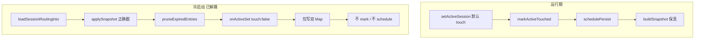

# 会话路由TTL脏键修复 - 代码评审报告

## 1、审查范围

- **变更类型**: apply 产出的未提交变更（T1–T4 + T-FIX-01 done）；本轮为 **复评**（R1 已标 fixed）
- **评审等级**: focused-review（P0 技术债、单端 Daemon、无 proto/多端契约；覆盖规范/Bug/设计偏差/精简轴）
- **涉及文件**: 7（persist / maps / routing / daemon.ts / AGENTS.md + auto_test `.mts`/`.sh`）
- **设计文档**: `02-design.md`（对照基准）；验收以 `01-proposal.md` §六 + `03-tasks.md` T1–T4 / T-FIX-01
- **CodeGraph**: `projectPath` 检索；索引仍偏旧（`setActiveSession` 仍指向批二前 `daemon.ts`；impact 不可靠）。现盘核对为准：`setActiveSession(opts.touch)` → 默认 mark/schedule；`touch:false` 早退；冷启动 `daemon.ts` 包装回调传 `{ touch: false }`
- **契约冒烟**: `auto_test/run-session-routing-ttl-dirty-key-contract.sh` → **ALL PASS**（含「冷启动 onActiveSet 不误 mark」，2026-07-12 复评复跑）

## 2、严重（必须处理）

无。

**R1 复评（已闭环 → fixed）**：

- 位置: `src/daemon/daemon-session-maps.ts:61-73`；`src/daemon/daemon.ts:164-169`；契约 `testColdStartOnActiveSetNoMark`
- 核实: `setActiveSession` 支持 `opts?.touch === false` 时只写双 Map、禁止 mark/schedule；load 经包装回调传 `{ touch: false }`，非裸传；静态 grep 禁裸传；契约断言 flush 后磁盘戳不抬升，且对照默认 touch 会抬升
- 结论: 冷启动全员续命缺口已消除，符合 01 R1 / T-FIX-01

## 3、警告（建议处理）

无（≥75 且非已关闭项）。

**Ponytail 精简**: Lean already. Ship.（`opts.touch` 三参可选、无新文件/抽象；四函数 mark/clear + `buildSnapshot` 保真保持薄）

## 4、设计偏差

无（相对 01 R1 / T-FIX-01 的冷启动缺口已闭环）。

**既有范围外观察（不抬 open）**：`daemon-http-admin-crud.ts` workspace 热切换仍可能直写 `activeSessionMap`（非本变更白名单）；archive 后若运维依赖磁盘路由与热切换一致，可另开变更。

## 5、验收标准检查

| 任务 | 验收条件 | 状态 |
|------|---------|------|
| T1 | `buildSnapshot` 无全量 `set(touch, now)`；缺失才补 now | ✅ |
| T1 | 四函数导出；clear 删旁路；TTL/schema/关键字/debounce 未改 | ✅ |
| T1 | load 不批量纠偏历史同戳；注释含禁止全量刷新与残差口径 | ✅ |
| T1 | 文件 ≤300 行（288）；中文注释；无 Service 类 | ✅ |
| T2 | set 前 mark、clear 前 clear；仅经 helper | ✅ |
| T2 | 仅 set A 时 B 不变（运行期） | ✅ 契约 |
| T2 / T-FIX-01 | 冷启动不经 mark 抬升（01 R1） | ✅ `touch:false` + 契约 |
| T3 | set/clear fallback 接线 mark/clear；HTTP 无 Map 直写 | ✅ |
| T4 | 脏键保真 / prune 不续命 / C2 / mark 续期 / 静态回归 | ✅ ALL PASS |
| T4 / T-FIX-01 | 带 onActiveSet=`touch:false` 的冷启动保真；禁裸传 | ✅ |
| 02 八·（二） | AGENTS 触达语义 + 冷启动解耦一句 | ✅ |

## 6、调用链与回归风险

| 风险点 | 说明 |
|--------|------|
| 冷启动续命 | 已消除：`touch:false` 早退 + 契约锁路径 |
| 运行期路径 | maps/routing mutation + buildSnapshot 保真与 02 一致 |
| 调用方签名 | 第三参可选；queue/orchestrator/HTTP 两参调用仍默认触达 |
| CodeGraph | 索引滞后，合入前宜刷新后再做影响面 |

## 7、遗留债务

无。历史磁盘同戳残差（02 S10）已定案「不 load 纠偏、forward 消化」，**不**记为 debt/open。禁止将已闭环项记 debt。

## 8、修复任务建议

无 open 问题。R1 已由 `T-FIX-01` 闭环（status=`fixed`）。

## 9、结论

**通过**，可进入 `/kb-archive`。复评确认 R1 真正闭环；open=0；`stage=reviewed`；reviews 仅 `fixed`，无 `open`/`accepted_debt`。
