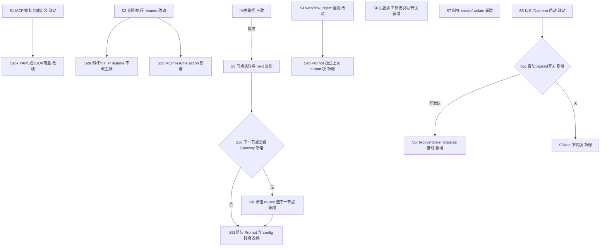
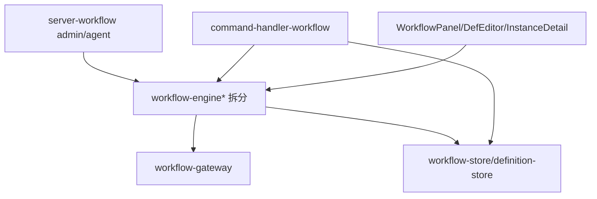

# 工作流产品缺口补齐 - 实现设计

> **业务 PRD**：见同目录 `01-proposal.md`（验收以 01 为准）
> **范围**：原一期 R1–R6 + 原二期 R7–R9 **全部必做**；禁止 defer
> **Figma**：无新视觉（`auto-none`）

## 一、业务流程与改动范围

> 口径：01 §四场景、§五 R1–R9、§六验收。下图覆盖管理入口、驳回重跑、自动 paused、Gateway、config 替换主路径与失败分支。

### （一）业务流程图



**图例**：`不改` 现网一致；`改动` 改代码；`新增` 新节点/分支；`删除` 本期无。

### （二）流程步骤与改动对照

| 步骤 ID | 业务含义 | 改动 | 落点（模块/文件） | 01 验收关联 |
|---------|----------|------|-------------------|-------------|
| S1 | MCP create/update 文案与解析 | 改动 | `src/workflow/server-workflow.ts`（错误文案）；工具描述已含 YAML 则核对 | R1；验收 1 |
| S1ok | YAML/JSON 定义落盘 | 不改解析主体 | `workflow-parse.ts` `parseWorkflowDefinitionText` | R1 |
| S2a | 斜杠/UI/HTTP resume | 不改主体 | `command-handler-workflow.ts`；`workflow-runner.ts`；`daemon-http-workflow-signal.ts` | R2 |
| S2b | MCP `resume` action | 新增 | `server-workflow.ts` `registerWorkflowAdminTools` → `resumeWorkflowAndEmit` | R2；验收 2 |
| S2h | 斜杠/COMMANDS/帮助 resume 表述 | 改动 | `WORKFLOW_SUBCMD_HELP`；`daemon-slash-command-router.ts` | R2 |
| S3 | `handleNext` 推进 | 改动 | 拆出后的 `workflow-engine-advance.ts`（或等价） | R6/R7 |
| S3g/S3r | Gateway 条件路由 | 新增 | `workflow-types.ts` 节点字段；`workflow-gateway.ts`（新）；advance 调用 | R7；验收 5 |
| S3t | Prompt 组装 + config 替换 | 改动 | `workflow-engine-prompt.ts`（新拆）；`template-utils` 或局部 `applyConfigPlaceholders` | R8；验收 6 |
| S4/S4p | 驳回重跑 + 上次 output 块 | 改动/新增 | prompt 组装；`resources/template/workflow/node-prompt.md` | R3/R4；验收 3 |
| S4d | 驳回说明文案 | 新增 | `WorkflowPanel.tsx` / `WorkflowInstanceDetail.tsx` 辅助一句 | R4 |
| S5/S5c/S5r | 启动 recover + 开关 | 新增/改动 | `AppConfig.workflowAutoPauseStale`（默认 true）；Electron 启动与 Daemon 启动调用点；`recoverStaleInstances` 读开关 | R5；验收 4 |
| S5ui | 设置页开关 UI | 新增 | `WorkflowPanel.tsx` 既有 Tab 内 checkbox+说明（无新视觉组件） | R5；Figma 无 |
| S6 | paused 态说明 | 新增 | `WorkflowInstanceDetail.tsx` paused 辅助文本 | R5 |
| S7 | `/workflow create\|update` | 新增 | `command-handler-workflow.ts`；help/router 文案 | R9；验收 7 |
| S7p | 斜杠体解析 YAML/JSON | 改动复用 | `parseWorkflowDefinitionText`；`raw` 去命令头后余文 | R9 |
| UI-def | 设置页编辑 Gateway/routes | 改动 | `WorkflowDefEditor.tsx`（字段编辑；超限则再拆） | R7 |
| IM | 飞书/微信入队调度展示 | 不改 | bridge/daemon presentation | R6；验收 8 |

### （三）改动汇总

- **新增**：
  - MCP `manage_workflows` action=`resume`
  - `workflow-gateway.ts`：条件求值与下一节点解析
  - `workflow-engine-prompt.ts`（建议）：Prompt 组装、`applyConfigPlaceholders`、上次 output 注入
  - `/workflow create|update` 子命令与帮助行
  - `AppConfig.workflowAutoPauseStale` + WorkflowPanel 开关与说明
  - 启动路径调用 `recoverStaleInstances`（现网 **无调用方**，必须接线）
- **改动**：
  - MCP create 缺参错误文案「JSON」→「YAML 或 JSON」
  - `handleNext`：遇 Gateway 自动路由，不 spawn Agent
  - `node-prompt.md`：`isRetry` 下「上次本节点产出」块
  - `WorkflowNode` 类型扩展 `kind`/`routes`/`defaultNext`
  - `workflow-engine.ts` **拆分**（现 439 行）以满足 ≤300
- **删除**：无
- **不改（显式）**：
  - IM 主路径；resume 三入口既有语义；存储根 SSOT；`parseWorkflowDefinitionText` 双格式能力本身

## 二、整体思路

**根因**（CodeGraph + 现盘）：

1. MCP `data` 描述已写 YAML，但 create 缺参仍报「JSON」→ 文案漂移（R1）。
2. `resumeWorkflowAndEmit` 已存在，admin 工具 enum **未含** resume（R2）。
3. `buildRetryPrompt`→`buildNodePrompt` 仅 `isRetry` 驳回原因；模板无「上次本节点 output」独立变量（R3）。
4. `recoverStaleInstances` **零 callers**——知识库写「会标 paused」但启动未接线；亦无开关（R5）。
5. `handleNext` 固定 `nextIdx = currentIdx + 1`，无条件边（R7）。
6. `CONFIG_VARS` 只列表展示；`renderTemplate` 仅匹配 `{{WORD}}`，**不**替换 `{{config.xxx}}`（R8）。
7. 斜杠仅 ls/info/run/resume/status/delete（R9）。

**方案要点**：

1. **文案 + MCP resume**：最小改 `server-workflow`；resume 直接调已有 SSOT。
2. **上次 output**：`LAST_NODE_OUTPUT`←`instance.context[node.id]`（驳回前已写入的产物）或 nodeHistory 最近一次 completed；模板独立节。
3. **recover**：Electron `seedBuiltins`/app ready 与 Daemon 启动各调一次；读 `workflowAutoPauseStale`（默认 true）。Daemon 无 electron-store 时经 env/配置文件或启动参数注入布尔（实现择一：优先 Electron 写配置后 Daemon 读同一 userData 配置，或仅 Electron 侧接线——若 Daemon 单独重启也需恢复，则 Daemon 启动读 `{APP_DATA_DIR}` 旁配置或共享 JSON；**本设计定**：开关落 `AppConfig`，Electron 启动必调；Daemon 启动若可读到同配置则同样尊重，否则默认 true 仍 recover）。
4. **Gateway**：`kind: "gateway"` 节点不跑 Agent；进入或离开时由引擎求值 `routes[].when`，命中 `next`；否则 `defaultNext`；再否则 failed 可读错误。
5. **config 替换**：在写入 `NODE_PROMPT` 前对 `node.prompt` 做 `{{config.key}}`→`def.config[key]`；缺失键替换为空并在日志 WARN（或保留占位并标注——验收取「可预期」：缺失→空字符串 + 组装日志）。
6. **斜杠 CRUD**：`/workflow create` / `update <id>`，定义正文取 `raw` 去掉前缀后的余文（支持换行 YAML）；复用 `parseWorkflowDefinitionText` + `saveDefinition`。

**最小方案三问（Ponytail）**：

1. **复用？** 是。解析、存储、`resumeWorkflowAndEmit`、模板条件块、斜杠 `reportCommandResult` 全复用。
2. **新抽象是否必要？** Gateway 求值与 prompt 组装因 `workflow-engine.ts` 已超 300 行，**必须拆文件**，非预建框架；不引入新 npm 表达式引擎（自研极简 when）。
3. **合并已有文件？** 文案/MCP resume/斜杠分支可进现有文件；引擎能力进拆分后的专职文件，避免继续堆 439 行单体。

## 三、分层设计



- **端点层**：设置页开关/说明；斜杠 create/update/resume；MCP manage_workflows；HTTP resume 不改。
- **服务层**：引擎 next/reject/resume/recover；Gateway 求值；Prompt 组装与 config 替换。
- **数据层**：Definition/Node 扩展字段；`AppConfig.workflowAutoPauseStale`；实例 JSON 不变（context 已够）。

## 四、接口设计

### MCP `manage_workflows`

| action | 入参 | 行为 |
|--------|------|------|
| create/update | `data` YAML/JSON | 既有；错误文案统一「YAML 或 JSON」 |
| resume | `id`=实例 ID | 调 `resumeWorkflowAndEmit`；失败返回引擎文案 |
| 其余 | 既有 | 工具总述补「resume」 |

### 斜杠 `/workflow`

| 子命令 | 用法 |
|--------|------|
| create | `/workflow create` + 其后正文（YAML/JSON） |
| update | `/workflow update <id>` + 其后正文 |
| 其余 | 既有；help 增 create/update |

### 配置

| 键 | 类型 | 默认 | 含义 |
|----|------|------|------|
| `workflowAutoPauseStale` | boolean | `true` | 启动时是否将陈旧 running→paused |

### Gateway 条件（极简）

| `when` 形态 | 语义 |
|-------------|------|
| `always` / `true` | 总是命中 |
| `contains <子串>` | 对**上一节点刚写入的 output**（或指定 `context.<nodeId>`）做子串包含（大小写敏感） |
| `context.<nodeId> contains <子串>` | 对指定 context 值 |

首条命中即停；无命中用 `defaultNext`；皆无则 `failed` + 可读 message。

## 五、数据结构

```typescript
// WorkflowNode 增量（workflow-types.ts）
kind?: "task" | "gateway"  // 默认 task
routes?: { when: string; next: string }[]
defaultNext?: string
```

- `normalizeWorkflowDefinition`：缺省 `kind=task`；gateway 校验 routes/next 指向存在节点。
- `serializeDefinition`：写出 kind/routes/defaultNext。
- UI：`WorkflowDefEditor` 可编辑上述字段（辅助说明一句即可）。
- 实例模型：**无**新字段。
- `AppConfig` + defaults + preload/env.d 若经 IPC 暴露开关读写。

## 六、实现步骤

1. **拆分引擎**（前置）：`workflow-engine.ts` → prompt / advance（next+gateway）/ reject / lifecycle（create/start/resume/recover），各 ≤300；步骤对应 S3/S4。
2. **R1+R2**：MCP 文案与 `resume` action（S1/S2b）。
3. **R8**：`applyConfigPlaceholders` 接入 prompt 组装（S3t）。
4. **R3**：模板 + `LAST_NODE_OUTPUT`（S4p）。
5. **R7**：类型 + gateway 模块 + advance 调用；DefEditor 字段（S3g/UI-def）。
6. **R5**：Config 开关；启动接线 recover；Panel/Detail 文案（S5/S6）。
7. **R4**：驳回说明一句（S4d）。
8. **R9**：斜杠 create/update + help/router（S7）。
9. **回归**：IM 主路径冒烟；单文件行数门禁。

## 七、参考实现

| 符号 | 路径 | 用途 |
|------|------|------|
| `buildNodePrompt` / `buildRetryPrompt` | `workflow-engine.ts` | 驳回与 config 挂点 |
| `handleNext` / `handleReject` | 同上 | Gateway / 上次 output |
| `recoverStaleInstances` | 同上:398 | 接线 + 开关 |
| `resumeWorkflowAndEmit` | `server-workflow.ts` | MCP resume |
| `registerWorkflowAdminTools` | 同上:167 | action enum |
| `parseWorkflowDefinitionText` | `workflow-parse.ts` | 斜杠/MCP 共用 |
| `handleFeishuWorkflowCommand` | `command-handler-workflow.ts` | 斜杠 CRUD |
| `renderTemplate` | `template-utils.ts` | 仅 `{{WORD}}`；config 点号另函数 |
| `AppConfig` / `saveConfig` | `electron/config/config-store.ts` | 开关 SSOT |
| `WorkflowPanel` / `WorkflowInstanceDetail` / `WorkflowDefEditor` | `src/renderer/components/` | UI |

## 八、技术影响

### （一）影响范围

- **模块**：`src/workflow/*`、`electron/scheduling/command-handler-workflow.ts`、`electron/config/config-store.ts`、renderer 工作流三组件、启动接线（Electron/Daemon）、`node-prompt.md`、帮助/router 文案。
- **接口**：MCP action 增 `resume`；斜杠增 create/update；Definition YAML 增可选字段（向后兼容）。
- **数据**：`AppConfig` 新布尔；定义文件可选 gateway 字段。
- **风险**：
  - recover 接线后，升级首次启动会批量 paused（符合默认安全策略，需在说明中写清）。
  - Gateway 条件过简可能不覆盖复杂表达式——产品接受极简子集。
  - `command-handler-workflow.ts` 186 行，加 create/update 后接近 300，必要时拆 `command-handler-workflow-crud.ts`。
  - `server-workflow.ts` 281 行，加 resume 后须盯行数。

### （二）工程补充验收项

- [ ] `recoverStaleInstances` 至少一处生产调用（Electron 启动；Daemon 能读配置则同样）
- [ ] 开关 `false` 时启动不改写 running 实例
- [ ] Gateway 节点不触发 `__WF_LAUNCH__` / Agent spawn
- [ ] `{{config.xxx}}` 在 NODE_PROMPT 内已替换；`{{config.missing}}` 行为符合设计（空串）
- [ ] 驳回 Prompt 含「上次本节点产出」标题或等价标记（契约可 grep）
- [ ] 相关新/改文件均 ≤300 行
- [ ] IM 飞书/微信主路径无回归

## 九、知识库影响

- `knowledge/业务域/工作流/01-概览.md` — 状态机补 Gateway；限制更新
- `knowledge/业务域/工作流/02-定义与实例.md` — Node 字段、config 替换语义
- `knowledge/业务域/工作流/03-节点执行与流转.md` — 驳回 output、Gateway、recover 接线/开关
- `knowledge/业务域/工作流/04-触发与管理入口.md` — MCP resume、斜杠 create/update、文案
- `knowledge/业务域/工作流/00-README.md` — 锚点若增新文件
- 两级索引：领域 README 若增文件则更新；总索引通常不改

## 十、知识库更新计划

### （一）必须更新

- 工作流 `01`～`04` 与 `00-README`（归档前与代码对齐：Gateway、config 替换、resume MCP、斜杠 CRUD、recover 开关与接线）

### （二）可能更新（视实现结果）

- `src/workflow/AGENTS.md`（模块分工表增 gateway/prompt 文件）
- 工程平台 Electron 设置相关叶子（若开关说明写入平台文档习惯）

### （三）不需要更新

- 消息桥接 / Agent 调度主文档（本变更不改 IM 主路径）
- 知识索引总入口（无新领域）

## 相关

- [[01-proposal]]
- [[00-manifest]]
