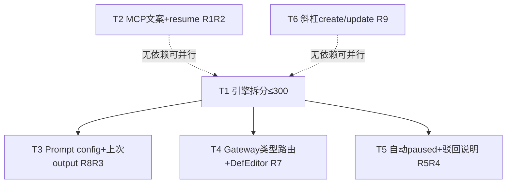

# 工作流产品缺口补齐 - 任务分解

> **来源**：`/kb-plan`（基于 `01-proposal.md`、`02-design.md`）
> **任务数**：6（T1–T6）
> **范围硬约束**：R1–R9 **全部本变更必做**；禁止 defer /「二期」/「下期再说」。`workflow-engine.ts` 现 439 行，T1 必须先拆分。

## 1、执行计划

### 1.1 依赖图

**CodeGraph 文件依赖边**（`projectPath=/home/suveng/doger/cursor-claw`）：

| 源符号/文件 | 依赖/波及 | 任务 |
|-------------|-----------|------|
| `workflow-engine.ts` 439 行 | `buildNodePrompt`、`handleNext`、`handleReject`、`recoverStaleInstances`（**零 callers**） | T1→T3/T4/T5 |
| `resumeWorkflowAndEmit` | `server-workflow.ts:93`；admin enum 无 resume | T2 |
| `registerWorkflowAdminTools` | action enum + create 缺参仍写「JSON」 | T2 |
| `renderTemplate` | 仅 `{{WORD}}`，不替换 `{{config.xxx}}` | T3 |
| `WorkflowNode` / `normalizeWorkflowDefinition` | `workflow-types.ts`；serialize 在 definition-store | T4 |
| `handleFeishuWorkflowCommand` | `command-handler-workflow.ts`；help 无 create/update | T6 |
| `AppConfig` / `seedBuiltins` | `config-store.ts`；`daemon-manager` 启动调 seed | T5 |
| `WorkflowPanel` / `InstanceDetail` / `DefEditor` | renderer 三组件 | T4/T5 |

**01 验收追溯**：

| 01 验收 | 主责任务 |
|---------|----------|
| 1 YAML 文案与可 create | T2、T6 |
| 2 resume 一致 + MCP resume | T2 |
| 3 驳回 Prompt 含上次 output 独立块 | T3 |
| 4 自动 paused 开关/接线/说明 | T5 |
| 5 Gateway 条件路由 | T4 |
| 6 `{{config.xxx}}` 替换 | T3 |
| 7 斜杠 create/update | T6 |
| 8 IM 无回归 + 文件 ≤300 | T1（拆分）+ 全任务行数门禁 |

**02 §六步骤对齐**：T1→步骤1；T2→步骤2；T3→步骤3+4；T4→步骤5；T5→步骤6+7；T6→步骤8；行数/IM→步骤9。

**02 §八·（二）工程补充**：recover 生产调用→T5；开关 false→T5；Gateway 不 spawn→T4；config 替换→T3；驳回标题块→T3；≤300→全任务；IM→全任务禁止改 bridge/queue。

### 1.2 分组调度

| 轮次 | 并行任务 | 说明 |
|------|----------|------|
| **第一轮** | T1、T2、T6 | 三簇无共享写文件；T1 为引擎后续前置 |
| **第二轮** | T3、T4、T5 | 均依赖 T1；prompt / advance+gateway+DefEditor / lifecycle+config+UI 三簇分离可并行 |

**同文件冲突清单（须串行）**：

| 文件 | 涉及任务（顺序） |
|------|------------------|
| `src/workflow/workflow-engine.ts` 及拆出子文件 | T1 → T3（prompt）/ T4（advance）/ T5（lifecycle 内 recover） |
| `src/workflow/server-workflow.ts` | T2 |
| `electron/scheduling/command-handler-workflow.ts`（及可选 crud 拆分） | T6 |
| `WorkflowPanel.tsx` / `WorkflowInstanceDetail.tsx` | T5 |
| `WorkflowDefEditor.tsx` | T4 |
| `electron/config/config-store.ts` + preload/`env.d.ts` | T5 |

## 2、任务清单

## T1: 拆分 workflow-engine（≤300 门禁前置）

### 背景

`workflow-engine.ts` 现 439 行，后续 Gateway/config/驳回注入无法继续堆叠。本任务纯机械拆分并保留对外导出稳定，对应 02 §六步骤1 / S3·S4 落点准备；**不实现** R3/R7/R8 新语义。

### 上下文文件

- CodeGraph: `buildNodePrompt` `handleNext` `handleReject` `recoverStaleInstances` `createInstance` — 拆分边界
- 必读: `src/workflow/workflow-engine.ts` — 全文件职责切分
- 必读: `src/workflow/AGENTS.md` — 模块分工表须同步新文件名
- 必读: `src/workflow/server-workflow.ts`、`electron/workflow/workflow-runner.ts` — 现有 `from "./workflow-engine.js"` import，须保持可解析
- 参考: `src/workflow/workflow-types.ts` — 类型仅引用不改

### 实现范围

- 新建: `src/workflow/workflow-engine-prompt.ts` — Prompt 组装（`buildNodesBrief`/`assembleContext`/`parseConditionals`/`buildNodePrompt`/`buildRetryPrompt` 等）
- 新建: `src/workflow/workflow-engine-advance.ts` — `handleNext` 及推进辅助
- 新建: `src/workflow/workflow-engine-reject.ts` — `handleReject` 及驳回辅助
- 新建: `src/workflow/workflow-engine-lifecycle.ts` — `createInstance`/`startWorkflow`/`resumeWorkflow`/`recoverStaleInstances`
- 修改: `src/workflow/workflow-engine.ts` — 薄 facade：re-export 上述公开符号，自身 ≤300；**行为与拆分前一致**
- 修改: `src/workflow/AGENTS.md` — 模块分工表增拆分文件
- 删除: 无（禁止旧路径 shim/barrel）

### 接口契约

- 对外符号名与签名不变：`createInstance`、`startWorkflow`、`handleNext`、`handleReject`、`resumeWorkflow`、`recoverStaleInstances`、`EngineResult`（若已导出）仍可从 `workflow-engine.js` 导入
- 子模块互引用：同目录 `./xxx.js`（Node16 ESM）；禁止 barrel `index.ts`
- 各新文件与 facade **均 ≤300 行**

### 验收标准

- [ ] `wc -l`：`workflow-engine.ts` 与各拆出文件均 ≤300
- [ ] `server-workflow` / `workflow-runner` 无需改 import 路径即可编译（或仅改至 facade，行为不变）
- [ ] 拆分前后 `handleNext`/`handleReject`/`resumeWorkflow`/`recoverStaleInstances` 语义不变（无 Gateway/config 新逻辑）
- [ ] `AGENTS.md` 分工表已列新文件
- [ ] 无 `02`/`03` 未要求的抽象层、trait/mixin 中间层或未批准的新依赖（Ponytail 口径）

### 依赖

- 前置任务: 无
- 后续任务: T3、T4

---

## T2: MCP 文案对齐 + manage_workflows resume（R1+R2）

### 背景

create 缺参仍提示「JSON」，与 data 描述「YAML 或 JSON」漂移（R1）。`resumeWorkflowAndEmit` 已存在但 admin action enum 未含 `resume`（R2）。本任务只改 `server-workflow` 与帮助表述一致性，不改引擎。

### 上下文文件

- CodeGraph: `registerWorkflowAdminTools` `resumeWorkflowAndEmit` — action 分支模板
- 必读: `src/workflow/server-workflow.ts` — enum `:171`、create 缺参 `:194`、`resumeWorkflowAndEmit:93`
- 必读: `src/daemon/daemon-slash-command-router.ts` — `/workflow` 描述串，核对 resume 已存在
- 参考: `src/daemon/daemon-http-workflow-signal.ts` — HTTP resume 文案口径（不改主体）

### 实现范围

- 修改: `src/workflow/server-workflow.ts` —
  - `z.enum` 增 `"resume"`；工具总述补 resume
  - create（及 update 若同类）缺参/格式错误文案统一为「YAML 或 JSON」，禁止「仅 JSON」
  - `action === "resume"`：`id` 必填 → 调 `resumeWorkflowAndEmit` → 成功/失败返回可读中文（复用引擎 message）
- 修改（若需一致）: 斜杠/COMMANDS 中 resume 帮助句与 MCP/HTTP 语义对齐（已有 resume 则只核对，不改行为）
- 删除: 无
- 行数：改后 `server-workflow.ts` ≤300；超限则把 admin handler 抽邻近小文件（禁止新框架）

### 接口契约

- MCP：`manage_workflows` action=`resume`，入参 `id`=实例 ID
- 成功：实例恢复信号与既有 `resumeWorkflowAndEmit` 一致（`__WF_INSTANCE__`/`__WF_LAUNCH__` 等）
- 失败：非 paused / 不存在等透传引擎中文 message
- 错误文案关键字：含「YAML」且含「JSON」

### 验收标准

- [ ] MCP create 缺 `data` 时提示含「YAML」与「JSON」（01 验收1 / R1）
- [ ] MCP `resume` 可恢复 paused 实例（01 验收2 / R2）
- [ ] 斜杠帮助、MCP action 列表、HTTP 路径对 resume 表述一致（不宣称互斥能力）
- [ ] 相关文件 ≤300 行
- [ ] 无 `02`/`03` 未要求的抽象层或未批准新依赖（Ponytail）

### 依赖

- 前置任务: 无（可与 T1 并行）
- 后续任务: 无

---

## T3: Prompt config 二次替换 + 驳回上次 output（R8+R3）

### 背景

`renderTemplate` 不识别 `{{config.xxx}}`（R8）；驳回重跑仅有 `isRetry` 原因块，无「上次本节点 output」独立节（R3）。挂点在 T1 拆出的 prompt 模块与 `node-prompt.md`。

### 上下文文件

- CodeGraph: `buildNodePrompt` `buildRetryPrompt` `renderTemplate` — 组装链
- 必读: `src/workflow/workflow-engine-prompt.ts`（T1 产出）— 组装入口
- 必读: `src/workflow/template-utils.ts` — 勿破坏既有 `{{WORD}}`；config 点号用独立函数
- 必读: `resources/template/workflow/node-prompt.md` — `isRetry` 条件块
- 参考: `src/workflow/workflow-types.ts` — `def.config`、`instance.context`

### 实现范围

- 修改: `workflow-engine-prompt.ts` —
  - 新增 `applyConfigPlaceholders(prompt, config)`：`{{config.key}}`→`config[key]`；缺失键→空串 + WARN 日志（可预期，不静默留原样）
  - 在写入 NODE_PROMPT / `renderTemplate` 前对 `node.prompt`（及最终拼装串中需替换处）调用
  - 驳回路径传入 `LAST_NODE_OUTPUT`：取 `instance.context[node.id]`（或 nodeHistory 最近 completed output）；无则空串或「(无)」
- 修改: `node-prompt.md` — `isRetry` 下独立节标题「上次本节点产出」（或等价可 grep 标记）+ `{{LAST_NODE_OUTPUT}}`
- 删除: 无
- **禁止**引入通用模板引擎 npm 包

### 接口契约

- `applyConfigPlaceholders(text: string, config?: Record<string, string>): string`
- 模板变量：`LAST_NODE_OUTPUT`（字符串）
- 缺失 config 键：替换为空字符串；日志可检索

### 验收标准

- [ ] 组装后 Prompt 中 `{{config.xxx}}` 已为定义 config 值（01 验收6 / R8）
- [ ] `{{config.missing}}`→空串且行为可预期（02 §八·（二））
- [ ] 驳回重跑 Prompt 含「上次本节点产出」标题或等价标记且内容为该节点上次 output（01 验收3 / R3）
- [ ] 与既有 `isRetry` 驳回原因块不重复堆砌同一 output
- [ ] 相关文件 ≤300 行；无未批准抽象/新依赖（Ponytail）

### 依赖

- 前置任务: T1
- 后续任务: 无

---

## T4: Gateway 类型、求值、advance 接入与 DefEditor（R7）

### 背景

`handleNext` 固定 `currentIdx+1`，无法条件分支（R7）。新增极简 Gateway：`kind=gateway` 不 spawn Agent；按 `routes[].when` 选下一节点。须扩展类型、normalize/serialize、UI 字段编辑。

### 上下文文件

- CodeGraph: `handleNext` `normalizeWorkflowDefinition` `WorkflowNode` — 推进与定义校验
- 必读: `src/workflow/workflow-engine-advance.ts`（T1）— 接入点
- 必读: `src/workflow/workflow-types.ts` — Node 字段扩展
- 必读: `src/workflow/workflow-definition-store.ts` — `serializeDefinition` 写出新字段
- 必读: `src/renderer/components/WorkflowDefEditor.tsx` — 节点字段编辑（244 行，超限再拆）
- 参考: 02 §四 Gateway `when` 形态表

### 实现范围

- 修改: `workflow-types.ts` — `kind?: "task"|"gateway"`（默认 task）；`routes?: { when: string; next: string }[]`；`defaultNext?: string`；`normalizeWorkflowDefinition` 校验 gateway 的 next 指向存在节点
- 新建: `src/workflow/workflow-gateway.ts` — `resolveGatewayNext(def, instance, gatewayNode): { ok; nextNodeId?; message? }`；`when` 支持 `always`/`true`、`contains <子串>`（对上一节点 output）、`context.<nodeId> contains <子串>`；首条命中；否则 `defaultNext`；皆无→失败可读 message
- 修改: `workflow-engine-advance.ts` — 进入/推进遇 gateway：求值路由、更新 currentNode、**不**触发 `__WF_LAUNCH__`/Agent spawn；再继续至 task 节点再组装 Prompt
- 修改: `workflow-definition-store.ts` serialize 写出 kind/routes/defaultNext
- 修改: `WorkflowDefEditor.tsx` — 可编辑 kind/routes/defaultNext + 一句辅助说明；文件 ≤300，必要时拆小组件文件
- 删除: 无
- **禁止**新表达式语言/npm 引擎

### 接口契约

- `resolveGatewayNext(...)` 如上
- YAML/JSON 定义向后兼容：缺省 `kind=task` 行为与现网一致
- Gateway 节点失败：实例 `failed` + 可读中文 message

### 验收标准

- [ ] 单定义内可按条件走到不同后续节点（01 验收5 / R7）
- [ ] 未命中且无 defaultNext 时失败可读（01 验收5）
- [ ] Gateway 不触发 Agent spawn / `__WF_LAUNCH__`（02 §八·（二））
- [ ] DefEditor 可编辑 routes 等字段
- [ ] 相关新/改文件均 ≤300 行；无未批准抽象/新依赖（Ponytail）

### 依赖

- 前置任务: T1
- 后续任务: 无

---

## T5: 自动 paused 接线/开关/说明 + 驳回说明（R5+R4）

### 背景

`recoverStaleInstances` **零 callers**（R5）；需 AppConfig 开关（默认 true）、Electron（及可读同配置的 Daemon）启动接线，以及 Panel/Detail 说明。R4 驳回上下文一句说明同落设置区。

### 上下文文件

- CodeGraph: `recoverStaleInstances` `seedBuiltins` `getConfig` — 接线落点
- 必读: `src/workflow/workflow-engine-lifecycle.ts`（T1）— `recoverStaleInstances` 须读开关
- 必读: `electron/config/config-store.ts` — `AppConfig` + defaults
- 必读: `electron/daemon/daemon-manager.ts` — `seedBuiltins()` 启动附近（约 1223 行上下文）
- 必读: `electron/preload.ts`、`src/renderer/env.d.ts` — 配置字段三端同步
- 必读: `src/renderer/components/WorkflowPanel.tsx`、`WorkflowInstanceDetail.tsx`
- 参考: 02 §二 recover Daemon 读配置策略

### 实现范围

- 修改: `AppConfig` + defaults — `workflowAutoPauseStale: boolean` 默认 `true`
- 修改: preload / `env.d.ts` — 同步字段类型
- 修改: `recoverStaleInstances` — 若开关 false 则直接返回 `[]` 且不改写实例；true 则保持现有陈旧 running→paused
- 修改: Electron 启动路径（`seedBuiltins` 之后或 app ready 等价点）**必须**调用 `recoverStaleInstances`（生产调用，禁止只写开关）
- 修改: Daemon 启动 — 若可读同一 userData/`APP_DATA_DIR` 旁配置则尊重开关，否则默认 true 仍 recover
- 修改: `WorkflowPanel.tsx` — 既有 Tab 内 checkbox + 说明（无新视觉组件）；驳回重跑可见上次产出的一句说明（R4）
- 修改: `WorkflowInstanceDetail.tsx` — paused 态说明与恢复指引（设置页/斜杠/HTTP）
- 删除: 无

### 接口契约

- 配置键：`workflowAutoPauseStale`，默认 `true`
- `recoverStaleInstances(): WorkflowInstance[]` — 受开关门控
- UI 文案：中文；说明首次升级可能批量 paused

### 验收标准

- [ ] 开关默认开启时启动将陈旧 running→paused（01 验收4）
- [ ] 开关 false 时启动不改写 running（02 §八·（二））
- [ ] `recoverStaleInstances` 至少一处生产调用（Electron 必有；Daemon 按设计）（02 §八·（二））
- [ ] Panel/Detail 可理解为何 paused、如何恢复；驳回说明一句可见（R4/R5）
- [ ] 相关文件 ≤300；无未批准抽象/新依赖（Ponytail）

### 依赖

- 前置任务: T1（须在 `workflow-engine-lifecycle.ts` 落 recover 门控，避免与拆分争用同一函数体）
- 后续任务: 无

---

## T6: 斜杠 /workflow create|update（R9）

### 背景

斜杠仅有 ls/info/run/resume/status/delete，定义 CRUD 只能设置页/MCP（R9）。复用 `parseWorkflowDefinitionText` + `saveDefinition`，正文取 `raw` 去命令头后余文（支持多行 YAML）。

### 上下文文件

- CodeGraph: `handleFeishuWorkflowCommand` `parseWorkflowDefinitionText` `saveDefinition` — CRUD 复用
- 必读: `electron/scheduling/command-handler-workflow.ts` — 分支与 `WORKFLOW_SUBCMD_HELP`（186 行）
- 必读: `src/workflow/workflow-parse.ts` — 双格式解析 SSOT
- 必读: `electron/workflow/workflow-file.ts` — `saveDefinition` 封装
- 必读: `src/daemon/daemon-slash-command-router.ts` — COMMANDS 描述补 create/update
- 参考: `src/workflow/server-workflow.ts` create/update 成功/失败文案口径

### 实现范围

- 修改: `command-handler-workflow.ts` —
  - help 增：`/workflow create`、`/workflow update <id>`
  - `create`：余文解析 → `saveDefinition`；成功返回定义 id/name；失败可读错误（含 YAML/JSON）
  - `update <id>`：余文解析 → 更新已有定义；id 不存在可读错误
  - 若文件将超 300：拆 `command-handler-workflow-crud.ts`，本文件只做路由分发
- 修改: `daemon-slash-command-router.ts`（及若有 `COMMANDS` 其它副本）— 描述串含 create/update
- 删除: 无
- **禁止**改 IM 入队/调度主路径

### 接口契约

- `/workflow create` + 其后正文（YAML/JSON）
- `/workflow update <id>` + 其后正文
- 解析失败：中文错误，提示 YAML 或 JSON
- 与 MCP 解析口径一致（同一 `parseWorkflowDefinitionText`）

### 验收标准

- [ ] 可用 YAML/JSON 经斜杠 create 成功（01 验收1、7 / R9）
- [ ] update 可更新已有定义；错误可读
- [ ] help/router 文案含 create/update
- [ ] 相关文件 ≤300；IM 主路径无改动（01 验收8）
- [ ] 无未批准抽象/新依赖（Ponytail）

### 依赖

- 前置任务: 无（可与 T1 并行）
- 后续任务: 无

---

## T-FIX-01: handleReject 禁止回退到 Gateway spawn（REV-01）

### 背景

`handleReject` 默认 `currentIdx-1`（或显式目标）可为 Gateway；随后 `buildRetryPrompt` / isolated `__WF_LAUNCH__` 违反 R7 与 02 §八·（二）「Gateway 不 spawn」。`handleNext`/`startWorkflow` 已用 `enterFromNode` 穿越；驳回须对齐。

### 上下文文件

- 必读: `src/workflow/workflow-engine-reject.ts` — 回退目标与 Prompt 组装
- 必读: `src/workflow/workflow-engine-advance.ts` — `enterFromNode` / `resolveToTaskNode`（前进穿越参考；驳回为向后找 task）
- 参考: `04-review.md` REV-01；`src/workflow/AGENTS.md` 引擎分工

### 实现范围

- 修改: `workflow-engine-reject.ts` —
  - 解析目标后若 `kind===gateway`：默认回退继续向前找到最近 task；显式指定 gateway → 可读中文失败
  - **禁止**对 gateway 调用 `buildRetryPrompt` / 产生 isolated launch
- 修改（可选规矩一句）: `src/workflow/AGENTS.md` — reject 不得对 gateway spawn
- 删除: 无

### 接口契约

- `handleReject` 签名不变；成功时 `node.kind` 不为 gateway
- 显式 `targetNodeId` 为 gateway：`failed` + 中文说明须指定任务节点
- 默认回退路径仅有 gateway：`failed` + 可读说明

### 验收标准

- [ ] `taskA → gateway → taskB` 在 B 上无 target 驳回 → 落点为 taskA，不 spawn gateway
- [ ] 显式 target=gateway → 失败可读，不组装 Prompt
- [ ] 文件 ≤300；无 debt / 未批准抽象

### 依赖

- 前置任务: T1、T4
- 后续任务: 无
