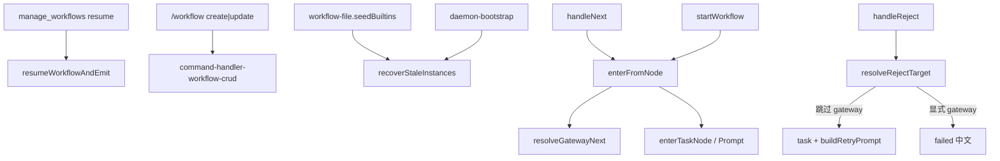

# 工作流产品缺口补齐 - 代码评审报告

## 1、审查范围

- **变更类型**: apply 产出 + T-FIX-01 修复后复评（`REV-01` 已 `fixed`）
- **评审等级**: **focused-review**（复评聚焦 Gateway/reject 契约；顺带复核 T1–T6 验收与行数门禁）
- **涉及文件**: manifest `files` 中 impl/agents；修复落点 `workflow-engine-reject.ts`、`src/workflow/AGENTS.md`
- **设计文档**: `01-proposal.md`（R1–R9）、`02-design.md`、`03-tasks.md`（含 T-FIX-01）
- **方法**: 磁盘源码 + `git diff`/`wc -l`；CodeGraph `handleReject` impact（索引对新符号滞后，以现盘为准）
- **行数硬门口径**: 本变更新建/主改写文件须 ≤300；`daemon-manager` 有历史豁免；`config-store`/`preload`/`env.d.ts` 既有超限且本变更仅字段同步，不记 open（禁止 `accepted_debt`）

**行数抽查（硬门相关）**：

| 文件 | 行数 | 结论 |
|------|------|------|
| `workflow-engine.ts` facade | 17 | ✅ |
| `workflow-engine-prompt/advance/reject/lifecycle` | 144/165/156/123 | ✅（reject 修复后仍 ≤300） |
| `workflow-gateway.ts` | 88 | ✅ |
| `server-workflow.ts` | 300 | ✅ 贴上限 |
| `command-handler-workflow.ts` / `-crud.ts` | 205/118 | ✅ |
| `WorkflowDefEditor` / `GatewayFields` / Panel / Detail | 259/110/215/111 | ✅ |

## 2、严重（必须处理）

无（评分 ≥90 的 open：无）

**已关闭（复评核实）**：

1. **REV-01 `handleReject` 回退可为 Gateway** — **fixed（T-FIX-01）**
   - 位置: `src/workflow/workflow-engine-reject.ts` — `resolveRejectTarget` + `handleReject`
   - 核实:
     - 默认回退：`while` 跳过连续 `kind===gateway`，落最近 task；路径仅有 gateway → 中文失败，不 `buildRetryPrompt`
     - 显式 `targetNodeId` 为 gateway → `failed` +「不能作为驳回重跑目标」，不组装 Prompt / 不 isolated spawn
     - `buildRetryPrompt` 仅在 `resolved.ok` 且目标为 task 之后
     - `AGENTS.md` 分工表已写明 reject 禁止对 gateway spawn
   - 契约: 与 02 §八·（二）「Gateway 不触发 `__WF_LAUNCH__` / Agent spawn」、T-FIX-01 验收一致

## 3、警告（建议处理）

无（评分 ≥75 且非已关闭项：无）

（Ponytail：引擎必拆；Gateway 自研极简 when；无新 npm；斜杠 CRUD 复用 parse。**Lean already. Ship.**）

## 4、设计偏差

1. **`resolveGatewayNext` 增加 `prevOutput` 参数**（初评遗留，非阻断）
   - 设计预期: 02 §四 签名三参
   - 实际实现: 四参，供 `contains` 作用在上一节点 output
   - 影响: 与 when 语义表一致，正向增强

2. **`handleReject` 未纳入 Gateway 穿越** — **已消除**
   - 初评缺口；T-FIX-01 以「向后跳过 gateway 至 task / 显式 gateway 失败」对齐「不 spawn」，与前进 `enterFromNode` 方向不同但契约等价

其余 R1–R9 落点与 02 对照一致。

## 5、验收标准检查

| 任务 | 验收条件 | 状态 |
|------|---------|------|
| T1 | engine facade + 拆出文件均 ≤300；re-export 稳定；AGENTS 分工表 | ✅ |
| T2 | MCP create 缺参含「YAML」「JSON」；`resume`→`resumeWorkflowAndEmit` | ✅ |
| T3 | `applyConfigPlaceholders`；缺失→空串；模板「上次本节点产出」+`LAST_NODE_OUTPUT` | ✅ |
| T4 | Gateway 类型/路由；advance/start 穿越不 spawn；DefEditor 可编 | ✅ |
| T5 | `workflowAutoPauseStale` 默认 true；开关/接线/Panel·Detail 说明；R4 一句 | ✅ |
| T6 | `/workflow create\|update` + help；复用 parse；≤300；未改 IM | ✅ |
| T-FIX-01 | B 无 target 驳回→taskA；显式 gateway→失败不 Prompt；≤300 | ✅ |
| 01 验收 1–8 | 文案/resume/驳回块/paused/Gateway/config/斜杠/IM+行数 | ✅ |
| 02 §八·（二） | recover、开关、Gateway 不 spawn（含 reject）、config、驳回标题、≤300、IM | ✅ |

## 6、调用链与回归风险

| 风险点 | 等级 | 说明 |
|--------|------|------|
| reject→gateway spawn | **已关闭** | REV-01 / T-FIX-01 |
| 首次升级批量 paused | 中（设计接受） | 默认开关 true；Panel 已说明 |
| `server-workflow.ts`=300 | 低 | 再增 action 须再拆 |
| IM / 队列 | 无 | diff 未触及 bridge/orchestrator |

## 7、遗留债务

无（禁止 `accepted_debt`）。既有超限文件观察见 §1，不入库 `reviews[]`。

知识库 `01`～`04` 对齐留待 `/kb-archive`（02 §十）。

## 8、修复任务建议

| 问题 ID | 建议动作 | 关联任务 |
|---------|----------|----------|
| — | 无 open；无需追加 T-FIX | — |

## 9、结论

**通过**，可进入 `/kb-archive`。`REV-01` 已闭环且零 open、无 debt；`stage=reviewed`。
