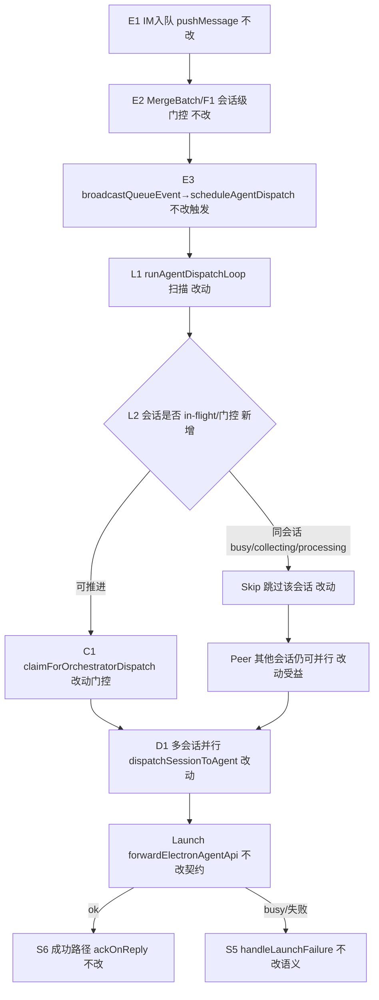
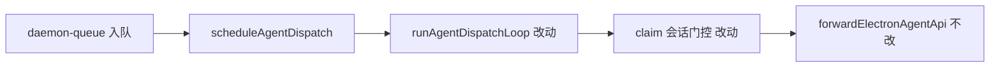

# 多会话并发调度 - 实现设计

> **业务 PRD**：见同目录 `01-proposal.md`（验收标准以 01 为准）
> **变更 ID**：`20260712170543-多会话并发调度`
> **workflow_version**：v2.6
> **硬依赖**：`20260712170438-Daemon批二拆分`（已 archived）；落点以现盘 `daemon-orchestrator*` / `daemon-queue*` 为准

## 一、业务流程与改动范围

> 业务口径以 `01-proposal.md` §四场景 S1～S6、§五 R1～R7、§六验收为准。下图覆盖入队 → 调度扫描 → 跨会话并行 launch → 同会话门控/合并/重试分支。

### （一）业务流程图

**图例**：`不改` 行为与现网一致；`改动` 需改代码；`新增` 会话级 in-flight / starting 门控；`删除` 全局串行 `await` 与「扫完一轮才放行他人」语义。

### （二）流程步骤与改动对照

| 步骤 ID | 业务含义 | 改动 | 落点（模块/文件） | 01 验收关联 |
|---------|----------|------|-------------------|-------------|
| E1 | IM 入队、磁盘队列 | 不改 | `daemon-queue.ts` `pushMessage`；`bridge/file-queue*` | §七范围外通道；S6 |
| E2 | 同会话 MergeBatch / F1 / `shouldDeferDispatch` | 不改语义 | `daemon-queue-merge.ts` | R2/R3；S3/S4 |
| E3 | 入队后 debounce 300ms 触发调度 | 不改触发点 | `broadcastQueueEvent` → `scheduleAgentDispatch` | R1 |
| L1 | 调度扫描：遍历 `getDistinctSessions` | 改动 | `daemon-orchestrator.ts` `runAgentDispatchLoop` | R1；S1；§六·6.1-1 |
| L2 | 会话级 in-flight；扫描锁不跨越 launch await | 新增 | 同上：`Set<sessionKey>` + 短生命周期 scan 锁；**删除**全局 `dispatchLoopBusy` 跨 await | R4；S2；禁止 defer |
| C1 | claim 前禁止同会话双跑（含 `starting`） | 改动 | `claimForOrchestratorDispatch`：`starting`\|`processing` 均不可 claim | R2/S6；并发安全；禁止 defer |
| D1 | 跨 sessionKey 并行启动 launch | 改动 | `runAgentDispatchLoop`：对可推进会话 fire-and-forget / `Promise.allSettled`  kickoff，**不**顺序 await | R1/R4；S1/S2 |
| Launch | Electron `POST /api/agent/launch` | 不改契约 | `forwardElectronAgentApi`；引擎侧 session busy | R5 |
| Retry | busy/失败重入队与有限重试 | 不改语义 | `daemon-orchestrator-retry.ts` | R5；S5；§六·6.1-4 |
| Ok | 成功 ack / Presentation | 不改 | `ackOnReply`、presentation 簇 | S6 |
| Idle | phase→idle 后 `flushReady`+`scheduleAgentDispatch` | 不改 | `daemon-http-routes-orchestrator.ts` | S3/S4 |
| Obs | 运维可区分会话忙 vs 全局停滞 | 改动（轻） | 保留既有关键字；可选 INFO `dispatch_parallel`/`dispatch_inflight`（实现任选，须可 grep） | R6 |
| Debt | 勾销「单条顺序 dispatch」债注释 | 改动 | `daemon-queue-merge-action.ts` ponytail 注释；`src/daemon/AGENTS.md` 调度节 | R7；01 §八 T7 |

### （三）改动汇总

- **改动**：`runAgentDispatchLoop` / `scheduleAgentDispatch` 并发模型；`claimForOrchestratorDispatch` 同会话门控含 `starting`；T7/ponytail 注释与 AGENTS 调度描述。
- **新增**：会话级 `inFlightSessions`（或等价）；短生命周期 scan 锁（不跨 launch await）。
- **不改（显式列出）**：MergeBatch phase 语义、`shouldDeferDispatch`/`isMergeDispatchAllowed`、file-queue 磁盘格式、retry/ack 策略、飞书/微信出站协议、Electron 引擎 busy、HTTP 路径、跨机器分布式队列、Daemon 枢纽再拆（批二已完成）。

## 二、整体思路

**根因**（CodeGraph + 现盘）：`daemon-orchestrator.ts` 中 `dispatchLoopBusy` 为**全局**互斥，且 `for … await dispatchSessionToAgent` 使会话 A 的 launch HTTP await 阻塞会话 B 的 claim/启动；期间新的 `scheduleAgentDispatch` 因 busy 直接 return，加剧跨会话排队。同会话顺序本已由 `shouldDeferDispatch` + `sessionAgentPhaseMap` + 单 session claim 保证，**不必**全局串行。

**方案要点**（会话间并行、会话内串行）：

1. **会话级 in-flight**：某 sessionKey 正在 dispatch 时跳过该键，其它键可 kickoff。
2. **扫描锁短持有**：仅保护「枚举 + 标记 + 启动」同步段；**禁止**再持全局锁跨越 `forwardElectronAgentApi` await。
3. **同会话防双跑**：claim 将 `starting` 与 `processing` 同等视为不可领取（现网仅挡 `processing`，并发后窗口会双 claim——**本变更必须修，禁止 defer**）。
4. **可靠性正交**：继续走既有 `handleLaunchFailure` / ackOnReply；不改退避与耗尽语义。
5. **行数**：`daemon-orchestrator.ts` 现 **294** 行；并发改造若将超 300，按既有模式拆 `daemon-orchestrator-dispatch.ts`（仅 loop/in-flight），禁止预建通用调度框架。

**与 01 追溯**：覆盖 R1～R7、S1～S6、§六；关闭 T7「单条顺序 dispatch」产品债。

**最小方案三问**：

1. **能否复用现有模块？** 能。只改 `createOrchestrator` 内 loop/claim；复用 `getDistinctSessions`、`shouldDeferDispatch`、retry/notify。
2. **拟新增抽象是否被 01 要求？** 否。不引入 worker pool / 优先级队列 / 第三方库；仅 `Set`+短 scan 锁。
3. **能否合并到已有文件？** 优先原地改 `daemon-orchestrator.ts`；仅因 ≤300 硬约束才拆 `daemon-orchestrator-dispatch.ts`。

## 三、分层设计

- **端点层**：HTTP `session-agent-phase` / `agent/launch|dispatch` **不改**契约；idle 仍 `scheduleAgentDispatch`。
- **服务层**：`daemon-orchestrator` 调度并发语义为本变更唯一主战场；queue-merge 仅注释/文档对齐。
- **数据层**：无持久化 schema 变更；`sessionAgentPhaseMap` / in-flight 均为进程内。

可选分层关系：

## 四、接口设计

无新增对外 HTTP/MCP。内部行为变更：

- `scheduleAgentDispatch(sessionKey?)`：签名不变；实现须允许「他会话 in-flight 时仍可扫描 kickoff 本轮可推进会话」。
- `runAgentDispatchLoop()`：语义由「全局串行一轮」改为「扫描并并行 kickoff 非 in-flight 会话」。
- `claimForOrchestratorDispatch`：`starting` 与 `processing` 均返回 `{ ok: false }`。

## 五、数据结构

无磁盘/配置表变更。进程内新增（命名以实现为准）：

| 结构 | 键 | 含义 |
|------|-----|------|
| `inFlightSessions` | `sessionKey` | 本轮已 kickoff、尚未结束的 dispatch（含 claim 失败快速路径的 finally 清理） |
| scan 锁 | 布尔 | 仅防扫描重入叠扫；**不**跨 launch await |

`sessionAgentPhaseMap` 既有；成功 launch 后仍由 Electron 报 `processing`/`idle`。

## 六、实现步骤

1. **C1**：`claimForOrchestratorDispatch` 门控扩展为 `starting`\|`processing`（步骤 C1）。
2. **L2/D1**：以会话 `Set` 替换全局 `dispatchLoopBusy` 跨 await；loop 对可推进会话并行 kickoff（步骤 L1/L2/D1）。
3. **行数门禁**：若 `daemon-orchestrator.ts`>300，拆 `daemon-orchestrator-dispatch.ts` 并经工厂注入（步骤 L1）。
4. **Obs/Debt**：保留 `dispatch_failed`/`agent_busy_requeue`/`dispatch_retry_*`；更新/删除「单条顺序」ponytail；同步 `src/daemon/AGENTS.md` Orchestrator 节（步骤 Obs/Debt）。
5. **回归**：对照 S1～S6 与已归档 dispatch 重入队矩阵做手工/契约验收（步骤 Retry/Ok）。

## 七、参考实现

| 符号 | 路径 | 用途 |
|------|------|------|
| `createOrchestrator` / `runAgentDispatchLoop` / `dispatchLoopBusy` | `src/daemon/daemon-orchestrator.ts` | 串行根因与改动主落点 |
| `dispatchSessionToAgent` / `claimForOrchestratorDispatch` | 同上 | claim→launch；须加 starting 门控 |
| `createDispatchRetry` | `src/daemon/daemon-orchestrator-retry.ts` | 可靠性不改 |
| `shouldDeferDispatch` / `performClaimAndMerge` | `src/daemon/daemon-queue-merge.ts` | 同会话合并门控不改 |
| `getDistinctSessions` | `src/bridge/file-queue-query.ts`（经 file-queue 入口） | 扫描会话列表 |
| 引擎 `agent busy` | `electron/agent/*/agent-*-sdk.ts` | 会话级 busy；与 Daemon 并行正交 |
| 批二边界 | 归档 `20260712170438` design「不改调度并发」 | 本变更承接 T7 |

## 八、技术影响

### （一）影响范围

- **涉及模块**：Daemon orchestrator（主）；queue-merge 注释；`src/daemon/AGENTS.md`。
- **接口/proto**：无。
- **数据**：无持久化变更。
- **风险**：同会话双 claim（用 starting+in-flight 消除）；扫描过频（保持 300ms debounce）；文件超 300 行（预拆 dispatch 子文件）。

### （二）工程补充验收项

- [ ] 双独立 sessionKey 几乎同时有待办时，第二路 launch **不必**等第一路 `forwardElectronAgentApi` 返回（可用日志时间戳或断点观察）。
- [ ] 同 sessionKey 在 `starting` 期间第二次 claim 必失败；无双 launch。
- [ ] 会话 A `collecting`/合并卡等待时，会话 B 仍可 kickoff。
- [ ] busy/失败仍出现 `agent_busy_requeue` / `dispatch_retry_*` / `dispatch_failed`；成功路径无提前 ack。
- [ ] `daemon-orchestrator*.ts` 各文件 ≤300 行；中文注释。

## 九、知识库影响

- `knowledge/工程平台/Daemon守护进程/01-概览.md` — 「未做…调度并发改造」须改写。
- `knowledge/业务域/Agent调度/01-概览.md` / `02-多会话模型.md` — 补充「会话间并行、会话内顺序」。
- `knowledge/工程平台/Daemon守护进程/02-HTTP与MCP服务.md` — 若记载 dispatch loop 串行，archive 时对齐。
- 两级索引：通常不改目录入口；仅正文更新时由 librarian 维护 README 准确性。

## 十、知识库更新计划

### （一）必须更新

- Daemon `01-概览` 全局已知限制：去掉「未做调度并发」；改为会话间并行现状与剩余限制（若有）。
- Agent 调度 `01-概览` 或 `02-多会话模型`：写明跨 sessionKey 并行、同会话 MergeBatch/phase 串行。

### （二）可能更新（视实现结果）

- Daemon `02-HTTP与MCP服务.md`（若含 orchestrator loop 细节）。
- `src/daemon/AGENTS.md`（工程约定，apply 阶段维护；知识库 archive 引用对齐）。

### （三）不需要更新

- 消息桥接出站协议文档、微信/飞书通道体验文档（本变更不改通道）。
- 工作流 / 定时任务知识（非 IM dispatch loop 主路径）。
