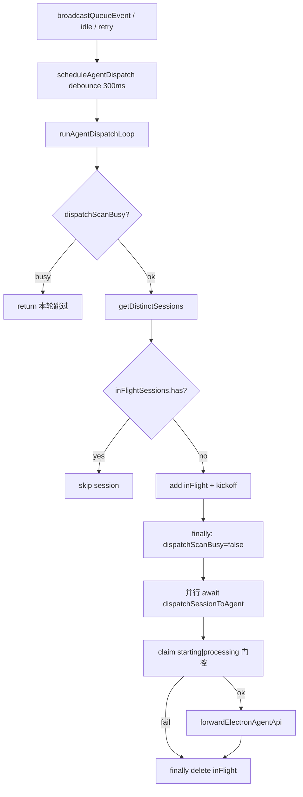

# 多会话并发调度 - 代码评审报告

## 1、审查范围

- **变更类型**: apply 产出的未提交变更（`stage: applied` → 本轮评审）
- **评审等级**: full-review（标准流程 + 调度并发热路径；单端 Daemon，无跨端契约）
- **涉及文件**: 4 个实现/文档文件（`daemon-orchestrator.ts`、`daemon-orchestrator-dispatch.ts`、`daemon-queue-merge-action.ts`、`src/daemon/AGENTS.md`）+ 变更文档
- **设计文档**: `02-design.md`（对照基准）；验收溯源 `03-tasks.md` T1～T4、`01-proposal.md` S1～S6
- **CodeGraph**: `codegraph_context`（`createOrchestrator` / schedule 触发链）；`codegraph_callers(scheduleAgentDispatch)` → `broadcastQueueEvent`；新符号 `createOrchestratorDispatch` / `inFlightSessions` 索引滞后，以源码 + diff 复核

## 2、严重（必须处理）

无

## 3、警告（建议处理）

无

**Ponytail #6**：`Lean already. Ship.` — 拆 `daemon-orchestrator-dispatch.ts` 符合 `02` 行数门禁与最小方案三问；仅用 `Set` + 短 scan 锁，无 worker pool / 未批准依赖。可选 shrink（`void Promise.allSettled` 在 IIFE 已自捕异常时略冗余）评分低于 75，不列入 open。

## 4、设计偏差

无

- 预期 C1：`starting`|`processing` 同挡 — 已实现于 `claimForOrchestratorDispatch`
- 预期 L2/D1：会话级 `inFlightSessions` + `dispatchScanBusy` 不跨 launch await + 并行 kickoff — 已实现于 `createOrchestratorDispatch`
- 预期 Obs/Debt：`dispatch_parallel` 可 grep；T7「单条顺序 dispatch」注释已改写；AGENTS 调度节已对齐

## 5、验收标准检查

| 任务 | 验收条件 | 状态 |
|------|---------|------|
| T1 | `starting` 期间二次 claim 失败 | ✅ 源码：`phase === "starting" \|\| "processing"` |
| T1 | `processing` 仍不可 claim；idle/无 phase 路径不变 | ✅ |
| T1 | 中文注释说明同挡原因 | ✅ |
| T1 | 无未批准抽象/依赖 | ✅ |
| T2 | 双 session 第二路 launch 不必等第一路 `forwardElectronAgentApi` | ✅ `void Promise.allSettled(kickoffs)`，scan 锁在 await 前释放 |
| T2 | 同 session in-flight/starting/processing 无双 kickoff；他 session 可推进 | ✅ Set + phase 门控 |
| T2 | 无跨 await 的全局 `dispatchLoopBusy` | ✅ 已删除 |
| T2 | `daemon-orchestrator*.ts` 各 ≤300 行；中文注释 | ✅ 285 / 72 / 96 / 36 |
| T3 | 无「单条顺序 dispatch」误导表述 | ✅ |
| T3 | AGENTS 会话间并行、会话内串行 | ✅ |
| T3 | `dispatch_failed` / `agent_busy_requeue` / `dispatch_retry_*` 可 grep | ✅；另增 `dispatch_parallel` |
| T4 | S1～S6 + 02 八·（二）源码契约 | ✅ manifest T4 note；本轮源码复核一致 |

## 6、调用链与回归风险

| 风险点 | 评估 |
|--------|------|
| 同会话双 launch | 低：in-flight 覆盖 kickoff 全程；claim 挡 starting/processing |
| 跨会话仍串行 | 低：已去掉全局跨 await busy |
| busy/失败重试误伤他会话 | 低：retry 仍按 sessionKey；关键字保留 |
| scan busy 丢唤醒 | 低：唯一入口为 debounce timer；叠扫时 `scheduleAgentDispatch` 会再排 300ms |
| 知识库正文 | archive 时按 `02` §十更新 Daemon/Agent 调度文档（本轮不改） |

## 7、遗留债务

无

## 8、修复任务建议

| 问题 ID | 建议动作 | 关联任务 |
|---------|----------|----------|
| — | 无 open 问题，无需 T-FIX | — |

## 9、结论

**通过**，可进入 `/kb-archive`（manifest `reviews` 为空；零 open / 零 accepted_debt）。无需派 kb-builder。
