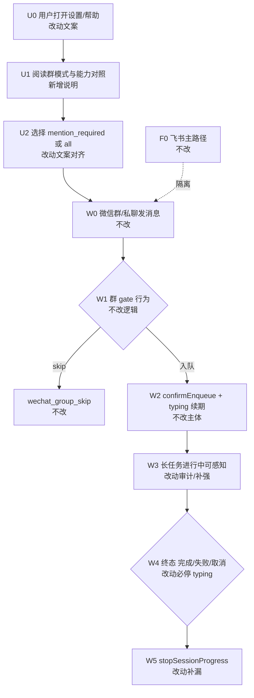
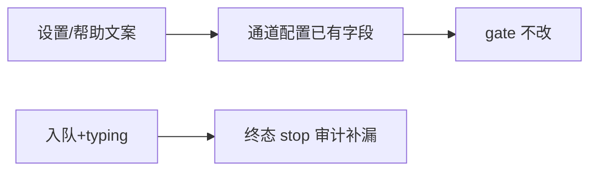

# 微信通道体验对齐 - 实现设计

> **业务 PRD**：见同目录 `01-proposal.md`（验收标准以 01 为准）
> **Figma**：无新视觉（`auto-none`）；文案落既有辅助说明区

## 一、业务流程与改动范围

> 业务口径以 `01-proposal.md` 场景 S1–S6、需求 R1–R6、验收 §6 为准。工程 gate/4s 续期/`wxc_` track 已由 `20260712145946` 落地；本变更补**产品可感知体验**与**用户可见说明**，不重写协议层。

### （一）业务流程图

**图例**：`不改` = 现网逻辑保持；`改动` = 文案或审计补强；`新增` = 用户可见说明块；`删除` = 本期无。

### （二）流程步骤与改动对照

| 步骤 ID | 业务含义 | 改动 | 落点（模块/文件） | 01 验收关联 |
|---------|----------|------|-------------------|-------------|
| U0 | 进入通道编辑 / 帮助引导 | 改动 | `ChannelEditWechat.tsx`；`SettingsSetupTab.tsx` | R5、S5、§6.1-4 |
| U1 | 群模式说明 + 主次能力对照可读 | 新增 | 同上（辅助文本，无新布局组件） | R1/R2/R5、S1/S2/S5 |
| U2 | `mention_required` / `all` 名称与行为一致 | 改动 | `ChannelEditWechat.tsx` option/说明文案 | R1、§6.1-1 |
| W0 | iLink 收消息 | 不改 | `wechat-manager.ts` | — |
| W1 | 群 gate / 别名 | 不改 | `daemon-channel-wechat.ts`；`wechat-group-enqueue-gate.ts` | S1/S2 行为已有 |
| SKIP | 未命中不入队 + 日志 | 不改 | `wechat_group_skip` | R2 排障指引引用 |
| W2 | 入队确认 + 4s typing 续期 | 不改（主体） | `daemon-presentation-enqueue.ts`；`startProgressTyping` | R3 依赖现网 |
| W3 | 长任务期间 typing 不长时间消失 | 改动 | 联调/契约审计 `wechat_typing_refresh`；必要时微调续期间隔或失败 WARN 可观测 | R3、S3、§6.1-2 |
| W4 | 完成/失败/取消终态 | 改动 | 全路径审计 `stopSessionProgress` 调用点；缺口必补 | R4、S4、§6.1-3 |
| W5 | 停止 typing + 清 timer | 改动 | `daemon-presentation-handlers.ts`；`wechat-manager.ts` `stopProgressTyping` | R4 |
| F0 | 飞书合并卡/菜单/Get+CardKit | 不改 | 飞书 presentation 全链路 | R6、S6、§6.1-5 |

### （三）改动汇总

**改动**

- `ChannelEditWechat`：群模式 option 旁补充用户可读说明（启发式局限、`all` 适用场景、`wechatBotDisplayName` 用途、排障关键字 `wechat_group_skip`）。
- 终态 typing：审计并补齐所有完成/失败/取消路径对 `stopSessionProgress` 的调用，禁止残留 typing（**禁止 defer**）。
- 长任务可感知：在既有 4s 续期上做联调/契约验收；若发现续期失败静默，补 WARN 可观测或最小修复。

**新增**

- `SettingsSetupTab`（帮助引导）：飞书（主）/ 微信（次）能力对照摘要（群过滤、进行中、track、合并/菜单），口径对齐知识库 `01-概览` §九。

**不改（显式）**

- gate 纯函数逻辑、`wechatGroupEnqueueMode` 字段形状、4s 续期主体、`wxc_` track 语义。
- iLink 协议、飞书 CardKit/合并卡/菜单、Daemon 调度内核、二期合并连发/菜单（R7/R8）。
- `wechat-manager.ts` 超 300 行预存债：本期若仅审计/小修，**不**顺手大拆（另开变更）；若触改导致超限，按 AGENTS 就地拆最小相关函数，仍不扩 scope。

## 二、整体思路

**根因**：前置变更补齐了工程能力，但设置文案偏短、帮助无主次对照；用户对启发式 @、长任务 typing、能力落差仍难预期。部分终态路径若漏 `stopSessionProgress`，会出现「结束后仍在处理」。

**方案要点**（对齐 01 R1–R6）：

1. **文案先行、无新视觉**：说明落在既有表单项下方与帮助引导区块，不新增独立「文案区」组件/路由。
2. **行为已有、说明对齐**：gate/`all`/别名行为以现盘为准，改的是可读性与一致性，不改判定算法。
3. **质量门（禁止 defer）**：知识库 §九「typing 可感知性」「启发式须产品说明」属本变更可修范围，须纳入实现与验收；不得标「二期再说」。`wxc_*` 边界写入能力对照即可；manager 行数债不属产品验收，不阻塞本期。
4. **终态必停**：以 `daemon/AGENTS.md` 会话进度规矩为 SSOT，对照 `ackOnReply`、`stream-text final`、`stop_progress`、notify 失败、取消等路径做缺口清单并修复。

**最小方案三问**

1. **复用现有模块？** 是 — UI 复用 `ChannelEditWechat` / `SettingsSetupTab`；进度复用 `sessionProgressMap` + `stopSessionProgress`；不新建通道说明服务。
2. **新增抽象必要？** 否 — 文案可 inline 或抽同文件常量；禁止预建「帮助中心」框架。若两处文案需同源，最多抽 `channel-capability-copy.ts` 纯文案常量（YAGNI：仅当重复出现时）。
3. **合并文件？** 优先改现有两文件；`ChannelEditWechat` / `SettingsSetupTab` 触顶 300 行时再拆辅助说明子块，不预建。

## 三、分层设计

| 层 | 落点 | 职责 |
|---|---|---|
| 渲染端设置 | `ChannelEditWechat.tsx` | 群模式/显示名辅助说明 |
| 渲染端帮助 | `SettingsSetupTab.tsx` | 主次通道能力对照 |
| Daemon 进度 | `daemon-presentation-handlers.ts` 等 stop 调用链 | 终态必停 typing |
| Bridge | `wechat-manager.ts` | 续期可观测；stop 清 timer（主体不改） |
| 配置/类型 | `channel-types` / preload / env.d.ts | **不改字段**；仅消费既有配置 |

可选分层示意（不替代「一·（一）」业务流）：

## 四、接口设计

无。不新增 HTTP/IPC/proto。沿用既有 `saveConfig({ channels })`、`wechatGroupEnqueueMode`、`startProgressTyping` / `stopProgressTyping` / `stopSessionProgress`。

## 五、数据结构

无。不扩展表/模型字段；能力对照为静态文案。若抽文案常量，仅为 TS 字符串表，非持久化 schema。

## 六、实现步骤

1. **S1 群模式文案（U1/U2）**：`ChannelEditWechat` 补 `mention_required`/`all` 说明、启发式局限、显示名用途、`wechat_group_skip` 排障一句 → 01 §6.1-1、R1/R2。
2. **S2 能力对照（U0/U1）**：`SettingsSetupTab` 增加飞书/微信对照摘要（对齐概览 §九；合并/菜单标「微信一期无」）→ R5、§6.1-4。
3. **S3 终态停 typing 审计（W4/W5）**：列出并核对 `ackOnReply`、`/api/stream-text` final、`stop_progress`、notify、`send-image|file`、取消/失败路径；缺口必补，写清调用点 → R4、§6.1-3。
4. **S4 长任务可感知（W3）**：契约或实机约定 ≥2 分钟窗口内应持续出现 `wechat_typing_refresh`；续期失败须 WARN；最小修复不改飞书 → R3、§6.1-2。
5. **S5 飞书回归（F0）**：抽检入队、合并、菜单、进度展示无退化 → R6、§6.1-5。
6. **S6 注释与行数**：中文注释；触改文件 ≤300 行。

## 七、参考实现

CodeGraph / 现盘（`projectPath=/home/suveng/doger/cursor-claw`）：

| 符号 / 文件 | 路径 | 用途 |
|-------------|------|------|
| `ChannelEditWechat` | `src/renderer/components/ChannelEditWechat.tsx` | 群策略 UI（现仅短 label） |
| `ChannelPanel` | `src/renderer/components/ChannelPanel.tsx` | 通道列表；编辑入口 |
| `SettingsSetupTab` | `src/renderer/pages/SettingsSetupTab.tsx` | 帮助引导（现偏飞书） |
| `initWeChatChannel` | `src/daemon/daemon-channel-wechat.ts` | 群 gate 接线（不改逻辑） |
| `shouldEnqueueWechatGroupMessage` | `src/daemon/wechat-group-enqueue-gate.ts` | @ 启发式 SSOT |
| `startProgressTyping` / `stopProgressTyping` | `src/bridge/wechat-manager.ts` | 4s 续期与停 |
| `confirmEnqueueAndStartProgress` | `src/daemon/daemon-presentation-enqueue.ts` | 入队启 typing |
| `stopSessionProgress` | `src/daemon/daemon-presentation-handlers.ts` | 停 typing SSOT |
| send 路径 stop | `daemon-http-routes-send.ts`；`daemon-orchestrator-notify.ts`；`daemon-presentation-stream.ts` | 终态审计清单 |

前置设计：`knowledge/变更/归档/20260712145946-微信通道入队与进度对齐/02-design.md`。

## 八、技术影响

### （一）影响范围

- **模块**：renderer 设置/帮助；daemon presentation 停进度路径（仅补漏时）；bridge typing（仅可观测/小修）。
- **接口/proto**：无。
- **数据**：无。
- **风险**：文案与知识库双口径漂移 → 对照表以概览 §九 为 SSOT；补 stop 时误伤飞书 → 改动限微信 `typingActive` 分支与共享 stop 调用完整性，飞书 Get 语义不改。

### （二）工程补充验收项

- [ ] `ChannelEditWechat` 可见说明覆盖：启发式局限、`all` 场景、显示名、skip 日志关键字。
- [ ] `SettingsSetupTab` 对照表含群过滤 / 进行中 / track / 合并·菜单四项，与概览 §九 一致。
- [ ] 终态路径清单无遗漏 `stopSessionProgress`（完成、失败、取消均覆盖）。
- [ ] 长任务约定窗口内 typing 续期可观测（日志或契约）；失败有 WARN。
- [ ] 飞书主路径抽检通过；微信不假装 CardKit/合并卡。
- [ ] 中文注释；触改文件 ≤300 行；无 02/03 未要求的抽象层。

## 九、知识库影响

- `knowledge/业务域/消息桥接/01-概览.md` — 中：§九 对照表与设置/帮助用户口径对齐（archive 确认）。
- `knowledge/业务域/消息桥接/03-微信通道.md` — 中：产品说明、typing 可感知验收结论、§九 限制收敛。
- `knowledge/业务域/消息桥接/02-飞书通道.md` — 低：仅对照引用。
- `knowledge/工程平台/Electron桌面应用/`（若有 ChannelPanel/帮助记载）— 低～中：文案落点一句。
- 两级索引：叶子更新即可，原则上不改 `知识索引.md`。

## 十、知识库更新计划

### （一）必须更新

- `03-微信通道.md`：§九 将「可感知性建议联调」收敛为本期验收结论；补充用户可见配置/说明入口。
- `01-概览.md`：§九 对照表与设置/帮助文案一致（若实现微调措辞则回写）。

### （二）可能更新（视实现结果）

- Electron 桌面应用分区：若存在设置页专文，补 ChannelEdit / SetupTab 落点。
- `02-飞书通道.md`：仅当对照引用句需改时。

### （三）不需要更新

- gate/typing/track 工程主体（已由前置 archive 写入）。
- Agent 调度域、工作流域正文。
- `知识索引.md`（无新领域文件）。
