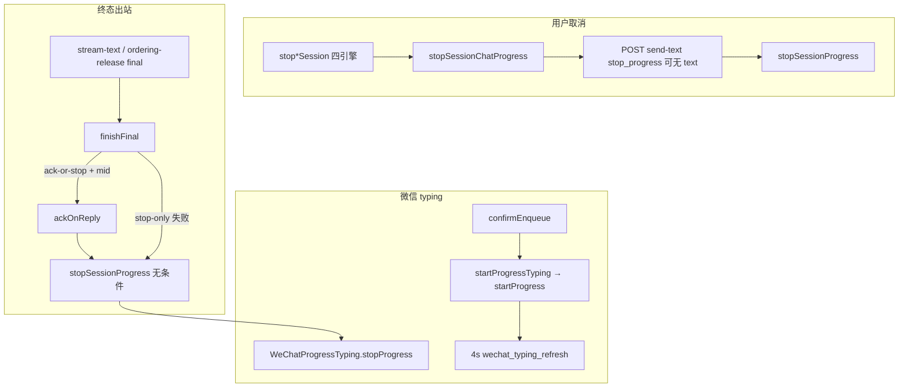

# 微信通道体验对齐 - 代码评审报告

> **复评**（R1/R2 已 fixed；对照 T-FIX-01 / T-FIX-02 与现盘 diff）

## 1、审查范围

- **变更类型**：apply 产出的未提交变更（含 T-FIX 拆分与 finishFinal 补强）
- **评审等级**：full-review（复评聚焦 R1/R2 闭环 + 原 T1–T5 验收复核；无 proto/DB）
- **涉及文件**：约 19 个代码/约定文件 + 本报告
  - UI：`ChannelEditWechat.tsx`、`SettingsSetupTab.tsx`、`renderer/components/AGENTS.md`
  - 终态 stop：`daemon-presentation-handlers.ts`、`daemon-presentation-stream.ts`、`daemon-presentation-ordering-release.ts`、`daemon-http-routes-send.ts`、`daemon-orchestrator-notify.ts`、`daemon-orchestrator.ts`、`daemon-wire.ts`、`daemon/AGENTS.md`
  - 取消停 typing：`run-notify.ts`、`sdk-run-lifecycle.ts`、四引擎 `stop*Session`、`electron/agent/shared/AGENTS.md`
  - typing 拆分（T-FIX-01）：`wechat-manager.ts`、`wechat-progress-typing.ts`、`wechat-manager-types.ts`、`bridge/AGENTS.md`
- **设计文档**：`02-design.md`、`03-tasks.md`（对照基准）
- **CodeGraph**：`stopSessionProgress` impact；`startProgressTyping` / `WeChatProgressTyping`；`finishFinal` 双调语义
- **既有 reviews**：R1/R2 状态均为 `fixed`，本轮只复核是否仍成立，不重复开单

## 2、严重（必须处理）

无。

**R1 复核（原严重 → fixed）**

- 原问题：触改后 `wechat-manager.ts` 391 行 > AGENTS ≤300。
- 现盘：`wechat-manager.ts` **296** 行；`wechat-progress-typing.ts` **132** 行；`wechat-manager-types.ts` **31** 行。
- 门面委托 `WeChatProgressTyping`；`stop()` 调 `typing.clearAll()`；域外仅经 `wechat-manager.js`（`bridge/AGENTS.md` 已禁止 daemon 直引 typing/types）。
- 结论：闭环成立，**保持 fixed**。

## 3、警告（建议处理）

无（评分 ≥75 的新问题为 0）。

**R2 复核（原警告 → fixed）**

- 原问题：`finishFinal("ack-or-stop")` 有 `message_id` 时仅 `ackOnReply`；ack 空集早退可能漏 stop。
- 现盘：`daemon-presentation-stream.ts` / `daemon-presentation-ordering-release.ts` 均在 ack 后**无条件** `stopSessionProgress`（幂等；注释与 `daemon/AGENTS.md` 完成路径规矩一致）。
- 与 send-image/file 双调对齐；`stopSessionProgress` 无 state 早退。
- 结论：闭环成立，**保持 fixed**。

**Ponytail 精简检查**

1. **Lean already. Ship.** — typing 拆分为 AGENTS/R1 硬限所逼，非预建框架；文案仍 inline。
2. **shrink（可选）:** stream 与 ordering-release 各一份 `finishFinal`（约 5 行）— 可抽共享，非必须，不阻断。
3. **yagni:** 未新建帮助中心/跨通道文案服务，符合 `02` §2 三问。

## 4、设计偏差

无。

首轮「行数债 vs 触改 ≤300」冲突已由 T-FIX-01 就地拆分消解；产品行为（gate/4s 续期/`wxc_` track）未改。

## 5、验收标准检查

| 任务 | 验收条件 | 状态 |
|------|---------|------|
| T1 | 启发式局限、`all` 场景、显示名、`wechat_group_skip` 可见 | ✅ |
| T1 | option 与入队语义一致；无新布局/抽象；≤300 | ✅（110 行） |
| T2 | 四项对照与概览 §九一致；微信一期无合并/菜单 | ✅ |
| T2 | ≤300；无帮助中心抽象 | ✅（191 行） |
| T3 | 完成/失败/取消覆盖 stop；禁止 defer | ✅（含 finishFinal 无条件 stop） |
| T3 | 飞书 Get 语义无故意变更 | ✅ |
| T3 | 触改 ≤300 | ✅ |
| T4 | ≥2min 窗口 refresh 可观测；失败 WARN | ✅（`wechat_typing_refresh` INFO + 无 ticket/抛错 WARN） |
| T4 | 不改飞书；中文注释 | ✅ |
| T5 | 飞书主路径无退化（代码级） | ✅ |
| T5 | 触改 ≤300 / 注释 / 无未批准抽象 | ✅（manager 已拆 ≤300） |
| T-FIX-01 | 门面与新增文件均 ≤300；对外 API 不变 | ✅ |
| T-FIX-02 | ack 空集仍 stop；与 send-image/file 双调一致 | ✅ |

## 6、调用链与回归风险

| 回归点 | 风险 | 结论 |
|--------|------|------|
| 飞书 Get/CardKit/合并/菜单 | 低 | 无故意语义改动；final 双调 stop 幂等 |
| ack 后再 stop | 低 | handlers 无 state 早退，安全 |
| typing 模块拆分 | 低 | 对外 API 不变；daemon 不直引子模块 |
| 仅 stop_progress 无 text | 低 | send-text 契约放宽；三态进度仍不带 stop |

## 7、遗留债务

无（**禁止** `accepted_debt`；本轮 open=0、debt=0）。

旁注（不入 reviews、不阻断 archive）：若工作区仍见归档契约 `run-notify-contract.mts` 旁路改动，合入时对齐对应归档变更白名单或回滚说明即可。

## 8、修复任务建议

无（R1/R2 已由 T-FIX-01 / T-FIX-02 闭环；无需新开 T-FIX）。

## 9、结论

**通过**，可进入 `/kb-archive`。open=**0**，无 `accepted_debt`；R1/R2 复核仍为 `fixed`。
