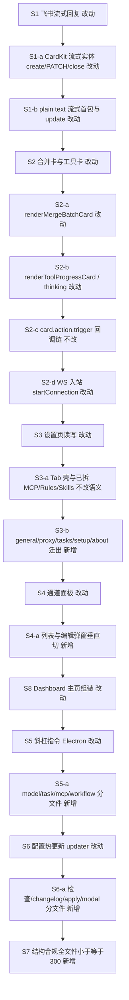
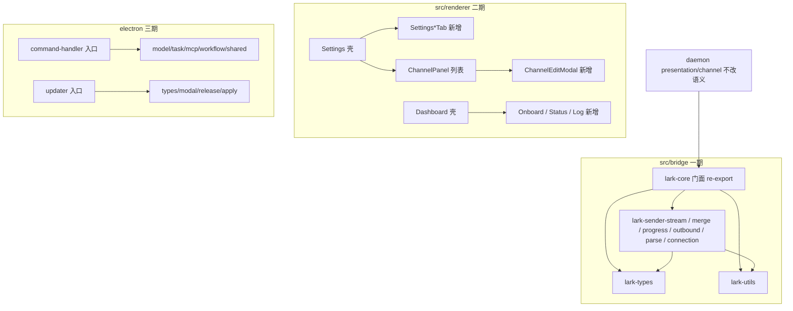

# 超限模块拆分续 - 实现设计

> **业务 PRD**：见同目录 `01-proposal.md`（验收标准以 01 为准）
> **现盘锚点（CodeGraph + `wc -l`，2026-07-12）**：Daemon 批二已 archived，`src/daemon/*.ts` 均 ≤300；本变更**不以批二前状态设计**。现盘仍超限且本轮必切：`lark-core.ts` 1190、`Settings.tsx` 962、`Dashboard.tsx` 764、`ChannelPanel.tsx` 687、`updater.ts` 864、`command-handler.ts` 750。
> **质量门**：纳入范围的超限文件本轮一次性切至 ≤300，**禁止** defer「下期再说」。

## 一、业务流程与改动范围

> 业务口径以 `01-proposal.md` §五场景 S1～S7、§六 R1～R8、§七验收为准。本变更为**纯结构搬迁**，用户可见语义不变；流程图覆盖飞书主路径、设置/通道 UI、斜杠与更新旁路。

### （一）业务流程图

**图例**：`不改` 行为与现网契约一致（仅可能改 import）；`改动` 源码从超限文件迁出或接线调整；`新增` 本变更新建拆分文件；`删除` 原文件内大段实现（迁出后删除内嵌体）。

### （二）流程步骤与改动对照

| 步骤 ID | 业务含义 | 改动 | 落点（模块/文件） | 01 验收关联 |
|---------|----------|------|-------------------|-------------|
| S1 | Agent 产出经飞书桥接流式展示 | 改动 | `src/bridge/lark-core.ts` 瘦身为 `LarkSender` 门面 + re-export；流式方法迁出 | §七·7.1-1；场景 S1；R1/R2 |
| S1-a | CardKit 流式 create / PATCH / close | 改动 | **新增** `lark-sender-stream.ts`：`createStreamingCardEntity`、`sendStreamingCardMessage`、`updateStreamingCardText`、`closeStreamingCardMode` | §七·7.1-1；R1 |
| S1-b | plain text 流式首包与增量 | 改动 | 同上或并入 `lark-sender-outbound.ts`：`sendStreamMessage`、`updateMessageContent` | §七·7.1-1 |
| S2 | 合并卡 / 工具卡 / 思考卡 | 改动 | **新增** `lark-sender-merge.ts`、`lark-sender-progress.ts`（tool/thinking/help） | §七·7.1-1～2；场景 S2；R1/R2 |
| S2-a | `renderMergeBatchCard` 及实体 PATCH | 改动 | `lark-sender-merge.ts` | §七·7.1-1～2 |
| S2-b | `renderToolProgressCard` / `renderThinkingCard` / help | 改动 | `lark-sender-progress.ts`（单文件若逼近 300 再拆 `lark-sender-help.ts`） | §七·7.1-1 |
| S2-c | `card.action.trigger` → merge 动作 | 不改 | `src/daemon/feishu-card-action.ts`、`feishu-event-handlers.ts`；仅继续 import `LarkSender` / 类型 | §七·7.1-2 |
| S2-d | WS 连接与入站解析 | 改动 | **新增** `lark-sender-connection.ts`、`lark-sender-parse.ts`；类型 → `lark-types.ts`；工具 → `lark-utils.ts` | §七·7.1；R1 |
| S3 | 设置页各 Tab 读写保存 | 改动 | `src/renderer/pages/Settings.tsx` 收敛为 Tab 壳 | §七·7.2-1；场景 S3；R3/R5 |
| S3-a | 已拆 MCP/Rules/Skills/Agent/Channel/Workflow | 不改语义 | 既有 `SettingsMcp*`、`SettingsRulesPanel`、`SettingsSkillsPanel`、`AgentPanel`、`ChannelPanel`、`WorkflowPanel`；仅被壳引用 | §七·7.2-1 |
| S3-b | general / proxy / tasks / setup / about 内联 JSX | 新增 | **新增** `SettingsGeneralTab.tsx`、`SettingsProxyTab.tsx`、`SettingsTasksTab.tsx`、`SettingsSetupTab.tsx`、`SettingsAboutTab.tsx` | §七·7.2-1～2；R3/R8 |
| S4 | 通道列表面板与编辑 | 改动 | `ChannelPanel.tsx` 保留列表；编辑弹窗迁出 | §七·7.2；场景 S4；R4/R5 |
| S4-a | 飞书/微信编辑、扫码、凭据 | 新增 | **新增** `ChannelEditModal.tsx`（必要时再拆 `ChannelEditWechat.tsx`）；辅助 → `channel-panel-helpers.ts` | §七·7.2-2；R4/R8 |
| S5 | Electron 斜杠 model/task/mcp/workflow | 改动 | `electron/scheduling/command-handler.ts` 改为 barrel + 薄转发 | §七·7.3（本轮必做，不 defer）；场景 S5；R6/R8 |
| S5-a | 按指令族垂直切 | 新增 | **新增** `command-handler-model.ts`、`command-handler-task.ts`、`command-handler-mcp.ts`、`command-handler-workflow.ts`；共享 → `command-handler-shared.ts` | §七·7.3；R6 |
| S6 | 应用内更新检查与安装 | 改动 | `electron/config/updater.ts` 瘦身入口 | §七·7.3（本轮必做）；场景 S6；R7/R8 |
| S6-a | 检查 / changelog / modal / brew·win apply | 新增 | **新增** `updater-types.ts`、`updater-modal.ts`、`updater-release.ts`、`updater-apply.ts`；入口保留公开 API | §七·7.3；R7 |
| S7 | 纳入范围各文件 ≤300 | 新增 | 上表全部新建文件 + 瘦身后主文件；`wc -l` 硬验收 | §七·7.1-3、7.2-2、7.3-2、7.4；场景 S7；R8 |
| S8 | Dashboard 状态卡 / 引导 / 日志 | 改动 | **现盘超限补入**（01 未列，但 `Dashboard.tsx` 764 行）：拆 `DashboardOnboard.tsx`、`DashboardLogPanel.tsx`（含 `LogLine`）、`DashboardStatusCards.tsx`；壳 ≤300 | §七·7.4 + 工程补充；与 S3 同属渲染端续拆 |

### （三）改动汇总

- **改动**：
  - `src/bridge/lark-core.ts`：删除大段实现，保留 `LarkSender` 门面（委托）与稳定 re-export，保证 `daemon.ts` / `feishu-event-handlers` / `wechat-manager` 等既有 import 路径不崩。
  - `src/renderer/pages/Settings.tsx`、`Dashboard.tsx`：收敛为组装壳。
  - `src/renderer/components/ChannelPanel.tsx`：列表 + 接线；编辑逻辑迁出。
  - `electron/scheduling/command-handler.ts`、`electron/config/updater.ts`：收敛为公开 API 入口 / re-export。
- **新增**（目标均 ≤300 行）：
  - 桥接：`lark-types.ts`、`lark-utils.ts`、`lark-sender-stream.ts`、`lark-sender-merge.ts`、`lark-sender-progress.ts`、`lark-sender-outbound.ts`、`lark-sender-parse.ts`、`lark-sender-connection.ts`（help 逼近上限时再加 `lark-sender-help.ts`）。
  - 设置：`SettingsGeneralTab.tsx`、`SettingsProxyTab.tsx`、`SettingsTasksTab.tsx`、`SettingsSetupTab.tsx`、`SettingsAboutTab.tsx`。
  - 通道：`ChannelEditModal.tsx`、`channel-panel-helpers.ts`（必要时 `ChannelEditWechat.tsx`）。
  - Dashboard：`DashboardOnboard.tsx`、`DashboardStatusCards.tsx`、`DashboardLogPanel.tsx`。
  - 斜杠：`command-handler-shared.ts`、`command-handler-model.ts`、`command-handler-task.ts`、`command-handler-mcp.ts`、`command-handler-workflow.ts`。
  - 更新：`updater-types.ts`、`updater-modal.ts`、`updater-release.ts`、`updater-apply.ts`。
- **不改（显式列出）**：
  - `src/daemon/**`、`electron/daemon/daemon-manager.ts`（01 非目标；Daemon 批二已 archived；现盘 daemon 源码已合规）。
  - `src/workflow/workflow-engine.ts`（并行变更 `20260712170536-工作流产品缺口补齐` 白名单）。
  - `src/bridge/wechat-manager.ts`（并行变更 `20260712170556-微信通道体验对齐` 白名单）。
  - `src/renderer/env.d.ts`（ambient 类型声明，非业务逻辑模块）。
  - 飞书卡片版式、合并策略、流式时序、设置默认值、IPC 契约、用户可见布局/交互语义。
  - 既有已拆 Settings 子面板内部逻辑（仅调整父级引用）。

**文件白名单（本变更可写）**：上表「改动/新增」路径；禁止改写 Daemon 枢纽、workflow-engine、wechat-manager 内部（桥接类型 re-export 除外）。

## 二、整体思路

**根因**：巨型单体拆分批 1 将 `lark-core` 记为 T13 deferred；Daemon 批二明确不拆桥接。现盘 Daemon 已合规，但桥接 / 渲染页 / Electron 调度与更新仍严重超限（见上表现盘行数），阻碍评审与安全迭代。

**方案要点**（见 01 §四～§六；延续批 1/批二「垂直切 + 稳定入口 re-export」）：

1. **一期桥接**：按 CardKit 流式 / 合并卡 / 工具·思考·帮助 / 出站媒体 / 解析 / 连接 / 类型·工具 垂直切；`lark-core.ts` 保持对外符号稳定。
2. **二期 UI**：Settings 迁出仍内联的 Tab；ChannelPanel 拆编辑弹窗；**现盘补入 Dashboard**（同渲染层、无并行变更占用）。
3. **三期指令与更新**：`command-handler`、`updater` **本轮必切完**（覆盖 01「可选」口径；质量门禁止 defer）。
4. **行为等价**：只搬移与拆 props/委托；不改产品语义与默认值。
5. **行数硬门槛**：每个新建与瘦身后文件 ≤300；迁出簇若仍超限，**同轮**再切，不得登记下期债。

**与 01 追溯**：R1～R8、场景 S1～S7、§七 一期～三期验收；关闭历史 D1 / ChannelPanel R-01 等指向本变更的 accepted_debt（archive 时勾销）。Dashboard 为现盘补入，验收挂 §八·（二）。

**最小方案三问**：

1. **能否复用现有模块/符号？** 能。复用已拆 `SettingsMcp*` / `SettingsRulesPanel` / `SettingsSkillsPanel` / `AgentPanel` / `WorkflowPanel` / `ChannelModelSection`；`LarkSender` 类名与 daemon import 路径保留；command/updater 公开函数名保留。
2. **拟新增抽象/依赖是否被 01 要求？** 否。不新增第三方包、不建插件式 Card 框架 / 通用 Settings DSL；新建文件**仅**因 ≤300 与职责边界。
3. **能否合并到已有文件？** 目标文件均已超限或并入后必超，故新建同目录邻接文件；优先委托/re-export，不引入 mixin 基类体系。

## 三、分层设计

- **端点层**：无 HTTP/IPC 契约变更；渲染端仍经既有 `window.electronAPI`。
- **服务层**：`LarkSender` 对外方法签名不变；斜杠 `handleFeishu*Command`、updater 公开检查/应用 API 不变。
- **数据层**：无持久化 schema 变更。

## 四、接口设计

无新增对外接口。沿用既有契约：

| 符号 | 稳定性要求 |
|------|------------|
| `LarkSender` 实例方法（流式/合并/工具/出站/连接等） | 签名与行为不变；实现可迁至邻接模块后由门面委托 |
| `PresentationCardState` / `MergeBatchCardState` / `LarkMessageEvent` / `Feishu*Event` 等 | 仍可从 `lark-core.js` import（re-export） |
| `handleFeishuModelCommand` / `Task` / `Mcp` / `Workflow`、`reportCommandResult` | 仍可从 `command-handler` 入口 import |
| updater 公开检查/应用/启动检查符号 | 仍可从 `updater` 入口 import |

## 五、数据结构

无。不新增表/配置字段/模型；仅 TypeScript 类型文件搬迁（`lark-types`、`updater-types`），序列化形状不变。

## 六、实现步骤

1. **S7 基线**：对白名单文件跑 `wc -l` 记基线；锁定不改名单（daemon / workflow-engine / wechat-manager / env.d.ts）。（对照 S7）
2. **S1/S2 一期 — 类型与工具**：抽出 `lark-types.ts`、`lark-utils.ts`；`lark-core` 改 re-export。（对照 S2-d）
3. **S1-a/S1-b**：抽出 `lark-sender-stream.ts` + 文本流式至 outbound 或 stream；门面委托。（对照 S1）
4. **S2-a/S2-b**：抽出 `lark-sender-merge.ts`、`lark-sender-progress.ts`（必要时 help 再拆）；确认 ≤300。（对照 S2）
5. **出站/解析/连接**：抽出 `lark-sender-outbound.ts`、`lark-sender-parse.ts`、`lark-sender-connection.ts`；瘦身 `lark-core.ts` ≤300；编译通过；飞书 S1/S2 smoke。（对照 S1、S2-d、§七·7.1）
6. **S3 二期 Settings**：迁出 general/proxy/tasks/setup/about Tab 组件；壳只负责 tab state 与已有子面板组装。（对照 S3、S3-b）
7. **S4 ChannelPanel**：迁出 `ChannelEditModal`（+helpers）；列表壳 ≤300；字段/扫码行为等价 smoke。（对照 S4）
8. **S8 Dashboard**：迁出 onboard / status cards / log 面板；壳 ≤300。（对照 S8）
9. **S5 三期 command-handler**：按 model/task/mcp/workflow/shared 拆分；入口 re-export；斜杠主路径 smoke。（对照 S5）
10. **S6 updater**：按 types/modal/release/apply 拆分；入口保留；更新检查路径不改语义。（对照 S6）
11. **S7 收口**：白名单内全部 `wc -l ≤300`；中文注释；无无关默认值改动；准备 archive 知识库勾销债。（对照 S7、§七·7.4）

## 七、参考实现

| 符号/路径 | 用途 |
|-----------|------|
| `LarkSender`（`src/bridge/lark-core.ts:133`） | 一期拆分主体；方法簇见流式/合并/工具/连接分段 |
| `renderMergeBatchCard` / `renderToolProgressCard` | 合并卡与工具卡出站锚点 |
| `createLarkClient` / `MEDIA_CACHE_DIR` / `stripProxyEnv` | 工具层迁出锚点 |
| `Settings`（`Settings.tsx:71`）+ 已有 `SettingsMcpPanel` 等 | 二期壳模式参考（已拆 MCP 分块） |
| `ChannelPanel` / `emptyChannel` | 通道列表与编辑拆分锚点 |
| `Dashboard` / `LogLine` / `StatusCard` | 主页拆分锚点 |
| `handleFeishuModelCommand` / `handleFeishuTaskCommand` / `handleFeishuMcpCommand` / `handleFeishuWorkflowCommand` | 斜杠按族拆分锚点 |
| `UpdaterCheckResult` / `runBrewUpgrade` / `wireAutoUpdater` | 更新模块拆分锚点 |
| 归档 `20260712170438-Daemon批二拆分/02-design.md` | deps 注入 + 同轮 ≤300、禁止 defer 的先例 |
| 归档 `20260711203953-巨型单体拆分` T13 | lark-core deferred 承接来源 |

## 八、技术影响

### （一）影响范围

- **涉及模块**：`src/bridge/lark-*`、`src/renderer/pages/{Settings,Dashboard}`、`src/renderer/components/Channel*`、`electron/scheduling/command-handler*`、`electron/config/updater*`。
- **接口/proto 变更**：无。
- **数据变更**：无。
- **风险**：
  - 门面委托遗漏导致 CardKit/流式回归 → 一期以 S1/S2 行为等价为硬门槛。
  - Settings/Channel props 漏传导致字段不可见 → 二期按 Tab/通道类型字段清单 smoke。
  - 与并行「工作流缺口」「微信体验」冲突 → 白名单排除 `workflow-engine` / `wechat-manager`。
  - `daemon-manager` 仍超限但不在范围 → 保持 01 非目标，另立变更。

### （二）工程补充验收项

- [ ] 白名单内每个 `.ts`/`.tsx` 源文件 `wc -l ≤300`（含全部新建文件）。
- [ ] `lark-core.ts` 仍可被现有相对路径 import，且导出符号集合不减少（允许 re-export）。
- [ ] `Dashboard.tsx` 及新建子组件均 ≤300；主页引导三步与日志区行为与拆分前一致。
- [ ] `command-handler.ts`、`updater.ts` 本轮完成拆分（**不得** defer）。
- [ ] 未修改 `workflow-engine.ts`、`wechat-manager.ts`、`src/daemon/**` 业务实现（import 类型路径除外）。
- [ ] 变更代码含中文注释；无与拆分无关的默认值/文案/IPC 变更。

## 九、知识库影响

- `knowledge/业务域/消息桥接/02-飞书通道.md` — 一期后补充 `lark-sender-*` 阅读路径与 `LarkSender` 门面说明。
- `knowledge/业务域/消息桥接/01-概览.md` / `00-README.md` — 若模块清单失真则更新链接。
- `knowledge/工程平台/Electron桌面应用/03-渲染端界面.md` — 二期后更新 Settings Tab / ChannelPanel / Dashboard 组件结构。
- `knowledge/工程平台/Electron桌面应用/04-配置与更新.md` — 三期后更新 updater 文件边界。
- `knowledge/工程平台/Electron桌面应用/02-主进程与IPC.md` — 若 command-handler 路径描述失真则更新。
- 两级索引：叶子更新后视需要改领域/分区 `00-README`；根 `知识索引.md` 仅在入口变化时更新。

## 十、知识库更新计划

### （一）必须更新

- `knowledge/业务域/消息桥接/02-飞书通道.md` — lark-core 拆分后职责与阅读路径。
- `knowledge/工程平台/Electron桌面应用/03-渲染端界面.md` — Settings / ChannelPanel / Dashboard 结构。
- `knowledge/工程平台/Electron桌面应用/04-配置与更新.md` — updater 拆分边界。
- archive summary：勾销指向本变更的 lark-core / ChannelPanel 等 accepted_debt。

### （二）可能更新（视实现结果）

- `knowledge/业务域/消息桥接/01-概览.md`、`00-README.md`。
- `knowledge/工程平台/Electron桌面应用/02-主进程与IPC.md`（command-handler 文件表）。
- `knowledge/工程平台/Electron桌面应用/00-README.md` / `知识索引.md`（入口文案）。

### （三）不需要更新

- 调度并发 / T7 / 日志双写相关业务域正文（本变更非目标）。
- Daemon 批二已归档文档（本变更不改 daemon 实现）。
- 微信通道产品体验、工作流产品缺口相关 PRD（并行变更各自维护）。
