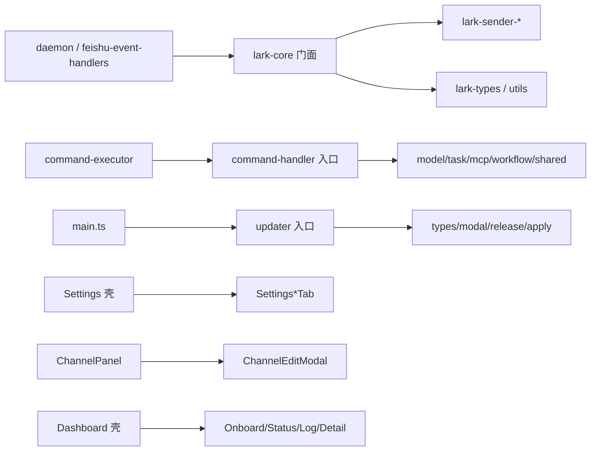

# 超限模块拆分续 - 代码评审报告

## 1、审查范围

- **变更类型**: apply 产出的未提交变更（stage=applied → reviewed）
- **评审等级**: focused-review（纯结构搬迁；无 proto/IPC/数据契约变更；跨 bridge/renderer/electron 但风险可收敛）
- **涉及文件**: 白名单内约 40 个代码/AGENTS 文件（含新建 `lark-*` / `Settings*Tab` / `ChannelEdit*` / `Dashboard*` / `command-handler-*` / `updater-*`）
- **设计文档**: `02-design.md`（对照基准）；任务 `03-tasks.md` T1～T10
- **方法**: CodeGraph（`LarkSender` / `handleFeishuModelCommand` / `initAppUpdater` / `emptyChannel` 等 context+impact+explore）+ `wc -l` 全量抽查 + 门面/入口委托与排除名单 diff 核对
- **说明**: CodeGraph 索引对部分符号仍残留拆分前行号（如旧 `lark-core` 千行级锚点）；以磁盘现盘与 import 为准

## 2、严重（必须处理）

无

## 3、警告（建议处理）

无

（Ponytail 精简轴：`command-handler-{model,task,mcp}.ts` 末尾残留跨文件分段注释如 `// ── MCP 命令`，属死注释噪音，评分 &lt;75，不列入 open。其余为垂直切 + 稳定入口 re-export，**Lean already. Ship.**）

## 4、设计偏差

无

- Dashboard 较 02 S8 初列多拆出 `DashboardDetailPanels.tsx`，属同轮 ≤300 再切，与 T7「逼近上限再切」一致，不视为偏差。
- `ChannelEditWechat` / `ChannelEditAccess`、`lark-sender-help` 同理，符合 02/03 允许的再切。

## 5、验收标准检查

| 任务 | 验收条件 | 状态 |
|------|---------|------|
| T1 | `lark-types`/`lark-utils` ≤300；`lark-core` re-export；未改 daemon/wechat-manager | ✅ |
| T2 | stream/outbound ≤300；门面委托流式/出站；公开方法签名保留 | ✅ |
| T3 | merge/progress(/help) ≤300；合并/工具/思考/帮助委托齐全 | ✅ |
| T4 | `lark-core` ≤300（现盘 258）；parse/connection 抽出；`bridge/AGENTS.md` 子模块表已替换行数债务 | ✅ |
| T5 | Settings 壳与 5 个 Tab ≤300；壳挂载 general/proxy/tasks/setup/about | ✅ |
| T6 | ChannelPanel/EditModal/helpers(/Wechat/Access) ≤300；列表+弹窗接线 | ✅ |
| T7 | Dashboard 壳与 Onboard/Status/Log(/Detail) ≤300；签名 `Dashboard({ onSettings, active })` 保留 | ✅ |
| T8 | command-handler 入口薄 re-export；各族文件 ≤300；`scheduling/AGENTS.md` 已更新；未 defer | ✅ |
| T9 | updater 入口保留 `initAppUpdater`/`registerUpdaterIpc`/`fetchLatestRelease`；子文件 ≤300；`config/AGENTS.md` 已更新 | ✅ |
| T10 | 白名单全部 `.ts`/`.tsx` ≤300；`components/AGENTS.md` 已沉淀；排除名单无 diff | ✅ |
| 02 §八·（二） | 行数门禁、导出不减、Dashboard、command/updater 必做、排除名单、中文注释 | ✅ |

**行数抽查（最高档）**：`lark-sender-outbound` 282、`updater` 276、`ChannelEditModal` 273、`command-handler-task` 265、`lark-core` 258、`SettingsTasksTab` 253、`Dashboard` 254；全部 ≤300。入口最薄：`command-handler.ts` 16 行。

**公开 API**：daemon 仍从 `lark-core.js` 取 `LarkSender`/类型/工具；`command-executor`/`daemon-manager` 仍从 `command-handler` 取 handler；`main.ts` 仍 `import { initAppUpdater } from "./config/updater"`。

## 6、调用链与回归风险

| 风险点 | 说明 | 缓解 |
|--------|------|------|
| CardKit / 合并卡回归 | 实现迁至子模块，委托遗漏会导致空白卡 | 现盘门面方法均委托；`card.action.trigger` 仍 `return await onCardAction` |
| 斜杠入口断裂 | re-export 漏符号 | 入口覆盖 model/task/mcp/workflow + shared 公开符号 |
| 更新 IPC | 通道名/流程迁出 apply/release | `registerUpdaterIpc`/`initAppUpdater` 仍在入口组装 |
| 并行变更冲突 | workflow-engine / wechat-manager | 本变更 diff 未触及 |

## 7、遗留债务

无阻断项。可选清理：删除 `command-handler-{model,task,mcp}.ts` 文件末尾残留的跨族分段注释（不阻断 archive）。

知识库正文合并（飞书通道 / 渲染端 / 配置与更新）留待 `/kb-archive` 按 02 §十执行。

## 8、修复任务建议

| 问题 ID | 建议动作 | 关联任务 |
|---------|----------|----------|
| — | 无 open 问题；无需 T-FIX / builder | — |

## 9、结论

**通过**，零 open；可进入 `/kb-archive`（归档时合并知识库并勾销指向本变更的历史行数债）。
