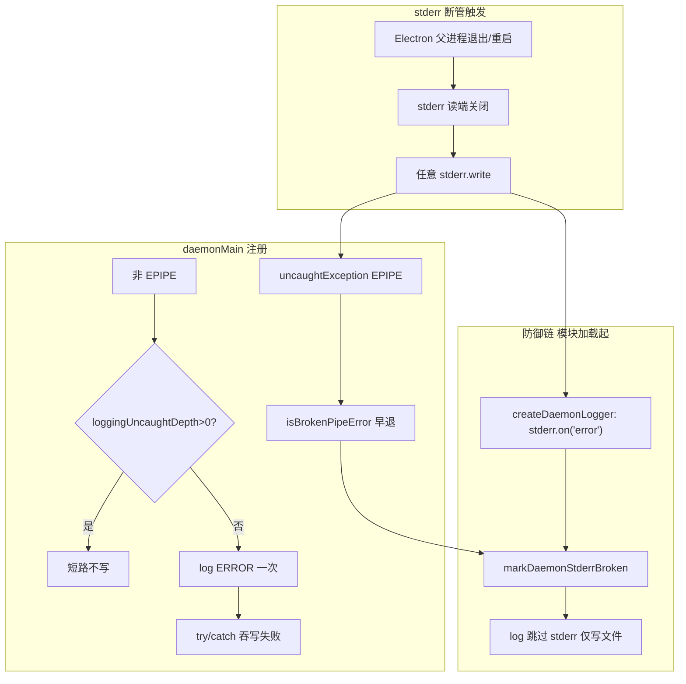

# Daemon EPIPE日志风暴加固 - 代码评审报告

## 1、审查范围

- **变更类型**: apply 产出的未提交变更（lite hotfix，`stage=applied`）
- **评审等级**: focused-review（P1 Bug、单端 Daemon stderr/日志、无 proto/多端契约；对照 `01-proposal.md` 与现盘 diff）
- **涉及文件**: 8（`is-broken-pipe-error.ts` 新增 + `daemon-logging.ts` / `daemon.ts` / `daemon-entry.ts` / `daemon-session-routing-persist.ts` / `shared/AGENTS.md` + `package.json` / `changelog/1.14.7.json`）
- **设计文档**: 无 `02-design.md` / `03-tasks.md`（lite）；对照基准为 `01-proposal.md` §根因/变更说明/验收标准
- **背景核实**: 已安装 App bundle（21:45 重建）grep **不含** `isBrokenPipeError` / `markDaemonStderrBroken` / `stderrBroken`，与 8a3055e 部分修复一致；工作区 diff 为完整加固集
- **CodeGraph**: 索引调用未单独依赖；现盘 `grep process.stderr.write` + 全文阅读为准

## 2、严重（必须处理）

无。

## 3、警告（建议处理）

无（≥75 且未缓解项）。

**已评估但未抬为 open 的观察**（评分 50～74，风暴路径已缓解）：

1. **工作流路径仍裸 `process.stderr.write`**
   - 位置: `src/workflow/server-workflow.ts:59`（`logWorkflowResume`）；`src/daemon/daemon-http-workflow-signal.ts:10`（`logWorkflowResumeHttp`）
   - 说明: 未包 `try/catch`、未复用 `safeStderrWrite` / `markDaemonStderrBroken`。但 `daemon.ts` 模块加载时 `createDaemonLogger()` 已注册 `process.stderr.on('error')`，且 `daemonMain` 内 `uncaughtException` 对 EPIPE **早退不写 log**，故**不会**再形成 01 描述的「处理器内 `log()` → 再写 stderr → 递归数千条」风暴；最多单条 uncaught 后被吞掉。建议后续 lite 统一到 shared 安全写或导出 `markDaemonStderrBroken` 联动（记入 §7，非阻断 archive）。

## 4、设计偏差

无（相对 `01-proposal.md` 拟定五项变更）。

| 01 项 | 实现 | 偏差 |
|-------|------|------|
| `is-broken-pipe-error.ts` SSOT | ✅ 新增，覆盖 code/errno/message/syscall | 无 |
| `createDaemonLogger` stderr error + `stderrBroken` | ✅ `stderrErrorHooked`、`markDaemonStderrBroken`、断管后跳过 stderr | 无 |
| `daemon.ts` uncaught/unhandled 早退 | ✅ `isBrokenPipeError` + `markDaemonStderrBroken` | 无 |
| `daemon-entry.ts` 启动失败安全写 | ✅ 双层 try/catch | 无 |
| `daemon-session-routing-persist`（可选） | ✅ `safeStderrWrite` 两处替换 | 无 |

**命名**: 01 写 `markStderrBroken()`，实现为 `markDaemonStderrBroken()`（daemon 域导出），语义一致，非行为偏差。

## 5、验收标准检查

对照 `01-proposal.md` §验收标准（`05-summary.md` §6 交叉核对）：

| # | 标准（01） | 代码/构建侧 | 运行侧 |
|---|------------|-------------|--------|
| 1 | 断管场景 `daemon.log` 无 EPIPE 递归风暴 | ✅ 断管标志 + uncaught 早退不写 log + stderr `error` 监听 | ⏳ 须用户完全重启 App/Daemon 后复验 |
| 2 | EPIPE 静默，不刷屏 `未捕获异常: write EPIPE` | ✅ `isBrokenPipeError` 统一判定；处理器不再对 EPIPE 调用 `log("ERROR",…)` | ⏳ 用户验收 |
| 3 | 断管后仍写文件日志 | ✅ `log()` 在 `stderrBroken` 时仍 `fs.appendFileSync` | ⏳ 用户验收 |
| 4 | 稳态启动/通道/调度/session-routing 无回归 | ✅ 变更限于日志与异常路径；routing 仅 WARN stderr 包装 | ⏳ 用户验收 |
| 5 | `npm run build` + patch bump + changelog | ✅ `1.14.7` + `changelog/1.14.7.json`（builder 已落地） | ✅ |

**专题核对（用户指定）**：

| 专题 | 结论 |
|------|------|
| 根因与修复对齐 01 | ✅ 异步 EPIPE、`stderr.on('error')`、断管后跳过 stderr、裸写加固、统一判定均已落地 |
| `loggingUncaughtDepth` 防重入 | ✅ 由布尔 `loggingUncaught` 改为深度计数；`>0` 短路 + `try/catch/finally` 递减，覆盖 handler 内 `log()` 同步再抛场景；与 `stderrBroken` 早退联用足够 |
| uncaught 注册时机竞态 | ⚠️ **有次序差但可接受**：`createDaemonLogger()` 在 `daemon.ts` **模块加载**（约 L52）注册 `stderr.on('error')`；`uncaughtException`/`unhandledRejection` 在 **`daemonMain()`**（约 L162）注册。窗口内若发生 stderr 异步 EPIPE，**优先**由已注册的 `stderr` `error` 监听 `markDaemonStderrBroken()`，通常**不进** uncaught；若极少数同步 EPIPE 在 hook 前发生，仅 `daemon-entry` 一层（已 try/catch）。`daemon.ts` 顶层大量 import 副作用在 L52 之前，**未见** import 期裸写 stderr。竞态不构成风暴复现主因 |

## 6、调用链与回归风险

| 风险点 | 说明 |
|--------|------|
| 旧 Daemon 子进程 | 用户未完全退出 App 时仍跑 8a3055e 逻辑；**须重启**后加载 1.14.7 加固（01/08 已说明） |
| 工作流裸 stderr | 低频率 `workflow_resume` 行；风暴已断，见 §3 观察 |
| `safeStderrWrite` 未设 `stderrBroken` | 依赖全局 `stderr.on('error')`；与主日志器策略略不一致，无功能缺口 |
| 文件日志轮转 | 未改；断管后仅文件路径，轮转逻辑不变 |

## 7、遗留债务

1. **工作流 stderr 一致性**（非阻断）：`server-workflow.ts` / `daemon-http-workflow-signal.ts` 裸写可后续提取 `shared/safe-stderr-write.ts` 或复用 daemon 导出，与 `session-routing` 策略对齐。
2. **工程平台 KB**：`knowledge/工程平台/Electron桌面应用/02-主进程与IPC.md` 未补 Daemon stderr 断管约定（01 标注可能更新；`05-summary` 记为 archive 后 kb-librarian 可选）。

## 8、修复任务建议

无 open 阻断项。若团队希望清零 §7 债务，可追加 lite `T-FIX-01`：工作流两条 `workflow_resume` stderr 改安全写并补 `isBrokenPipeError` import（可选，不挡 archive）。

| 问题 ID | 建议动作 | 关联任务 |
|---------|----------|----------|
| — | 无 mandatory fix | — |

## 9、结论

**通过**，可进入 `/kb-archive`（版本/changelog 已就绪）。

根因与 `01-proposal` 对齐；核心风暴链路（uncaught 内 `log()` 再写断管 stderr）已切断。`loggingUncaughtDepth` 与 module-load 级 `stderr.on('error')` 足以支撑防重入与竞态缓解。工作流裸 stderr 为一致性债务，**不**构成递归风暴回归点。运行验收 01 §1–4 仍须用户**完全重启 App** 后执行（见 `05-summary` §5）。
