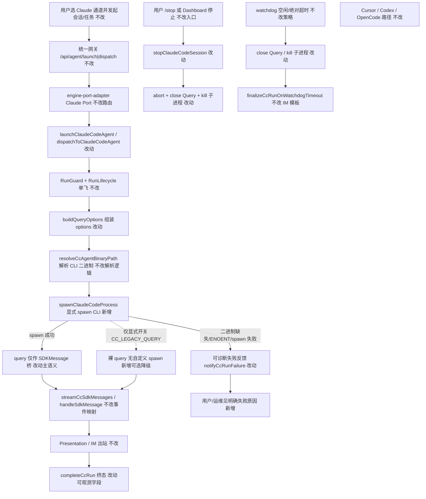
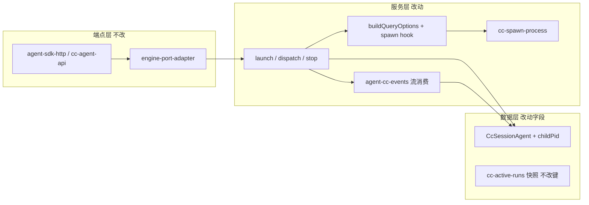

# Claude引擎改走spawn - 实现设计

> **业务 PRD**：见同目录 `01-proposal.md`（验收标准以 01 为准）

## 一、业务流程与改动范围

> 业务口径以 `01-proposal.md` §三方案说明、§四验收为准；下图覆盖 Claude 通道 launch/dispatch 主路径、中断/失败分支与显式降级后备。

### （一）业务流程图

**图例**：`不改` 行为与现网一致；`改动` 需改代码/配置；`新增` 新节点或新分支；`删除` 本期无删除主路径（query 能力可保留为显式降级，不作为默认）。

### （二）流程步骤与改动对照

| 步骤 ID | 业务含义 | 改动 | 落点（模块/文件） | 01 验收关联 |
|---------|----------|------|-------------------|-------------|
| S1 | 用户经 IM/任务/工作流发起 Claude 会话 | 不改 | `electron/agent/shared` 统一网关、`agent-sdk-http` | 验收 5 其它引擎不受影响 |
| S2 | Port 路由到 Claude 引擎 | 不改 | `electron/agent/claude-code/engine-port-adapter.ts` | 验收 1、5 |
| S3 | launch / dispatch 建会话、claim guard | 改动（日志/主路径语义） | `electron/agent/claude-code/agent-claude-sdk.ts` | 验收 1 |
| S4 | 组装 MCP/插件/resume/env/二进制路径 | 改动（注入 spawn） | `electron/agent/claude-code/cc-query-options.ts` | 验收 1、2 |
| S5 | 解析平台包内 `claude` 可执行文件 | 不改（复用） | `electron/agent/claude-code/agent-cc-utils.ts` `resolveCcAgentBinaryPath` | 验收 1、4 |
| S6 | **主路径：显式 spawn CLI 子进程** | 新增 | 新建 `electron/agent/claude-code/cc-spawn-process.ts`（或并入 `cc-query-options.ts` 若行数允许） | 验收 1、2、3 |
| S7 | 记录 pid / ChildProcess 到 session | 改动 | `electron/agent/claude-code/agent-cc-types.ts`、`agent-cc-session-registry.ts` | 验收 1、3 |
| S8 | `query()` 仅作消息桥（非「默认主执行抽象」） | 改动 | `electron/agent/claude-code/agent-claude-sdk.ts` `startCcQuery`→`startCcSpawn`（或同文件改语义） | 验收 1 |
| S9 | SDKMessage 流 → Presentation | 不改 | `electron/agent/claude-code/agent-cc-events.ts`、`agent-cc-stream.ts` | 验收 5 |
| S10 | 会话列表广播真实 pid（现网写死 0） | 改动 | `electron/agent/claude-code/agent-cc-stream.ts` `broadcastCcSessionStatus`、`agent-cc-session-registry.ts` | 验收 1、3 |
| S11 | spawn 失败 → 可诊断 IM/错误 | 改动 | `engine-port-adapter.ts` `notifyCcRunFailure`、`agent-claude-sdk.ts` launch 返回 | 验收 3、4 |
| S12 | 可选裸 query 降级（非默认） | 新增 | `cc-query-options.ts` / `agent-claude-sdk.ts`（env 门控，如 `CC_LEGACY_QUERY=1`） | 验收 4 |
| S13 | 用户 stop：中止 Query + kill 子进程 | 改动 | `agent-claude-sdk.ts` `stopClaudeCodeSession` | 验收 3 |
| S14 | watchdog 超时中止 | 改动（挂接进程 kill） | `agent-cc-events.ts` `armCcWatchdog` | 验收 3 |
| S15 | recover 续接仍走同一 spawn 主路径 | 改动（调用点对齐） | `electron/agent/claude-code/cc-run-recover.ts` | 验收 1 |
| S16 | Cursor / Codex / OpenCode | 不改 | `electron/agent/cursor-sdk/**`、`codex/**`、`opencode/**` | 验收 5 |
| S17 | 预热变更 `startup`/`WarmQuery` 任务 | 不改（显式排除） | 进行中 `20260714000128-…` | 01 §二·（二）边界 |

### （三）改动汇总

- **改动**：`agent-claude-sdk.ts`（主路径入口语义、stop/kill）、`cc-query-options.ts`（注入 `spawnClaudeCodeProcess` + 可选 legacy）、`agent-cc-types.ts`（pid/进程句柄）、`agent-cc-session-registry.ts` / `broadcastCcSessionStatus`（可观测 pid）、`armCcWatchdog` / `stopClaudeCodeSession`（进程级中断）、`cc-run-recover.ts`（对齐新入口名）。
- **新增**：`cc-spawn-process.ts`（薄封装：`child_process.spawn` → SDK `SpawnedProcess`；含存在性校验与错误分类）；env 显式降级分支。
- **不改（显式列出）**：
  - Cursor / Codex / OpenCode 引擎与路由；
  - Presentation / RunLifecycle / Engine Port 契约外形；
  - MCP loader 配置源与 `strictMcpConfig` 语义（仍随 options 注入）；
  - **预热变更** `20260714000128` 的 `startup()` / WarmQuery / lifecycle 观测实现任务（禁止并入本期步骤）；
  - 强制删除 `query()` 符号本身（可保留作桥与显式降级）。

## 二、整体思路

见 01 §一背景与 §三方案：现网 Claude 以 `startCcQuery` → `query({ prompt, options })` 为默认主路径；`buildQueryOptions` 虽已传 `pathToClaudeCodeExecutable`，但进程拉起对产品侧仍黑盒（会话列表 `pid: 0`、中断主要靠 `Query.close()`），冷启动/状态黏性/排障可控性差。

**依赖包事实（`@anthropic-ai/claude-agent-sdk` 0.3.207）**：

- 公开主入口仍是 `query()`；**无**可替代的顶层 `spawn()` 导出。
- 文档化能力：`Options.spawnClaudeCodeProcess`（自定义 CLI 进程拉起）、`SpawnedProcess` / `SpawnOptions`；另有 `startup()`/`WarmQuery`（属预热方向，**本期不用**）。
- 现网已具备 `resolveCcAgentBinaryPath()` 解析平台包内 `claude` 二进制。

**默认选型结论**：**主路径 =「SDK 文档化 spawn」——经 `spawnClaudeCodeProcess` 显式 `child_process.spawn` CLI，仍用 `query()` 作 SDKMessage 桥**。不采用首版手搓 CLI `--output-format stream-json` 全量重写（避免重做事件桥，违背 Ponytail）。

**降级策略（默认选型）**：

1. **默认**：spawn 失败（二进制缺失、ENOENT、spawn error）→ **明确可诊断失败**（launch `{ ok:false, error }` + 既有 `notifyCcRunFailure` / UI 日志），**不**自动静默回退到「无自定义 spawn 的裸 query」。
2. **可选后备**：环境变量显式开启（建议 `CC_LEGACY_QUERY=1`）时允许裸 `query()`（SDK 默认内部 spawn），供应急；**非默认主路径**，日志须标注 `legacy_query`。

**最小方案三问（必答）**：

1. **能否复用现有模块/符号？** 能。复用 `startCcQuery` 调用链、`buildQueryOptions`、`streamCcSdkMessages`、`resolveCcAgentBinaryPath`、`stopClaudeCodeSession`、`notifyCcRunFailure`；仅把「谁 spawn CLI」从 SDK 黑盒改为本仓 hook。
2. **拟新增抽象/依赖是否被 01 要求？** 不新增 npm 依赖。新建至多一个 ≤300 行的 `cc-spawn-process.ts` 仅因 `agent-claude-sdk.ts`/`cc-query-options.ts` 行数边界与单一职责；**不**新建通用「多引擎 Spawn 框架」。
3. **能否合并到已有文件？** spawn 适配器优先 inline 进 `cc-query-options.ts`；若超过 300 行或职责混杂，再拆 `cc-spawn-process.ts`（理由：进程适配与 options 组装分离，便于 stop/kill 复用）。

## 三、分层设计

- **端点层**：统一网关与 `AgentEnginePort` 六方法签名不改；Claude Port 仍委托 `launchClaudeCodeAgent` / `stopClaudeCodeSession`。
- **服务层**：主路径在 options 注入自定义 spawn；流消费与 Presentation 保持现网。
- **数据层**：`CcSessionAgent` 增加子进程可观测字段（pid / 弱引用 ChildProcess）；`ccSessionId` resume 语义不变。

## 四、接口设计

无新增对外 HTTP/IPC 契约。沿用：

| 入口 | 说明 |
|------|------|
| `AgentEnginePort.launch/dispatch/stop` | 外形不变；内部主路径改 spawn |
| `POST /api/agent/launch\|dispatch`、`/api/cc/agent/*` | 契约不变 |
| `getClaudeCodeSessionList` | 返回字段已有 `pid`，现网恒为 0 → **改为真实子进程 pid**（兼容前端已有字段） |

新增**内部**约定（非公开 API）：

- `CC_LEGACY_QUERY=1`：显式降级裸 query（可选后备）。
- UI/日志：spawn 成功打 `[sessionKey] cc_spawn pid=… path=…`；失败打可检索错误码（如 `cc_spawn_enoent`）。

## 五、数据结构

| 字段 | 位置 | 说明 |
|------|------|------|
| `childPid?: number` | `CcSessionAgent` | 当前 CLI 子进程 pid；idle 可清空 |
| `spawnedProcess?: SpawnedProcess \| null` | `CcSessionAgent`（可选） | 供 stop/watchdog `kill`；勿序列化进 `cc-active-runs.json` |
| `ccSessionId` / `activeQuery` | 现有 | resume 与 Query 桥不变；`activeQuery` 仍表示活跃桥 |

持久化快照：`CcActiveRunRecord` **不强制**写 pid（重启后进程已死）；续接仍靠 `ccSessionId` + `lastTaskMessage`。

## 六、实现步骤

1. **S6/S5**：实现 `spawnClaudeCodeProcess` 适配（校验 `resolveCcAgentBinaryPath` 真实存在 → `child_process.spawn` → 满足 SDK `SpawnedProcess`）；失败抛/返回可分类错误。（对照表 S5、S6）
2. **S4/S8**：`buildQueryOptions` 默认注入该 hook + 传入 `abortController`；`startCcQuery` 改名为 `startCcSpawn`（或保留名改注释/日志）并在 launch/dispatch/recover 统一调用。（S3、S4、S8、S15）
3. **S7/S10**：session 写入 `childPid`；`getClaudeCodeSessionList` / `broadcastCcSessionStatus` 输出真实 pid。（S7、S10）
4. **S13/S14**：`stopClaudeCodeSession` 与 `armCcWatchdog.onTimeout` 在 `Query.close()` 之外 best-effort `kill` 子进程。（S13、S14）
5. **S11**：spawn 失败路径保证 launch 返回明确 `error` 且走 `notifyCcRunFailure`（防无声卡死）。（S11）
6. **S12**：实现 `CC_LEGACY_QUERY` 门控裸 query；默认关闭；文档/日志标明非主路径。（S12）
7. **回归冒烟**：Claude launch/dispatch/stop；Cursor/Codex/OpenCode 各一冒烟不回归。（S16）
8. **禁止**：实现步骤中不得出现 `startup()` / WarmQuery / 预热挂点任务。（S17）

## 七、参考实现

CodeGraph / 依赖包命中：

| 符号 / API | 路径或出处 |
|------------|------------|
| `startCcQuery` → `query({ prompt, options })` | `electron/agent/claude-code/agent-claude-sdk.ts` |
| `buildQueryOptions` / `pathToClaudeCodeExecutable` | `electron/agent/claude-code/cc-query-options.ts` |
| `resolveCcAgentBinaryPath` / `ensureCcAgentBinaryPaths` | `electron/agent/claude-code/agent-cc-utils.ts` |
| `streamCcSdkMessages` / `armCcWatchdog` / `activeQuery.close()` | `electron/agent/claude-code/agent-cc-events.ts` |
| `stopClaudeCodeSession` | `electron/agent/claude-code/agent-claude-sdk.ts` |
| `notifyCcRunFailure` / Port `stop` | `electron/agent/claude-code/engine-port-adapter.ts` |
| `recoverCcActiveRuns` → `startCcQuery` | `electron/agent/claude-code/cc-run-recover.ts` |
| `Options.spawnClaudeCodeProcess` / `SpawnedProcess` / `startup` | `node_modules/@anthropic-ai/claude-agent-sdk/sdk.d.ts` |
| 引擎边界说明（现网写「非 spawn CLI」） | `electron/agent/claude-code/AGENTS.md`、`knowledge/业务域/Agent调度/07-ClaudeCodeSDK执行引擎.md` |

## 八、技术影响

### （一）影响范围

- **涉及模块**：仅 `electron/agent/claude-code/`（及该引擎对 session 列表 pid 的展示消费方，只读字段语义增强）。
- **接口/proto 变更**：无；`pid` 字段从占位 0 变为真实值（向前兼容）。
- **数据变更**：内存 session 字段扩展；磁盘 `cc-active-runs.json` 键集原则上不变。
- **风险**：
  1. 自定义 spawn 与 SDK 默认路径行为细微差异（信号处理、Windows kill）——须跟测 stop/watchdog。
  2. 与进行中预热变更双主方向冲突——本设计已排除预热任务；**待用户确认**是否搁置 `20260714000128`。
  3. 环境无二进制时失败更「响」——符合可诊断目标，需确认文案对用户友好（勿堆 stack）。
  4. 冷启动毫秒级改善非本设计锁死；可观测 pid/进程生命周期是验收主证据，对比方法在 test 阶段固定。

### （二）工程补充验收项

- [ ] 默认路径日志可检索到 `cc_spawn pid=`；会话列表 pid ≠ 0（进程存活期间）。
- [ ] 人为删除/错误二进制路径时，用户侧有明确失败提示，且无长期 processing 卡死。
- [ ] `CC_LEGACY_QUERY=1` 时可跑通一轮（可选后备演示）；默认关闭时不走该分支。
- [ ] stop / watchdog 后子进程退出（无僵尸进程）。
- [ ] Cursor / Codex / OpenCode 冒烟无回归。
- [ ] 代码与注释未引入预热变更实现（无 `startup(`/`WarmQuery` 接入任务）。

## 九、知识库影响

- `knowledge/业务域/Agent调度/07-ClaudeCodeSDK执行引擎.md` — 主路径由「`query()` 执行」改为「显式 spawn CLI + query 桥」；流程图与接口表需改。
- `knowledge/业务域/Agent调度/03-启动与自动重连.md` — 文中「Claude `query()`」表述需改为 spawn 主路径口径。
- `knowledge/业务域/Agent调度/01-概览.md` / `00-README.md` — 若仍写 CC=`query()` 总述，archive 时对齐一句。
- `electron/agent/claude-code/AGENTS.md` — 工程边界「非 spawn CLI」过时（工程目录，archive 时由实现/librarian 流程同步，本变更 design 记影响）。
- 两级索引：`Agent调度/00-README.md` 文件清单无需新增叶子；若概览链接文案变更则顺带改一句。

## 十、知识库更新计划

### （一）必须更新

- `knowledge/业务域/Agent调度/07-ClaudeCodeSDK执行引擎.md` — 能力范围、流程、接口：主路径 spawn、降级策略、pid 可观测。
- `knowledge/业务域/Agent调度/03-启动与自动重连.md` — Claude 启动表述与四引擎对照。

### （二）可能更新（视实现结果）

- `knowledge/业务域/Agent调度/01-概览.md` — 总图若仍标 CC=query。
- `knowledge/业务域/Agent调度/10-SDK上下文保护与失败归因.md` — 若新增 `cc_spawn_*` 失败分类文案。
- `electron/agent/claude-code/AGENTS.md` — 模块边界与主路径说明（工程文档）。

### （三）不需要更新

- Cursor / Codex / OpenCode 引擎文档（`06`/`08`/`09`）——本期不改行为。
- 预热变更目录 `20260714000128` — 不在本变更 archive 范围自动改写；由用户另行搁置/取消。
- 消息桥接 / 工作流域正文——无契约变更。
