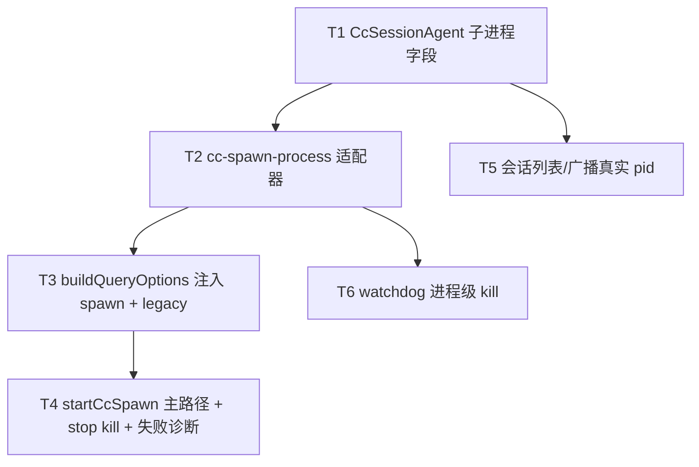

# Claude引擎改走spawn - 任务分解

> **来源**：`/kb-plan`（基于 `01-proposal.md`、`02-design.md`）
> **任务数**：6（T1–T6）
> **硬约束**：仅改 `electron/agent/claude-code/`；禁止 Cursor/Codex/OpenCode；禁止预热变更 `20260714000128` 的 `startup()` / WarmQuery / lifecycle 观测实现；单文件 ≤300 行；禁止预建多引擎通用 Spawn 框架。

## 一、执行计划

### （一）依赖图

```
T1 ──→ T2 ──→ T3 ──→ T4
 │                      │
 └──→ T5                └──→（验收联调：pid/stop/失败）
 T2 ──→ T6
```



**CodeGraph 落点确认**（`projectPath=/home/suveng/doger/cursor-claw`）：

| 符号/文件 | 路径 | 任务 |
|-----------|------|------|
| `CcSessionAgent` | `electron/agent/claude-code/agent-cc-types.ts:34` | T1 |
| `resolveCcAgentBinaryPath` / `ensureCcAgentBinaryPaths` | `agent-cc-utils.ts:30` / `:60` | T2 复用 |
| `Options.spawnClaudeCodeProcess` / `SpawnedProcess` | `@anthropic-ai/claude-agent-sdk/sdk.d.ts` | T2/T3 |
| `buildQueryOptions` | `cc-query-options.ts:20`（约 49 行） | T3 |
| `startCcQuery` → `query({ prompt, options })` | `agent-claude-sdk.ts:73` | T4 改语义/改名 |
| `launchClaudeCodeAgent` / `dispatchToClaudeCodeAgent` | `agent-claude-sdk.ts:82` / `:177` | T4 |
| `stopClaudeCodeSession` | `agent-claude-sdk.ts:218` | T4 挂接 kill |
| `recoverCcActiveRuns` → `startCcQuery` | `cc-run-recover.ts:72` / `:113` | T4 对齐入口 |
| `broadcastCcSessionStatus` `pid: 0` | `agent-cc-stream.ts:175` | T5 |
| `getClaudeCodeSessionList` `pid: 0` | `agent-cc-session-registry.ts:13` | T5 |
| `armCcWatchdog` `onTimeout` 仅 `activeQuery.close()` | `agent-cc-events.ts:207` | T6 |
| `notifyCcRunFailure` | `engine-port-adapter.ts:61` | T4 复用（外形不改） |

**同文件冲突（须串行）**：

| 文件 | 涉及任务 |
|------|----------|
| `agent-claude-sdk.ts`（266 行，近 300） | **仅 T4** 改写；T6 不得改此文件 |
| `cc-query-options.ts` | **仅 T3** |
| `cc-spawn-process.ts`（新建） | **仅 T2** |
| `agent-cc-events.ts`（292 行） | **仅 T6**；须调用 T2 薄封装，禁止内联大段 spawn 逻辑 |

**01 验收追溯**：

| 01 验收 | 主责任务 |
|---------|----------|
| 1 主路径为 spawn | T2、T3、T4 |
| 2 冷启动可感知改善 | T2、T3、T4（证据：显式 CLI spawn + `cc_spawn pid=`；毫秒阈值留给 test） |
| 3 可控性/可诊断改善 | T4、T5、T6 |
| 4 失败可降级或可诊断 | T3（legacy 门控）、T4（默认可诊断失败） |
| 5 其它引擎不受影响 | 全任务范围约束 + T4 冒烟说明 |

**02 八·（二）工程补充验收追溯**：

| 工程项 | 主责任务 |
|--------|----------|
| 默认路径日志 `cc_spawn pid=`；会话列表 pid ≠ 0 | T2/T3/T4 写 pid；T5 广播 |
| 错误二进制 → 明确失败、无长期 processing 卡死 | T2、T4 |
| `CC_LEGACY_QUERY=1` 可跑通；默认关闭 | T3、T4 |
| stop / watchdog 后子进程退出 | T4、T6 |
| Cursor / Codex / OpenCode 冒烟无回归 | T4（范围声明 + 冒烟清单） |
| 未引入预热实现 | 全任务硬约束 |

### （二）分组调度

- **第一轮**：T1（类型字段，无运行时行为）
- **第二轮（并行）**：T2（spawn 适配器）、T5（pid 读取点；进程存活前可为 0）
- **第三轮**：T3（options 注入 + legacy 门控）
- **第四轮（并行）**：T4（主路径/stop/失败/recover）、T6（watchdog kill；依赖 T2 的 kill 辅助，不改 `agent-claude-sdk.ts`）

## 二、任务清单

## T1: 扩展 CcSessionAgent 子进程可观测字段

### 背景

现网会话列表 `pid` 恒为 0，stop/watchdog 只能 `Query.close()`，无法进程级中断。本任务先在类型层增加 `childPid` / `spawnedProcess`，供后续 spawn 写入与 stop/watchdog/广播消费（对照 02 §五、步骤 S7）。

### 上下文文件

- CodeGraph: `CcSessionAgent agent-cc-types` — 确认字段落点与 62 处引用仅作类型扩展
- 必读: `electron/agent/claude-code/agent-cc-types.ts` — 在 `CcSessionAgent` 增加可选字段
- 参考: `node_modules/@anthropic-ai/claude-agent-sdk/sdk.d.ts` 中 `SpawnedProcess` — 类型引用，勿拷贝实现
- 参考: `electron/agent/claude-code/cc-run-persistence.ts` — **禁止**把 pid/进程句柄写入 `cc-active-runs.json`

### 实现范围

- 修改: `electron/agent/claude-code/agent-cc-types.ts`
  - `CcSessionAgent` 增加：
    - `childPid?: number` — 当前 CLI 子进程 pid；idle/终态可清空
    - `spawnedProcess?: import("@anthropic-ai/claude-agent-sdk").SpawnedProcess | null` — 供 stop/watchdog `kill`；**勿序列化**
  - 文件保持 ≤300 行；仅类型/注释，无行为逻辑
- 不改：其它引擎类型、`CcActiveRunRecord` 磁盘字段

### 接口契约

- `CcSessionAgent.childPid?: number` — 可观测 pid
- `CcSessionAgent.spawnedProcess?: SpawnedProcess | null` — 进程句柄（内存 only）
- 无新导出函数

### 验收标准

- [ ] `CcSessionAgent` 含上述两可选字段，注释标明勿写入 active-runs 快照
- [ ] 本任务不改运行时行为；TypeScript 编译通过（仅类型扩展）
- [ ] 无 `02`/`03` 未要求的抽象层、trait/mixin 中间层或未批准的新依赖（Ponytail）
- [ ] **禁止**引入 `startup(` / `WarmQuery` / 预热挂点

### 依赖

- 前置任务: 无
- 后续任务: T2、T5

## T2: 实现 spawnClaudeCodeProcess 适配器

### 背景

SDK 公开主入口仍是 `query()`，但 `Options.spawnClaudeCodeProcess` 可将 CLI 拉起从黑盒改为本仓显式 `child_process.spawn`。本任务新建薄适配模块（对照 02 §六步骤 1 / S5–S6），供 T3 注入 options，并导出 kill 辅助供 T4/T6 复用。

### 上下文文件

- CodeGraph: `resolveCcAgentBinaryPath ensureCcAgentBinaryPaths` — 复用现网二进制解析，不重写搜索逻辑
- 必读: `electron/agent/claude-code/agent-cc-utils.ts` — `resolveCcAgentBinaryPath` / `ensureCcAgentBinaryPaths`
- 必读: `node_modules/@anthropic-ai/claude-agent-sdk/sdk.d.ts` — `SpawnOptions`、`SpawnedProcess`、`Options.spawnClaudeCodeProcess`
- 必读: `electron/agent/claude-code/agent-cc-types.ts` — T1 字段
- 参考: `electron/agent/claude-code/cc-query-options.ts` — 现网已传 `pathToClaudeCodeExecutable`

### 实现范围

- 新建: `electron/agent/claude-code/cc-spawn-process.ts`（≤300 行）
  - `createCcSpawnClaudeCodeProcess(session: CcSessionAgent): (options: SpawnOptions) => SpawnedProcess`
    - 在调用前用 `existsSync`（或等价）校验 `options.command` / `resolveCcAgentBinaryPath()` 真实存在；缺失抛可分类错误（建议 message/code 含 `cc_spawn_enoent`）
    - `child_process.spawn(command, args, { cwd, env, stdio 管道, signal: options.signal })`，返回值须满足 `SpawnedProcess`（Node `ChildProcess` 即可）
    - 成功：写入 `session.childPid`、`session.spawnedProcess`；`pushUiLog("CC", "INFO", \`[${session.sessionKey}] cc_spawn pid=… path=…\`)`
    - spawn `error` / 同步失败：清空句柄字段，抛可检索错误（如 `cc_spawn_failed`）
  - `killCcSpawnedProcess(session: CcSessionAgent): void` — best-effort：若有 `spawnedProcess` 且未 killed，则 `kill('SIGTERM')`（Windows 可用默认信号）；随后清空 `spawnedProcess`/`childPid`
- 不新建 npm 依赖；不建多引擎通用框架
- 若坚持 inline 进 `cc-query-options.ts`：仅当合并后该文件仍 ≤300 行且 T4/T6 可直接 import kill 辅助；**默认按设计拆本文件**

### 接口契约

- `createCcSpawnClaudeCodeProcess(session) => (options: SpawnOptions) => SpawnedProcess`
- `killCcSpawnedProcess(session): void`
- 错误：抛 Error，message 可检索 `cc_spawn_enoent` / `cc_spawn_failed`（或等价前缀）

### 验收标准

- [ ] 适配器返回对象满足 SDK `SpawnedProcess`（stdin/stdout/killed/exitCode/kill/on）
- [ ] 二进制不存在时抛 `cc_spawn_enoent`（或等价），不静默回退
- [ ] 成功路径日志含 `cc_spawn pid=`（覆盖 02 八·（二）日志项的写入侧）
- [ ] `killCcSpawnedProcess` 可被其它模块 import；本文件 ≤300 行
- [ ] 无未批准抽象/新依赖（Ponytail）；**禁止**预热 API

### 依赖

- 前置任务: T1
- 后续任务: T3、T6

## T3: buildQueryOptions 注入 spawn hook 与 CC_LEGACY_QUERY

### 背景

现网 `buildQueryOptions` 只设 `pathToClaudeCodeExecutable`，进程仍由 SDK 内部拉起。本任务默认注入 T2 的 `spawnClaudeCodeProcess`，使主路径成为「显式 spawn + query 消息桥」；并用 env `CC_LEGACY_QUERY=1` 显式保留裸 query 后备（非默认，对照 02 §二降级、S4/S12）。

### 上下文文件

- CodeGraph: `buildQueryOptions` — 唯一注入点（caller：`agent-claude-sdk`）
- 必读: `electron/agent/claude-code/cc-query-options.ts` — 现有 options 组装
- 必读: `electron/agent/claude-code/cc-spawn-process.ts` — T2 导出
- 必读: `electron/agent/claude-code/agent-cc-types.ts` — session 入参
- 参考: SDK `Options.abortController` / session 已有 `abortController` — 若 SDK Options 支持则传入，与现网 abort 语义对齐

### 实现范围

- 修改: `electron/agent/claude-code/cc-query-options.ts`
  - 默认（**未**设 legacy）：`options.spawnClaudeCodeProcess = createCcSpawnClaudeCodeProcess(session)`
  - 若 `process.env.CC_LEGACY_QUERY` 为真（建议：trim 后为 `1`/`true`/`yes`，大小写不敏感）：**不**注入自定义 spawn；`pushUiLog` 标明 `legacy_query`（非主路径）
  - 保持 MCP/插件/`strictMcpConfig`/resume/`pathToClaudeCodeExecutable` 现网语义
  - 文件 ≤300 行
- 不改：Cursor/Codex/OpenCode；不调用 `startup()` / WarmQuery

### 接口契约

- `buildQueryOptions(session)` 返回值：默认含 `spawnClaudeCodeProcess`；legacy 时不含该字段（或为 undefined）
- env：`CC_LEGACY_QUERY=1` — 显式裸 query 后备

### 验收标准

- [ ] 默认 options 含自定义 `spawnClaudeCodeProcess`（覆盖 01 验收 1）
- [ ] `CC_LEGACY_QUERY=1` 时不注入自定义 spawn，且日志含 `legacy_query`（覆盖 01 验收 4 + 02 八·（二）legacy 项的门控侧）
- [ ] 默认关闭 legacy 时不走该分支
- [ ] MCP/resume/二进制路径行为不回归
- [ ] 无未批准抽象/新依赖（Ponytail）；**禁止**预热 API

### 依赖

- 前置任务: T2
- 后续任务: T4

## T4: startCcSpawn 主路径、失败诊断、stop kill 与 recover 对齐

### 背景

`startCcQuery` 是 launch/dispatch/recover 共用入口，现网把 `query()` 当作默认主执行抽象。本任务将其改为 spawn 主路径语义（可改名为 `startCcSpawn` 或保留名但改注释/日志），保证 spawn 失败可诊断、用户 stop 能 kill 子进程，且 recover 走同一入口（对照 02 S3/S8/S11/S13/S15）。

### 上下文文件

- CodeGraph: `startCcQuery launchClaudeCodeAgent dispatchToClaudeCodeAgent stopClaudeCodeSession recoverCcActiveRuns notifyCcRunFailure` — 调用链与影响面
- 必读: `electron/agent/claude-code/agent-claude-sdk.ts` — 主改文件（当前约 266 行，改后须 ≤300；超限则抽局部私有 helper 到同目录已有/本变更已有文件，禁止新通用层）
- 必读: `electron/agent/claude-code/cc-run-recover.ts` — `startCcQuery` import/调用改为新入口名
- 必读: `electron/agent/claude-code/cc-spawn-process.ts` — `killCcSpawnedProcess`
- 必读: `electron/agent/claude-code/engine-port-adapter.ts` — `notifyCcRunFailure` 复用，不改 Port 六方法外形
- 参考: `electron/agent/claude-code/agent-cc-stream.ts` `completeCcRun` — 终态可清空 `childPid`/`spawnedProcess`（若在本文件触及则一并做；否则留给流完成路径最小改动）

### 实现范围

- 修改: `electron/agent/claude-code/agent-claude-sdk.ts`
  - `startCcQuery` → `startCcSpawn`（推荐改名并 `export`；若保留旧名须同步改注释为「spawn 主路径 + query 桥」，且 recover 调用点语义一致）
  - 仍：`query({ prompt, options: buildQueryOptions(session) })` 作 SDKMessage 桥；`armCcWatchdog` + `streamCcSdkMessages` 保持
  - spawn/query 同步失败：不得吞掉；launch/dispatch 返回 `{ ok:false, error }`（错误文案用户可读，可含 `cc_spawn_*`）；必要时设 `session.lastStatus` 并走既有失败通知路径，**禁止**长期 processing 无反馈
  - **默认不**在失败时自动静默回退裸 query（除非 T3 legacy 已开启）
  - `stopClaudeCodeSession`：在现有 `abort` + `activeQuery.close()` 之外调用 `killCcSpawnedProcess(session)`；清理 session 字段
  - 启动日志体现 spawn 主路径（非「仅 query」表述）
- 修改: `electron/agent/claude-code/cc-run-recover.ts` — 调用新入口；续接仍走同一 spawn 主路径
- 不改：`electron/agent/cursor-sdk/**`、`codex/**`、`opencode/**`

### 接口契约

- `startCcSpawn(session, prompt, guardToken): void`（或兼容旧名 + 新语义）；launch/dispatch/recover 统一调用
- `stopClaudeCodeSession(sessionKey): void` — 附加进程 kill，对外签名不变
- launch/dispatch：`Promise<{ ok: boolean; error?: string }>` 外形不变

### 验收标准

- [ ] Claude launch/dispatch 默认走 spawn 主路径（可观测 `cc_spawn pid=`；不以默认裸 query 为合格）（01 验收 1、2）
- [ ] 人为错误/缺失二进制：launch 返回明确 `error`，用户侧有失败提示，无长期 processing 卡死（01 验收 3、4；02 八·（二））
- [ ] `CC_LEGACY_QUERY=1` 时可跑通一轮；默认关闭不走该分支（与 T3 联验）
- [ ] `stopClaudeCodeSession` 后子进程退出（无僵尸）（02 八·（二））
- [ ] recover 调用点与主路径入口一致（S15）
- [ ] Cursor / Codex / OpenCode 代码未改；冒烟场景行为不回归（01 验收 5；02 八·（二））
- [ ] 无未批准抽象/新依赖（Ponytail）；**禁止**预热 API；单文件 ≤300 行

### 依赖

- 前置任务: T3（及间接 T1、T2）
- 后续任务: 无（与 T6 可并行）

## T5: 会话列表与广播输出真实 childPid

### 背景

现网 `broadcastCcSessionStatus` 与 `getClaudeCodeSessionList` 写死 `pid: 0`，前端字段已存在但无诊断价值。本任务改为输出 `session.childPid`（对照 02 S10、§四），作为 spawn 主路径可观测证据。

### 上下文文件

- CodeGraph: `broadcastCcSessionStatus getClaudeCodeSessionList` — 两处 `pid: 0`
- 必读: `electron/agent/claude-code/agent-cc-stream.ts` — `broadcastCcSessionStatus`
- 必读: `electron/agent/claude-code/agent-cc-session-registry.ts` — `getClaudeCodeSessionList`
- 必读: `electron/agent/claude-code/agent-cc-types.ts` — `childPid`
- 参考: `electron/agent/claude-code/agent-claude-sdk.ts` — 广播调用点（本任务不改 sdk，除非需在 complete 时清 pid 且更合适放 stream）

### 实现范围

- 修改: `electron/agent/claude-code/agent-cc-stream.ts`
  - `broadcastCcSessionStatus`：`pid: s.childPid ?? 0`
  - 可选：`completeCcRun` 清理 `childPid`/`spawnedProcess`（若 T4 未清）
- 修改: `electron/agent/claude-code/agent-cc-session-registry.ts`
  - `getClaudeCodeSessionList`：`pid: s.childPid ?? 0`
- 不改对外字段名；不改其它引擎 session list

### 接口契约

- `getClaudeCodeSessionList(): Array<{ …; pid: number; … }>` — `pid` 为真实子进程 pid（存活期间），缺省 0
- `broadcastCcSessionStatus` 广播载荷同语义

### 验收标准

- [ ] 进程存活期间会话列表/广播 `pid ≠ 0`（与 T2/T4 联验；覆盖 01 验收 1、3 与 02 八·（二）pid 项）
- [ ] idle/无进程时 `pid === 0` 可接受
- [ ] 未改其它引擎广播
- [ ] 无未批准抽象/新依赖（Ponytail）；**禁止**预热 API

### 依赖

- 前置任务: T1
- 后续任务: 无（建议与 T2 并行；完整验收需 T2–T4 已写入 pid）

## T6: watchdog 超时挂接子进程 kill

### 背景

现网 `armCcWatchdog.onTimeout` 仅 `activeQuery.close()`，自定义 spawn 后可能残留 CLI 子进程。本任务在超时路径 best-effort 调用 T2 的 `killCcSpawnedProcess`（对照 02 S14），且不得改 `agent-claude-sdk.ts`（避免与 T4 同文件冲突）。

### 上下文文件

- CodeGraph: `armCcWatchdog` — `onTimeout` 现网实现
- 必读: `electron/agent/claude-code/agent-cc-events.ts` — `armCcWatchdog`（约 292 行，**增量须极小**，只加 kill 调用）
- 必读: `electron/agent/claude-code/cc-spawn-process.ts` — `killCcSpawnedProcess`
- 参考: `electron/agent/claude-code/agent-claude-sdk.ts` `stopClaudeCodeSession` — 与用户 stop 语义对称（T4）

### 实现范围

- 修改: `electron/agent/claude-code/agent-cc-events.ts`
  - `onTimeout`：在 `activeQuery.close()` 之外调用 `killCcSpawnedProcess(s)`
  - 保持现有 `watchdogTimedOut` / IM 模板链路不改
  - 文件必须 ≤300 行
- 不改：watchdog 超时阈值策略、其它引擎

### 接口契约

- `armCcWatchdog` 签名不变；超时副作用增加进程 kill
- 复用 `killCcSpawnedProcess(session): void`

### 验收标准

- [ ] watchdog 超时后子进程退出（无僵尸）（01 验收 3；02 八·（二））
- [ ] 未改 idle/绝对超时策略数值（除非注释澄清）
- [ ] `agent-cc-events.ts` ≤300 行
- [ ] 无未批准抽象/新依赖（Ponytail）；**禁止**预热 API

### 依赖

- 前置任务: T2
- 后续任务: 无（可与 T4 并行）
