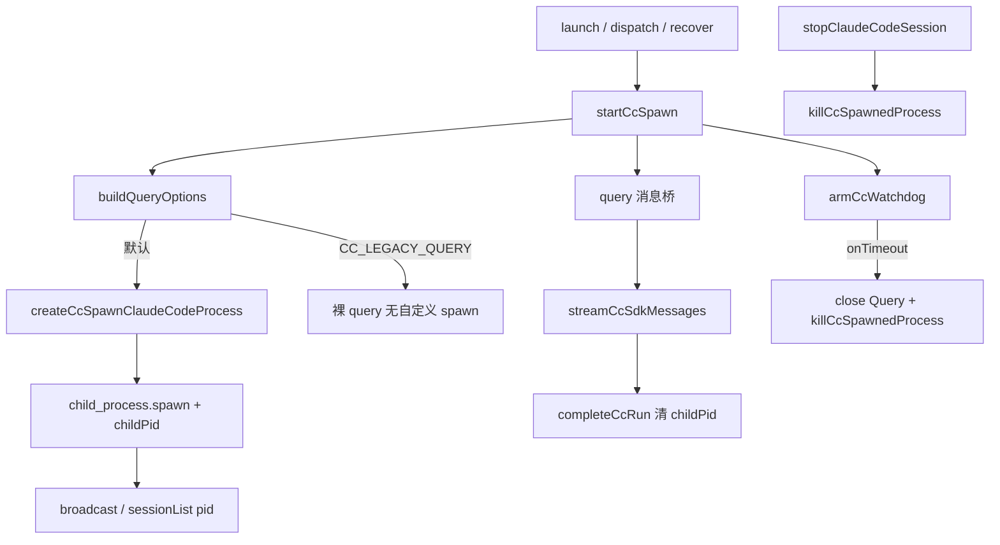

# Claude引擎改走spawn - 代码评审报告

## 1、审查范围

- **变更类型**: apply 产出的未提交变更（8 个已跟踪 M + 1 个新增 `cc-spawn-process.ts`）
- **评审等级**: focused-review（Claude 引擎主路径改 spawn：进程生命周期 / 中断 / 失败降级；无 proto/DB/跨端契约）
- **风险等级**: 中高（主执行路径与 stop/watchdog 杀进程），未升 full-review（影响面收敛于 `electron/agent/claude-code/`，无资金/权限/多端同步）
- **涉及文件**:
  - 新增：`electron/agent/claude-code/cc-spawn-process.ts`（T2）
  - 改动：`agent-cc-types.ts`（T1）、`cc-query-options.ts`（T3）、`agent-claude-sdk.ts` / `cc-run-recover.ts`（T4）、`agent-cc-stream.ts` / `agent-cc-session-registry.ts`（T5）、`agent-cc-events.ts`（T6）、`AGENTS.md`
  - **未改（范围确认）**：Cursor / Codex / OpenCode；预热变更 `20260714000128`；`.mcp.json` / `.codegraph/.gitignore`
- **设计文档**: `01-proposal.md`、`02-design.md`、`03-tasks.md`（对照基准）
- **核对方式**: CodeGraph `spawnClaudeCodeProcess` / `buildQueryOptions` / `startCcSpawn` / `killCcSpawnedProcess` / `armCcWatchdog` / `childPid` 广播调用链；`git diff` 工作区未提交改动；SDK `sdk.mjs` 核对默认路径非 `deferSpawn`（`query()` 构造期同步 `initialize`→spawn）

## 2、严重（必须处理）

无

## 3、警告（建议处理）

无（评分 ≥75 项）

**Ponytail 精简检查**（不阻断）：

1. **Lean already. Ship.** — 仅新增 ≤300 行薄适配 `cc-spawn-process.ts`；无多引擎 Spawn 框架、无新 npm 依赖、无 `startup()`/`WarmQuery`。
2. **shrink:** `startCcQuery` 弃用转发壳可保留作兼容（`02`/`03` 允许）；非必须删除。
3. **yagni:** `resolveAsarUnpackedPath` 为 Electron asar 真路径所需，非过度抽象。

## 4、设计偏差

1. **`CcSessionAgent.spawnedProcess` 类型形态**
   - 设计预期（T1）: `SpawnedProcess | null`（SDK 类型）
   - 实际实现: 最小子集 `{ kill; pid? }`，注释标明与 SDK kill 子集对齐
   - 影响: 运行时赋 `ChildProcess`，`killCcSpawnedProcess` 读 `killed` 在运行期成立；根 `tsc` 排除 `electron/`，类型缺口不进 CI
   - 结论: **可接受**（职责满足 stop/watchdog；建议后续对齐 SDK 类型或补 `killed`）

2. **S11「改动 notifyCcRunFailure」**
   - 设计预期: spawn 失败走可诊断反馈（含 notify 路径）
   - 实际实现: 未改 `engine-port-adapter.ts`；同步失败在 launch/dispatch 返回 `{ ok:false, error }`（含 `cc_spawn_*`），且发生在 `NOTIFY_PROCESSING` 之前；异步子进程 `error` 清句柄 + 依赖 SDK 流失败 → 既有 `notifyCcRunFailure`
   - 影响: 与既有「API Key 未配置」等 launch 失败口径一致，无默认静默回退裸 query
   - 结论: **可接受**

3. **`engine-port-adapter.ts` 注释仍写 `startCcQuery`**
   - 设计预期: 主入口语义改为 spawn
   - 实际实现: Port 行为已委托 `startCcSpawn` 链路，仅注释未改（文件不在本变更 tasks 改动面）
   - 结论: **可接受**（遗留债务，见 §7）

其余：默认注入 `spawnClaudeCodeProcess`、`CC_LEGACY_QUERY` 门控、`startCcSpawn` + recover 对齐、stop/watchdog `killCcSpawnedProcess`、广播/列表真实 `childPid`、`completeCcRun` 清句柄——与 `02` 流程图及 S3–S15 一致；未引入预热 API。

## 5、验收标准检查

| 任务 | 验收条件 | 状态 |
|------|---------|------|
| T1 | `childPid` / `spawnedProcess` 可选字段 + 勿序列化注释 | ✅ |
| T1 | 无运行时行为变更；无预热 API | ✅ |
| T2 | `createCcSpawnClaudeCodeProcess` + `killCcSpawnedProcess`；`cc_spawn_enoent`/`cc_spawn_failed`；日志 `cc_spawn pid=` | ✅ |
| T2 | 文件 ≤300 行；无新依赖 | ✅ 120 行 |
| T3 | 默认注入 spawn；`CC_LEGACY_QUERY=1/true/yes` 不注入且日志含 `legacy_query` | ✅ |
| T3 | 传入 `abortController`；MCP/resume/二进制路径保持 | ✅ |
| T4 | `startCcSpawn`；launch/dispatch/recover 统一；同步失败 `{ok:false,error}` | ✅ |
| T4 | `stopClaudeCodeSession` 调 `killCcSpawnedProcess` | ✅ |
| T4 | 未改 Cursor/Codex/OpenCode；无预热；`agent-claude-sdk.ts` ≤300 | ✅ 297 行；diff 范围确认 |
| T5 | `broadcastCcSessionStatus` / `getClaudeCodeSessionList` → `childPid ?? 0`；`completeCcRun` 清句柄 | ✅ |
| T6 | `armCcWatchdog.onTimeout` 调 `killCcSpawnedProcess`；策略数值未改 | ✅ |
| 01 验收 1 主路径 spawn | 默认 options 含自定义 spawn + `startCcSpawn` 日志 | ✅ 代码侧 |
| 01 验收 2 冷启动改善 | 证据挂点（显式 CLI spawn + pid 日志）；毫秒阈值留给 test | ⏳ 待冒烟对比 |
| 01 验收 3/4 可控/可诊断/降级 | 默认可诊断失败 + legacy 门控；stop/watchdog kill | ✅ 代码侧；⏳ 运行时杀进程验证 |
| 01 验收 5 其它引擎 | 本变更 diff 未触及其它引擎目录 | ✅ |
| 02 八·（二）日志/pid/legacy/无预热 | 代码路径齐全 | ✅ / ⏳ pid≠0 存活期待联调 |

## 6、调用链与回归风险

| 风险点 | 说明 | 缓解 |
|--------|------|------|
| 自定义 spawn vs SDK 默认细微差异 | 信号/Windows kill | `kill` 分平台；须跟测 stop/watchdog |
| 同步失败依赖 `query()` 构造期 spawn | SDK 0.3.207 普通路径非 `deferSpawn` | 已对照 `sdk.mjs`；升级 SDK 时复核 |
| `agent-claude-sdk.ts` 近 300 行 | 297 行，后续增量易超限 | archive 后若再改须抽 helper |
| 与预热变更双主方向 | 本实现未接入 WarmQuery | 仍待用户搁置 `20260714000128` |

## 7、遗留债务

1. `engine-port-adapter.ts` 注释仍写 `startCcQuery` → 建议随手改 `startCcSpawn`（非阻断）。
2. `spawnedProcess` 类型与 SDK `SpawnedProcess` / `killed` 对齐（非阻断）。
3. 业务域知识库（`07-ClaudeCodeSDK执行引擎.md` 等）按 `02` §十 在 `/kb-archive` 更新。
4. 运行时冒烟：错误二进制、`CC_LEGACY_QUERY=1`、stop/watchdog 无僵尸、它引擎不回归——建议 `/kb-test` 或手工清单。

## 8、修复任务建议

| 问题 ID | 建议动作 | 关联任务 |
|---------|----------|----------|
| — | 无 open 阻断项；无需 `T-FIX` | — |

## 9、结论

**通过**，可进入 `/kb-archive`（建议归档前完成 stop/watchdog/错误二进制冒烟；不阻断本评审结论）。
