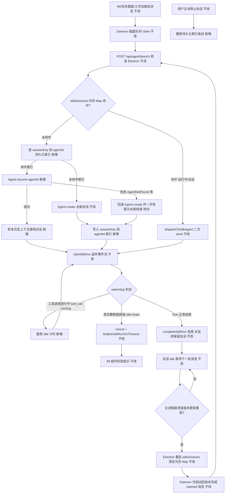
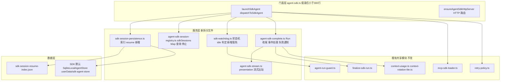

# Cursor SDK 执行引擎长任务支持 - 实现设计

> **业务 PRD**：见同目录 `01-proposal.md`（5 条验收标准以 01 为准）
> **技术口径**：`@cursor/sdk@1.0.22`（`package.json` 第 42 行）；SDK 能力结论均回 `node_modules/@cursor/sdk/dist/esm/**/*.d.ts` 类型声明与 `uploads/typescript-0.md` 官方文档核实，附依据位置；查不到依据标「（待确认/推测）」。

## 一、业务流程与改动范围

> 业务口径以 `01-proposal.md` §用户故事/§验收标准为准；下图覆盖"长任务从触发→正常执行→可能中断→续接/兜底提示"的主流程与关键分支。

### （一）业务流程图



**图例**：`不改` 行为与现网一致；`改动` 需改代码/配置；`新增` 新节点或新分支；`删除` 移除路径（本变更无删除）。

### （二）流程步骤与改动对照

| 步骤 ID | 业务含义 | 改动 | 落点（模块/文件） | 01 验收关联 |
|---------|----------|------|-------------------|-------------|
| S1 | IM/任务/工作流触发消息、Daemon claim 转发 | 不改 | `src/daemon.ts`、`electron/agent-sdk.ts`（HTTP 入口） | 01 验收 1、5 |
| S2 | 内存 Map 未命中时查持久化 sessionKey→agentId 索引 | 新增 | `electron/sdk-session-persistence.ts` | 01 验收 1、3 |
| S3 | 命中索引则调用 `Agent.resume(agentId)` 恢复历史上下文 | 新增 | `electron/sdk-session-persistence.ts`、`electron/agent-sdk.ts`（`launchSdkAgent`） | 01 验收 1、3、4 |
| S4 | resume 失败（无索引/AgentNotFound 等）回退 `Agent.create` 并一次性提示未续接 | 改动 | `electron/agent-sdk.ts`（`launchSdkAgent`） | 01 验收 3（"明确提示，而非静默消失"） |
| S5 | 会话创建/续接成功后写入持久化索引 | 新增 | `electron/sdk-session-persistence.ts` | 01 验收 1、3 |
| S6 | Run 事件流监听、正常收尾（长驻保留会话） | 不改 | `electron/agent-sdk-complete.ts`（拆分自 `agent-sdk.ts`，见 §三） | 01 验收 5 |
| S7 | watchdog 对"工具调用进行中"豁免 idle 计时，降低长耗时单步骤误杀概率 | 改动 | `electron/sdk-watchdog.ts`（拆分自 `agent-sdk.ts`） | 01 验收 2 |
| S8 | 真实静默超阈值触发 cancel + 超时 finalizer | 不改 | `electron/finalize-sdk-run.ts`、`electron/sdk-watchdog.ts` | 01 验收 2（不误杀是主线，超时兜底不变） |
| S9 | Electron 主进程崩溃/更新重启后 `sdkSessions` 清空 | 不改（现网既有行为，问题根因） | `electron/main.ts`、`electron/agent-sdk.ts` | 01 验收 1、3 |
| S10 | Daemon 冷启动回收 `.claimed` 未完成消息为 `.qmsg` 重新可调度 | 不改 | `src/daemon.ts`（`cleanupOrphanClaimedOnColdStart`） | 01 验收 1、3 |
| S11 | 用户主动停止会话时删除持久化索引，避免误续接已放弃的会话 | 新增 | `electron/agent-sdk-session-registry.ts`（`stopSdkSession`/`stopAllSdkSessions`） | 01 验收 5（不影响短任务/主动停止现有行为） |
| S12 | 显式开启 SDK 传输抖动自动重试 | 改动 | `electron/agent-sdk.ts`、`electron/agent-sdk-complete.ts`（`Agent.create`/`Agent.resume`/`maybeRotateSessionForPressure` 的 `local` 选项） | 01 验收 2 |

### （三）改动汇总

- **改动**：`electron/agent-sdk.ts`（瘦身为门面，`launchSdkAgent` 加 resume 分支、`local.enableAgentRetries` 显式开启）；`electron/finalize-sdk-run.ts`（不改行为，仅确认 import 关系不变）。
- **新增**：`electron/sdk-session-persistence.ts`（持久化索引 + `tryResumeSdkAgent`）、`electron/sdk-watchdog.ts`（watchdog 状态机迁移 + tool-running 豁免分支）、`electron/agent-sdk-session-registry.ts`（`sdkSessions` Map 本体与查询/停止 API 迁移）、`electron/agent-sdk-stream.ts`（presentation/流式出站迁移）、`electron/agent-sdk-complete.ts`（Run 收尾/事件处理/失败通知迁移）；运行期产物 `userData/sdk-session-resume-index.json`、`userData/sdk-agent-store/`（SDK 默认 SQLite 持久化落点，显式固定路径）。
- **不改（显式列出）**：`electron/agent-run-guard.ts`、`electron/retry-policy.ts`、`electron/context-usage*.ts`、`electron/context-rotation-lite.ts`、`electron/mcp-sdk-loader.ts`、`electron/sdk-failure-messages.ts`、`electron/crash-log-archiver.ts`（全部复用不改动）；`electron/session-dispatcher.ts`、`electron/daemon-manager.ts`、`electron/session-mcp-status.ts`（仅通过既有 `from "./agent-sdk"` import 路径引用 re-export 符号，行为不变）；Claude Code/Codex/OpenCode 三引擎全部文件（01 §非目标明确排除）；Daemon 侧磁盘队列与冷启动回收逻辑（`src/daemon.ts`，已具备崩溃自愈，本次不改）；`/api/agent/launch|dispatch` HTTP 契约（请求/响应体不变）。

## 二、整体思路

**根因**（回 CodeGraph `codegraph_context` 定位 + 源码核实，见 §七）：`electron/agent-sdk.ts:128` 的 `sdkSessions` 是纯内存 `Map<string, SdkSessionAgent>`；`electron/main.ts` 的 `will-quit` 钩子 `cleanupDaemonManager()` 会连带 kill 子进程 Daemon，应用重启（含 `electron/updater.ts` 的 `autoUpdater.quitAndInstall`）或崩溃后，Electron 主进程与 Daemon 子进程一并消失，`sdkSessions` 随进程退出清空。Daemon 重新拉起后 `cleanupOrphanClaimedOnColdStart`（`src/daemon.ts`）会把中断前 `.claimed` 未完成消息还原为 `.qmsg` 并重新调度，但 `launchSdkAgentFromHttp` 发现 `sdkSessions` 未命中时现状只会 `Agent.create()` 建全新会话——历史对话上下文完全丢失，这正是 01 背景所述"重启后长任务/长对话被中断且无法自动恢复"的直接代码级根因。

**SDK 能力核实结论**（逐条附依据，详见 §七"SDK 能力核实清单"）：`@cursor/sdk@1.0.22` **已支持** `Agent.resume(agentId, options)`、内置 `SqliteLocalAgentStore`/`JsonlLocalAgentStore`（`LocalAgentStore` 接口）、`LocalAgentOptions.enableAgentRetries`、`AgentBusyError`、`Run.onDidChangeStatus()`、`Run.conversation()`——`knowledge/业务域/Agent调度/06-CursorSDK执行引擎.md` §九「SDK 无 `Agent.resume` 级跨进程续接」与 `03-启动与自动重连.md` §九同类表述**已过时**，需在 §十 知识库更新计划中修正。更关键的是：`LocalAgentStore` 类型声明明确"When `local.store` / `localStore` is omitted, the SDK opens `SqliteLocalAgentStore`（on-disk SQLite under the workspace state root）"——即**默认情况下 SDK 已经把会话元数据与对话检查点持久化到磁盘**（按 `cwd` 维度隔离），本次改造无需自建会话历史存储，只需解决"如何找到某个 `sessionKey` 对应的 `agentId`"这一层索引问题。

**方案要点**：

1. **不自建 `LocalAgentStore`**：直接复用 SDK 默认 `SqliteLocalAgentStore`（Node 内置 `node:sqlite`，无原生二进制依赖，见 §七核实），仅在应用启动时用 `Cursor.configure({ local: { store } })` 把落盘路径显式钉在 Electron `userData` 下（避免依赖未文档化的默认路径计算规则），保证跨重启路径稳定。
2. **新增一层轻量持久化索引**：`sessionKey → agentId`（+ `workspaceDir` 供 resume 时 `cwd` 校验），JSON 文件落盘（`userData/sdk-session-resume-index.json`），在 `Agent.create`/`Agent.resume` 成功后写入，在用户主动 `stopSdkSession` 时删除。
3. **`launchSdkAgent` 无内存命中分支新增"先尝试 resume，失败回退 create + 一次性提示"**：满足 01 验收 3"确实无法恢复时给出用户可理解的明确提示，而非任务无声消失"。
4. **watchdog 增加"工具调用进行中豁免 idle 计时"分支**：核实 SDK `SDKToolUseMessage` 只有 `running`/`completed`/`error` 三态（无执行期心跳，见 §七），单个长耗时工具调用（如长时间 shell/构建）在 `running` 状态期间没有任何中间事件会刷新 `lastActivityAt`，是当前"长耗时被误判"的实际触发点（`NEVER_CANCEL_ON_DURATION` 默认 true 已豁免总时长上限，真正风险在单工具静默期）。
5. **显式开启 `enableAgentRetries: true`**：覆盖"传输抖动导致长任务中断"场景；当前代码未显式设置，依赖 SDK 对"headless embedder"的启发式默认（依据不可从类型声明验证，标待确认），显式设置消除歧义。
6. **不引入 cloud 运行时**：结论与理由见 §八·（一）。

**与 01 的追溯**：目标 1/验收 1（重启后自动续接）→ S2/S3/S5；目标 2/验收 2（长耗时/长等待不误杀）→ S7/S8；目标 3/验收 3（崩溃恢复+明确提示）→ S2~S5、S9/S10；目标 4/验收 3（无法续接给兜底提示）→ S4；目标 1/验收 4（续接后上下文一致）→ S3（`Agent.resume` 恢复 SDK 侧检查点，非本应用自建上下文拼接）；验收 5（短任务不受影响）→ S6/S11（长驻/短任务路径未改）。

**最小方案三问**：

1. **能否复用 CodeGraph 已定位的现有模块，而非新建抽象层？** 能，且是本方案主干：SDK 默认 `SqliteLocalAgentStore` 已提供会话/检查点持久化，不需要实现自定义 `LocalAgentStore`；超时收尾复用既有 `finalize-sdk-run.ts` 的 `FinalizerContext` 模式；重试/退避复用既有 `retry-policy.ts`/`agent-run-guard.ts`，不新增重试框架。
2. **拟新增的抽象是否被 01 明确要求？** 01 验收 1/3 明确要求"重启/崩溃后可自动续接、无需重新发起"，因此"`sessionKey→agentId` 持久化索引"与"resume-then-fallback"分支是验收硬性要求的最小新增，不可省略。除此之外不新增任何通用引擎抽象层（如 `EngineAdapter`/可插拔 Store 工厂）——YAGNI：目前只有一种落地后端（SDK 默认 SQLite），无需为"未来可能换存储"预留策略层。
3. **能否合并到已有文件，而非预建通用层？** 索引读写与 resume 封装体量小，但 `electron/agent-sdk.ts` 现状约 1696 行，早已超过仓库单文件 ≤300 行硬限制，本次必须拆分（不能继续堆叠）。拆分方案见 §三，采用仓库已有先例（Codex/OpenCode 的 `agent-<engine>-session-registry.ts`/`agent-<engine>-stream.ts`/`agent-<engine>-complete.ts`/`agent-<engine>-watchdog.ts` 四件套），不是发明新模式，是把 SDK 引擎补齐到与 CC/Codex/OpenCode 一致的既有拆分惯例。

## 三、分层设计

`electron/agent-sdk.ts`（1696 行，`Read` 工具全量核实，函数清单见 §七）职责混杂：会话类型定义、watchdog 状态机、presentation/流式出站、Run 收尾与失败通知、发送重试、HTTP server、会话注册表查询/停止、HTTP handler。拆分采用**门面模式（Facade）**——`agent-sdk.ts` 瘦身为对外唯一入口，内部委托专职文件，并 `re-export` 迁移符号以保持 `session-dispatcher.ts`/`daemon-manager.ts`/`session-mcp-status.ts` 现有 `from "./agent-sdk"` import 路径不变（`electron/AGENTS.md` 已有先例："`agent-codex-sdk.ts` re-export 三函数以保持 `daemon-manager`/`session-dispatcher` import 路径不变"，本次对 SDK 引擎补齐同一惯例，非新发明）。



- **端点层**：无（本变更不涉及 renderer/UI，01 §非目标已排除界面改动）。
- **服务层**：`agent-sdk.ts`（门面，编排 launch/dispatch/HTTP）→ `sdk-session-persistence.ts`（新增，索引+resume）→ `agent-sdk-session-registry.ts`（新增，会话表）→ `sdk-watchdog.ts`（新增，超时判定）→ `agent-sdk-stream.ts`/`agent-sdk-complete.ts`（新增，出站与收尾）；既有 `finalize-sdk-run.ts`/`agent-run-guard.ts`/`retry-policy.ts`/`context-usage*.ts`/`mcp-sdk-loader.ts` 全部复用不改。
- **数据层**：新增 `sdk-session-resume-index.json`（本应用自有小索引）+ SDK 内置 `SqliteLocalAgentStore`（会话与检查点，SDK 自管理表结构，本应用不建表、不解析其内部 schema）。

## 四、接口设计

### 新增内部接口（`electron/sdk-session-persistence.ts`）

| 方法 | 签名 | 说明 |
|------|------|------|
| `initSdkAgentStore` | `(): Promise<void>` | 应用启动时调用一次，`SqliteLocalAgentStore.open(...)` + `Cursor.configure({ local: { store } })`，失败降级 `JsonlLocalAgentStore`（见 §八风险） |
| `loadResumeRecord` | `(sessionKey: string): SdkSessionResumeRecord \| undefined` | 读索引文件，缺失/解析失败返回 `undefined`，不 throw |
| `saveResumeRecord` | `(sessionKey: string, record: Omit<SdkSessionResumeRecord, "sessionKey">): void` | 原子写（tmp 文件 + rename），best-effort，写失败仅 WARN 不阻断主流程 |
| `deleteResumeRecord` | `(sessionKey: string): void` | 幂等删除，用户主动停止会话时调用 |
| `tryResumeSdkAgent` | `(sessionKey: string, workspaceDir: string, apiKey: string): Promise<{ agent: SDKAgent; agentId: string } \| null>` | 查索引未命中直接返回 `null`；命中则 `Agent.resume(agentId, { apiKey, local: { cwd: workspaceDir, enableAgentRetries: true } })`，捕获异常（含 `AgentNotFoundError`）记 WARN 日志后返回 `null`，调用方负责回退 `Agent.create` |

### 改造的既有接口（签名不变，仅内部实现调整）

- `launchSdkAgent(opts: SdkLaunchOptions)`：无内存 session 命中分支内新增"先 `tryResumeSdkAgent`，成功则复用其 `agent`/`agentId` 构造 `SdkSessionAgent` 并直接进入 `dispatchToSdkAgent` 语义处理排队消息；失败或未命中则维持现有 `Agent.create()` 路径，`Agent.create`/成功 resume 后统一调用 `saveResumeRecord`"。
- `stopSdkSession(sessionKey)` / `stopAllSdkSessions()`（迁移至 `agent-sdk-session-registry.ts`，签名不变）：新增调用 `deleteResumeRecord(sessionKey)`。

### 外部 HTTP 契约

无变更——`POST /api/agent/launch|dispatch` 请求体、响应体（`{ ok, error? }`）与现网一致，01 §非目标"不改变用户发起对话/任务的入口与交互方式"要求本次不新增/不修改对外契约。

## 五、数据结构

### 持久化索引文件 `userData/sdk-session-resume-index.json`

```json
{
  "<sessionKey>": {
    "agentId": "string，SDK 本地 agentId",
    "workspaceDir": "string，创建/最近一次成功 send 时的 cwd",
    "createdAt": 1751000000000,
    "updatedAt": 1751000600000
  }
}
```

- 单文件 JSON Map，键为 `sessionKey`；无需数据库，量级与 `sdkSessions` 常驻会话数一致（通常 ≤ 数十条），复用现有 `agent-api-port.json`/`mcp-auth.json` 同类"小型 JSON 状态文件"约定，不新增依赖。
- 写入时机：`Agent.create`/`Agent.resume` 成功后（覆盖式 upsert）；删除时机：`stopSdkSession`/`stopAllSdkSessions`。
- **不做的事**：不存储对话内容、不存储 token/凭证（`apiKey` 不落盘于此文件，沿用现有 `config-store` 管理）。

### SDK 内置持久化（不自建，仅固定路径）

- `SqliteLocalAgentStore.open({ workspaceRef, stateRoot: path.join(app.getPath("userData"), "sdk-agent-store") })`：`stateRoot` 显式指定，避免依赖未文档化的默认路径解析规则（`getDefaultSdkStateRoot(workspaceRef)` 内部实现未在 `.d.ts` 暴露，标**待确认**，见 §七）；`workspaceRef` 取值待实现阶段确认是否需要按主工作区固定还是允许多 `cwd` 共享同一 store 实例（`LocalAgentDocument.cwd`/`LocalAgentListFilter.cwd` 支持同一 store 内按 `cwd` 过滤，理论上单实例可覆盖多工作目录，标**待确认**，建议实现阶段补充最小验证）。
- 该库内部表结构（`agents`/`runs`/`run_events`/checkpoint blob）由 SDK 自管理，本应用不解析、不直接读写。

## 六、实现步骤

> 每步回溯「一·（二）」步骤 ID。

1. **新增 `sdk-session-persistence.ts`**：索引读写（`loadResumeRecord`/`saveResumeRecord`/`deleteResumeRecord`）+ `initSdkAgentStore`（`Cursor.configure` 固定存储路径）+ `tryResumeSdkAgent`。回溯 S2、S3、S5。
2. **应用启动挂载 `initSdkAgentStore()`**：在 `ensureAgentSdkHttpServer()` 首次调用前（`initDaemonManager()` 路径）执行一次，失败仅 WARN、不阻断应用启动（保底仍可用 `Agent.create` 默认行为）。回溯 S2。
3. **拆分 `agent-sdk-session-registry.ts`**：迁移 `sdkSessions` Map、`getSdkSession`/`getSdkSessionList`/`getSdkSessionCount`/`hasSdkSession`/`isSdkSessionRunning`/`stopSdkSession`/`stopAllSdkSessions`/`broadcastSdkSessionStatus`，签名与导出路径不变（`agent-sdk.ts` re-export）。`stopSdkSession`/`stopAllSdkSessions` 内新增 `deleteResumeRecord` 调用。回溯 S11。
4. **拆分 `agent-sdk-stream.ts`**：迁移 presentation/流式出站相关函数（`postPresentationEvent`/`postStreamText`/`appendStreamDelta`/`scheduleStreamPost`/`flushStreamPost`/PRESENTATION_ORDERING 相关辅助函数）。回溯 S6（不改行为，仅搬迁）。
5. **拆分 `agent-sdk-complete.ts`**：迁移 `streamRunEvents`/`completeSdkRun`/`startSdkRun`/`handleSdkEvent`/`notifySdkFailure`/`notifyDispatchFailure`/`finalizeRunContextUsage`。回溯 S6、S12（`local.enableAgentRetries` 显式设置落在本文件内 `maybeRotateSessionForPressure` 的 `Agent.create` 调用处）。
6. **拆分 `sdk-watchdog.ts`**：迁移 `armRunWatchdog`/`setWatchdogState`/`markSessionActivity`/watchdog 常量。在 `onTick` 判定 idle 前新增分支：若 `session.lastTool?.status === "running"`，视为忙碌（跳过 idle→draining 判定），直到该工具 `completed`/`error`。回溯 S7、S8（S8 逻辑不变，仅与新分支共存于同一函数内）。
7. **改造 `agent-sdk.ts` 内 `launchSdkAgent`**：内存 Map 未命中分支，新增"先 `tryResumeSdkAgent`（成功→复用 agent 走 dispatch 语义处理排队消息；失败/未命中→`Agent.create` 并在 resume 失败场景下附带一次性提示文案）"；成功创建/续接后调用 `saveResumeRecord`。回溯 S2~S5。
8. **显式设置 `enableAgentRetries: true`**：`launchSdkAgent` 的 `Agent.create`、`sdk-session-persistence.ts` 的 `Agent.resume`、`agent-sdk-complete.ts` 的 `maybeRotateSessionForPressure` 三处 `local` 选项统一补充。回溯 S12。
9. **工程验证**（见 §八·（二）工程补充验收项清单，非新增业务步骤，implement 阶段核对）：模拟重启后 dispatch 命中 resume 分支；watchdog 单工具长耗时不误杀；resume 失败正确回退并提示；主动停止后索引被清理。

## 七、参考实现

### SDK 能力核实清单（`@cursor/sdk@1.0.22`，逐条附依据）

| 能力 | 结论 | 依据 |
|------|------|------|
| `Agent.resume(agentId, options?)` | **支持** | `node_modules/@cursor/sdk/dist/esm/stubs.d.ts:46`：`static resume(agentId: string, options?: Partial<AgentOptions>): Promise<SDKAgent>` |
| `LocalAgentStore`（`SqliteLocalAgentStore`/`JsonlLocalAgentStore`） | **支持**，且为默认行为 | `.../agent/store/local-agent-store.d.ts:230-233`（"When local.store/localStore is omitted, the SDK opens SqliteLocalAgentStore"）；`.../store/sqlite-local-agent-store.d.ts:18`；`.../store/jsonl-local-agent-store.d.ts:26`；均经 `public-api.d.ts:14-15` 对外导出 |
| `enableAgentRetries` | **支持** | `.../options.d.ts:145`：`LocalAgentOptions.enableAgentRetries?: boolean`（注释："Enable transport and stall auto-retry for local agent runs. Defaults to true for headless embedders"）——"headless embedder" 是否自动识别本应用 Electron 主进程场景**待确认**，建议显式设置消除歧义 |
| `AgentBusyError` | **支持** | `.../errors.d.ts:89`：`export declare class AgentBusyError extends CursorAgentError`（409 冲突：已有活跃 run 时创建新 run 抛出） |
| `Run.onDidChangeStatus()` | **支持** | `.../run.d.ts:42`：`onDidChangeStatus(listener: (status: RunStatus) => void): () => void` |
| `Run.conversation()` | **支持** | `.../run.d.ts:38`：`conversation(): Promise<ConversationTurn[]>` |
| `SDKToolUseMessage` 执行期心跳 | **不支持**（仅 `running`/`completed`/`error` 三态，无中间进度事件） | `.../messages.d.ts:42-55` |
| `sqlite` 后端原生依赖 | 使用 Node 内置 `node:sqlite`（`DatabaseSync`），**非原生二进制插件** | `node_modules/@cursor/sdk/dist/cjs/sqlite.js` 内 grep 命中 `node:sqlite`；Electron 41（`package.json` `"electron": "^41.0.3"`）内置 Node v24.14.0+（[electron v41.0.0 release notes](https://github.com/electron/electron/releases/tag/v41.0.0)），Node 22.5+ 已含 `node:sqlite` |
| `getDefaultSdkStateRoot` 默认落盘路径的具体计算规则 | **待确认/推测**（仅确认函数存在与用途，未反解压缩后源码定位具体目录） | `.../store/sdk-state-root.d.ts:5` 仅声明签名与注释，无实现细节；本设计不依赖默认路径，显式传 `stateRoot` 规避该不确定性 |

### CodeGraph / 源码命中的关键符号

| 符号 | 路径 | 说明 |
|------|------|------|
| `sdkSessions` | `electron/agent-sdk.ts:128` | CodeGraph `codegraph_context` 命中；纯内存 Map，本次问题根因 |
| `SdkSessionAgent` | `electron/agent-sdk.ts:50-126` | 会话状态接口，`agentId`/`workspaceDir`/`watchdogState` 等字段为持久化索引取值来源 |
| `launchSdkAgent` | `electron/agent-sdk.ts:1174-1322` | 全量 `Read` 核实；无内存命中分支（1178-1194）现状直接落 `Agent.create`（1231-1240），本次改造点 |
| `dispatchToSdkAgent` | `electron/agent-sdk.ts:1324-1383` | 二次 send 入口，签名不变 |
| `launchSdkAgentFromHttp` | `electron/agent-sdk.ts:1479-1561` | 全量 `Read` 核实；`workspaceDir`/`model`/`apiKey` 均按当前通道配置**每次重新解析**（非从旧会话继承），确认持久化索引无需存这些字段 |
| `armRunWatchdog` | `electron/agent-sdk.ts:812-872` | 全量 `Read` 核实；`onTick` 现状仅按 `idleMs`/`NEVER_CANCEL_ON_DURATION` 判定，无 tool-running 豁免，本次改造点 |
| `markSessionActivity` | `electron/agent-sdk.ts:208-213` | 仅在 `run_start`/`stream:${event.type}` 调用，核实"单工具静默期无活跃信号刷新"的机制来源 |
| `handleSdkEvent` | `electron/agent-sdk.ts:1053-1115` | 全量 `Read` 核实事件分发；`tool_call` 分支（1075-1093）确认 `status` 仅三态 |
| `finalizeSdkRunOnTimeout` / `isRunTimeoutFailure` / `cancelRunAndWait` | `electron/finalize-sdk-run.ts` | 全量 `Read` 核实；`FinalizerContext` 依赖注入模式直接复用，不改 |
| `acquireRunGuard`/`watchRunGuard`/`completeRunGuard`/`releaseRunGuard` | `electron/agent-run-guard.ts` | 全量 `Read` 核实；单飞保证与 watchdog 拆分后仍原样复用 |
| `shouldRetry`/`buildIdempotencyKey` | `electron/retry-policy.ts` | 全量 `Read` 核实；传输抖动重试策略现状（正则匹配 timeout/network/econnreset 等），与 `enableAgentRetries` 是互补的两层（应用层重试 + SDK 内部 transport 重试） |
| `initDaemonManager`/`cleanupDaemonManager`/`autoStartDaemonOnLaunch` | `electron/daemon-manager.ts` | 核实 Daemon 为子进程、随 Electron `will-quit` 一并 kill、下次启动重新 spawn（`daemonProcess` 生命周期），佐证"Electron 重启 = Daemon 也重启 = 双方状态一并归零" |
| `cleanupOrphanClaimedOnColdStart`/`sessionAgentPhaseMap`/`forwardElectronAgentApi` | `src/daemon.ts` | 核实 Daemon 磁盘队列自带崩溃自愈（`.claimed`→`.qmsg`），本次不改；`sessionAgentPhaseMap` 随 Daemon 进程重启一并清零，不存在"Daemon 认为一直 processing"的死锁风险 |
| Codex/OpenCode 拆分先例 | `electron/agent-codex-session-registry.ts`、`electron/agent-opencode-{watchdog,complete,stream,session-registry}.ts` | 文件拆分与 re-export 惯例的直接模板（`electron/AGENTS.md` 已记录该约定） |

## 八、技术影响

### （一）影响范围

- **涉及模块**：`electron/agent-sdk.ts`（拆分+改造）、5 个新增文件（`sdk-session-persistence.ts`/`sdk-watchdog.ts`/`agent-sdk-session-registry.ts`/`agent-sdk-stream.ts`/`agent-sdk-complete.ts`）；间接涉及 `electron/session-dispatcher.ts`/`electron/daemon-manager.ts`/`electron/session-mcp-status.ts`（仅 import 路径引用，行为不变，需回归验证 re-export 完整）；`electron/main.ts`（新增 `initSdkAgentStore()` 启动挂载点）。
- **接口/proto 变更**：无。`/api/agent/launch|dispatch` 契约不变。
- **数据变更**：新增本地文件 `userData/sdk-session-resume-index.json`（小体量）与固定路径 `userData/sdk-agent-store/`（SDK 内置 SQLite，体量随会话历史增长，需运维观察，纳入 §（二）验收项）。
- **三项关键风险明确评估**：
  1. **进程重启丢会话** — 已通过 `Agent.resume` + 持久化索引解决 01 验收 1/3 的主诉求。残余风险：(a) 索引文件与 SDK 内置 store 是两套独立持久化，理论上存在不一致窗口（如索引写成功但 `Agent.create` 后进程立即崩溃，索引指向的 `agentId` 若 SDK 侧未及时落盘完整则 resume 可能取到不完整历史）——SDK 内部落盘时机未在 `.d.ts` 暴露，标**待确认**，建议实现阶段观察是否需要索引写入延后到首次 `agent.send()` 成功后而非 `Agent.create()` 后；(b) `cwd`/工作目录若被用户在两次重启之间修改，`Agent.resume` 可能因 `cwd` scoping 找不到记录而静默失败，已由 S4 兜底为"回退新对话+提示"，不会静默丢失。
  2. **cloud 运行时成本/延迟** — **结论：不采用**。理由：①本地 resume 方案已完整覆盖 01 全部 4 条目标，无需切换运行时；②`CloudAgentOptions` 要求 `repos`（Git 仓库绑定）+ 云端 VM 环境，与现有"任意本地工作目录 + 本地 MCP stdio 命令 + 按 chatId 隔离工作区"架构不兼容，强行接入需要重新设计工作区/工具执行模型；③云端 Run 的流式桥接（`Run.stream()`/事件轮询）与现有 `postStreamText`/`postPresentationEvent` 基于**本地同进程 Run 对象**同步桥接的实现方式不同，引入云端需要新增一套独立桥接路径，与 01 §非目标"不改变用户发起对话/任务的入口与交互方式""不新增可见的配置页面"存在张力；④云端计费与冷启动延迟对"IM 即时对话"体验是负向影响。**备选方案**：若未来出现"用户设备长时间关机/离线但任务仍需持续运行数十小时"的强需求，可作为独立后续变更单独评估 cloud 运行时，不在本次范围内。
  3. **watchdog 误杀** — tool-running 豁免分支针对性解决"单工具长耗时静默"这一已核实的实际触发点（`SDKToolUseMessage` 无中间心跳，见 §七）。残余风险：若 SDK 未来在两次 `tool_call` 之间存在**非工具类**长静默（如模型推理本身耗时且无 `thinking` 事件），当前豁免分支覆盖不到，仍可能触发 idle→cancel；此模式在现有 `.d.ts`/文档中未观测到证据，标**待确认**，缓解手段是 `SDK_IDLE_TIMEOUT_MS` 环境变量仍可调大（现状能力保留）。

### （二）工程补充验收项

- [ ] `sdk-session-resume-index.json` 写入为原子写（tmp + rename），并发多 session 写入互不覆盖对方条目
- [ ] `Agent.resume` 失败（`AgentNotFoundError`/`cwd` 不匹配等）时不阻断新对话创建，且用户仅收到一次"未能自动续接"提示（不重复刷屏）
- [ ] `stopSdkSession`/`stopAllSdkSessions` 执行后对应索引条目被删除，不残留可被误续接的目标
- [ ] `enableAgentRetries: true` 在 `Agent.create`（`launchSdkAgent`）、`Agent.resume`（`sdk-session-persistence.ts`）、`Agent.create`（`maybeRotateSessionForPressure` 轮转）三处均显式设置
- [ ] 单个工具调用运行中（`tool_call` 仅 `running`、未 `completed`/`error`）超过现有 `SDK_IDLE_TIMEOUT_MS` 时长，watchdog 不触发 cancel
- [ ] 拆分后 `agent-sdk.ts` 及全部新增文件单文件 ≤300 行（`AGENTS.md` 硬约束）
- [ ] 拆分后 `session-dispatcher.ts`/`daemon-manager.ts`/`session-mcp-status.ts` 现有 `from "./agent-sdk"` import 不需要改动（re-export 完整性验证）
- [ ] `initSdkAgentStore()` 在 `SqliteLocalAgentStore.open` 失败时（如 `node:sqlite` 不可用）有明确降级路径（`JsonlLocalAgentStore` 或维持无持久化的现网行为），不导致应用启动失败
- [ ] `electron/AGENTS.md` 补充 SDK resume/持久化索引/watchdog 新约定段落（工程规则文件，非 knowledge 域，`kb-builder` 落地实现时同步维护，本设计仅标注需求不代写）

## 九、知识库影响

- `knowledge/业务域/Agent调度/06-CursorSDK执行引擎.md` — §二"设计决策与取舍"需新增 resume/持久化索引/watchdog 决策；§九"已知限制与 TODO"中"SDK 无 `Agent.resume` 级跨进程续接"表述已被本设计核实推翻，需修正为"支持 resume，见持久化索引方案"。
- `knowledge/业务域/Agent调度/03-启动与自动重连.md` — 该文件是四引擎"续接"总口径，§二/§九当前将 SDK 描述为"无 resume"，需与 06 同步修正，同时保持 CC/Codex/OpenCode 三引擎现状表述不变（01 §非目标已排除对三者的改动）。
- `knowledge/业务域/Agent调度/00-README.md` — "关键源码"表需补充新增文件（`sdk-session-persistence.ts`/`sdk-watchdog.ts`/`agent-sdk-session-registry.ts`/`agent-sdk-stream.ts`/`agent-sdk-complete.ts`）。
- 两级索引：`知识索引.md` 是否引用 06/03 摘要待 `kb-archive` 阶段由 kb-librarian 核实，本设计不预判。

## 十、知识库更新计划

### （一）必须更新

- `knowledge/业务域/Agent调度/06-CursorSDK执行引擎.md`：§二 新增"长任务持久化 resume"决策段（存储选型、索引写入/删除时机、watchdog tool-running 豁免）；§六"数据"补充 `sdk-session-resume-index.json`；§九 修正"SDK 无 resume"表述，改为"支持 `Agent.resume` + 应用层持久化索引，见 06 §二"；§十 追加变更记录。
- `knowledge/业务域/Agent调度/03-启动与自动重连.md`：§二 SDK 一行由"无 resume"更新为"resume（`Agent.resume` + 持久化 `sessionKey→agentId` 索引）"，与 CC/Codex/OpenCode 并列表述保持四引擎总口径一致；§九 同步修正。
- `knowledge/业务域/Agent调度/00-README.md`：「关键源码」表 Cursor 行补充新增文件路径。

### （二）可能更新（视实现结果）

- `knowledge/业务域/Agent调度/01-概览.md`：若"关键约束"或架构图涉及"SDK 无跨进程续接"的旧表述，需一并修正（待实现阶段核实是否存在此类引用）。
- `知识索引.md`：若已收录 06/03 摘要且包含"无 resume"字样，需同步修正（`kb-archive` 阶段核实）。

### （三）不需要更新

- `knowledge/业务域/Agent调度/07-ClaudeCodeSDK执行引擎.md`、`08-CodexSDK执行引擎.md`、`09-OpenCodeSDK执行引擎.md`：01 §非目标明确排除对三引擎续接能力的改动，三份文档现状描述不受本变更影响。
- `knowledge/业务域/Agent调度/02-多会话模型.md`、`04-远程指令.md`、`05-定时任务.md`：本变更不涉及 sessionKey 生成规则、远程指令或定时任务调度逻辑。
