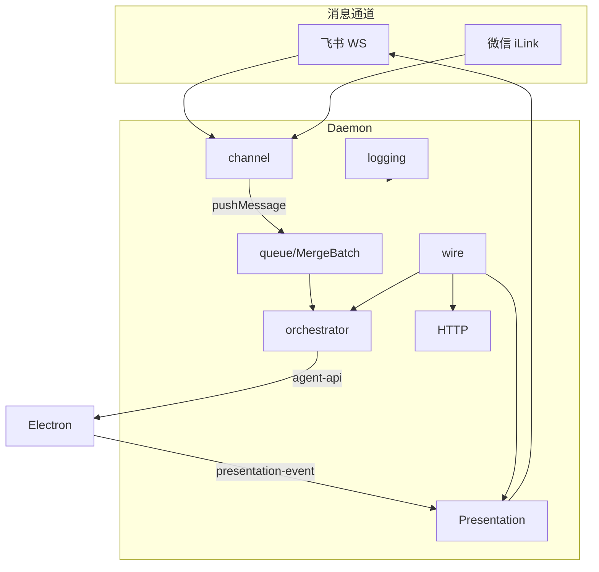
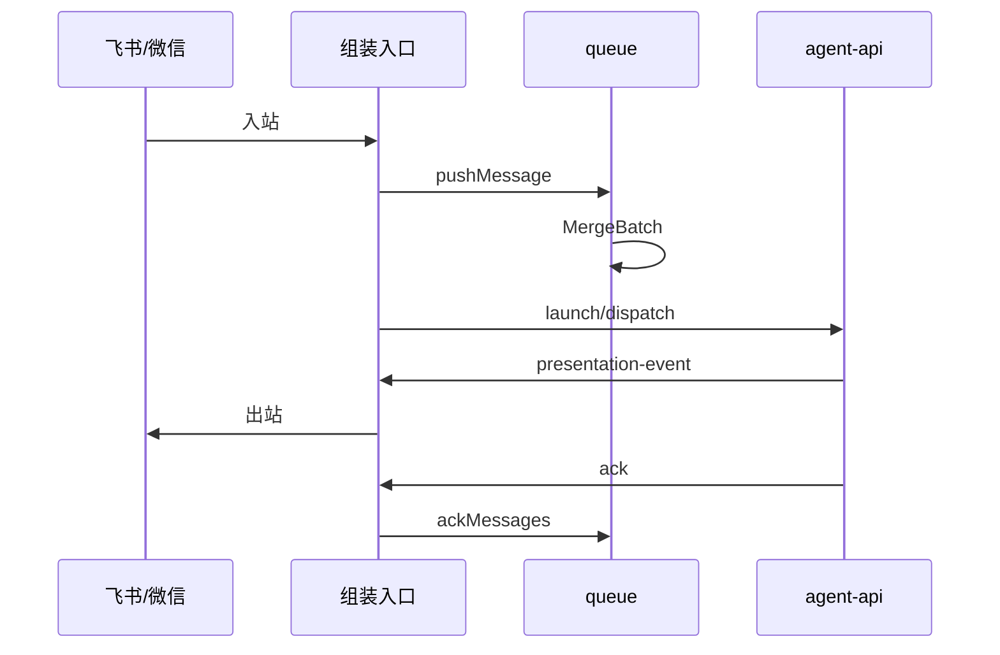

# Daemon 守护进程 · 概览

## 一、模块定位与边界

Daemon 是本机**唯一 IM 编排进程**：飞书/微信入站、文件队列、HTTP API、Presentation 与 SDK 调度转发。Agent **不 poll-message**；经 Electron `agent-api` launch/dispatch。枢纽 `daemon.ts` 仅薄组装（≤200 行）。

## 二、整体架构



## 三、核心状态机/主流程



冷启动：`createDaemonLogger` → `createQueueController` → routing load → `wireDaemonSubmodules` → `startChannelsHttpAndScheduler`。

## 四、子模块清单

| 子模块 | 职责 | 文档 |
|---|---|---|
| HTTP 与 MCP | REST、Presentation、调度 API | [02](./02-HTTP与MCP服务.md) |
| 进程模型与部署 | spawn、端口、日志 | [03](./03-进程模型与部署.md) |

源码职责表 SSOT：`src/daemon/AGENTS.md`（logging / queue* / channel* / wire / bootstrap）。

## 五、关键约束

- `CLAW_CHANNELS_JSON` 非空；HTTP 仅 `127.0.0.1`。
- poll-message **404**；斜杠 SSOT=`executeSlashCommand`，`SLASH_EXEC_MODE` 默认 `daemon`。
- 子模块禁止互引业务实现；跨域仅经 `daemon.ts` / `daemon-wire.ts` 注入 deps。

## 六、术语表

| 术语 | 含义 |
|---|---|
| MergeBatch | 合并批次（`daemon-queue-types` / `daemon-queue-merge*`） |
| createQueueController | 队列/SSE/入队/ack/merge 工厂 |
| createChannelRegistry | 飞书/微信通道注册与 resolve |
| createDaemonLogger | 文件日志与 2MB 轮转 |
| wireDaemonSubmodules | orchestrator/presentation/http/slash 接线 |
| chatKey / sessionKey | 通道路由 / Agent 会话 |

## 七、依赖关系

```mermaid
flowchart LR
  Electron -->|spawn| Daemon
  Daemon -->|agent-api-port| Electron
  Daemon --> Lark[@larksuiteoapi]
  Agent -->|send_*| HTTP
```

## 八、全局非功能与可观测

- 日志：`daemon-logging.ts`；`DAEMON_LOG_PATH` / Profile；2MB 轮转。
- 路由：`session-routing.json` 损坏降级空映射。
- 关键字：`presentation_failed`、`dispatch_failed`、`dispatch_retry_*`、`agent_busy_requeue`、`merge_action`。

## 九、全局已知限制

- `/merge` 闭环于 `daemon-merge-command.ts`；按钮 → `daemon-queue-merge-action.ts`。
- MCP：`POST /api/mcp` 或 `/mcp`；`/mcp-admin` 410。
- launch/dispatch 失败共用 `handleLaunchFailure`（见 [02](./02-HTTP与MCP服务.md)）。
- **未做**日志双写统一、调度并发改造。

## 十、文档入口

1. [03-进程模型与部署.md](./03-进程模型与部署.md) 2. [02-HTTP与MCP服务.md](./02-HTTP与MCP服务.md)

## 十一、变更记录

2026-07-12：批2 拆分 queue/channel/logging/wire/bootstrap；枢纽 ≤200（20260712170438）。
2026-07-12：斜杠默认 daemon、dispatch retry、会话路由（20260712144931 等）。
2026-06-27：IM 唯一编排、poll 移除（20260627162620）。
