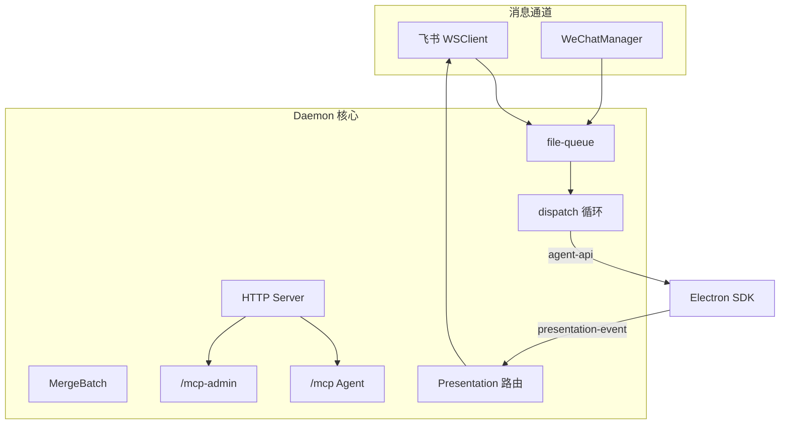
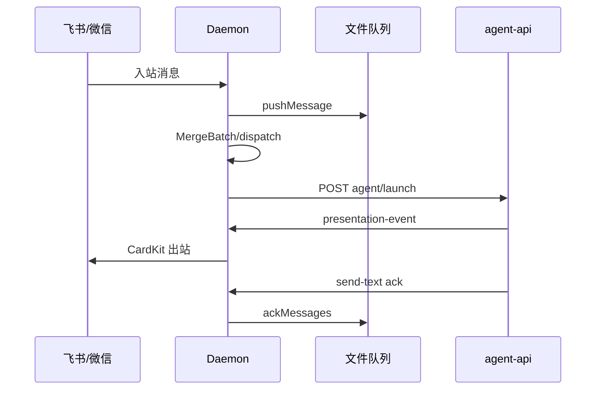

# Daemon 守护进程 · 概览

## 一、模块定位与边界

Daemon 是本机**唯一 IM 编排进程**：飞书 WebSocket、微信 iLink、文件队列、HTTP API、Presentation 路由与 SDK 调度转发。Agent **不再 poll-message**；经 Electron `agent-api` launch/dispatch。

## 二、整体架构



## 三、核心状态机/主流程



## 四、子模块清单

| 子模块 | 职责 | 文档 |
|---|---|---|
| HTTP 与 MCP 服务 | REST、Presentation、调度 API | [02-HTTP与MCP服务.md](./02-HTTP与MCP服务.md) |
| 进程模型与部署 | spawn、端口、agent-api 转发 | [03-进程模型与部署.md](./03-进程模型与部署.md) |

## 五、关键约束

- 启动时 `CLAW_CHANNELS_JSON` 非空（`src/daemon/daemon.ts`）。
- HTTP 仅 `127.0.0.1`；端口冲突回退随机。
- **poll-message 已移除（404）**；IM 闭环 Daemon→agent-api→Presentation。
- 代理环境变量启动时 strip。

## 六、术语表

| 术语 | 含义 |
|---|---|
| MergeBatch | 合并批次状态机 |
| PresentationEvent | SDK 展示事件 |
| agent-api-port.json | Electron SDK HTTP 端口 |
| chatKey / sessionKey | 通道路由 / Agent 会话粒度 |

## 七、依赖关系

```mermaid
flowchart LR
  Electron -->|spawn + env| Daemon
  Daemon -->|agent-api-port| Electron
  Daemon --> LarkSDK[@larksuiteoapi]
  Agent[MCP 工具] -->|send_*| HTTP
```

## 八、全局非功能与可观测

- 日志：`{APP_DATA_DIR}/daemon.log`，2MB 轮转。
- `presentation_failed`、`dispatch_failed` 可检索。
- MCP 连接数仍参与 agentRunning 推断（任务路径）。

## 九、全局已知限制

- 斜杠指令仍依赖 Electron claim `.fcmd`。
- 合并卡按钮回调 T8；admin MCP 废弃 T10。
- dispatch 失败 ack 不 re-queue（R3）。

## 十、文档入口

1. [03-进程模型与部署.md](./03-进程模型与部署.md) 2. [02-HTTP与MCP服务.md](./02-HTTP与MCP服务.md)

## 十一、变更记录

2026-07-02：源码路径对齐 `src/daemon/daemon.ts`（archive 20260702120154）。
2026-06-27：IM 唯一编排、Presentation、poll 移除（archive 20260627162620）。
2026-06-27：kb-sync 初始建立。
