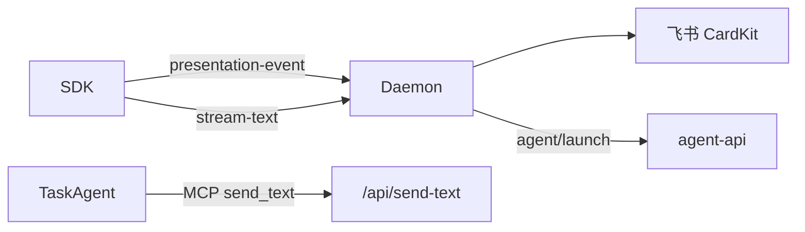

# HTTP 与 MCP 服务

## 一、能力范围

Daemon HTTP Server（`startHttpServer`）、StreamableHTTP MCP（`/mcp`、`/mcp-admin`）、**Presentation/MergeBatch/Agent 调度 API**。IM 路径不再提供 poll-message。

## 二、设计决策与取舍

- **StreamableHTTP 每请求新建 McpServer**（daemon.ts `/mcp`）。
- **Agent MCP 工具转调本地 HTTP**：`send_text` 等 POST `/api/send-text`。
- **IM SDK-only**：无 blocking poll 保活；任务 Agent 仍可用 MCP send。
- **调度转发**：Daemon 读 `agent-api-port.json` → `forwardElectronAgentApi`。
- **Presentation 单入口**：SDK POST `/api/presentation-event` → CardKit 渲染。

## 三、服务端规则

- 群聊须 @ 入队；斜杠写 `.fcmd`（**例外**：`/merge` 由 `daemon-merge-command.ts` Daemon 内闭环，不写 `.fcmd`）。
- 合并卡控制 SSOT：`handleMergeBatchAction`（按钮 `feishu-card-action.ts`、斜杠、HTTP `POST /api/merge-batch/action` 三入口）。
- ack 删队列；DONE 在 ack 路径（T7 无 poll）。
- MergeBatch：`merge-batch/action`；collecting 静默窗口内禁止 orchestrator claim。
- **IM launch 编排**失败走 `releaseClaimedMessages`+有限重试（见 [01-概览](./01-概览.md) §九）；**`POST /api/agent/dispatch` HTTP 旁路**失败仍 notify+ack、busy 仅 timer 不 release（与 launch 未对齐）。

## 四、客户端流程

## 五、接口

### MCP Agent 工具（`/mcp`）

| 工具 | 说明 |
|---|---|
| send_text / send_image / send_file | 文本/媒体回复（任务路径） |

### MCP Admin（`/mcp-admin`）

manage_agent / manage_mcp / manage_rules / manage_skills / manage_tasks / manage_workspace（T10 计划废弃统一 HTTP）。

### HTTP 路由（节选）

| 方法 | 路径 | 说明 |
|---|---|---|
| GET | /health | 健康检查 |
| GET | /api/poll-message | **404 已废弃** |
| POST | /api/presentation-event | Presentation 入站 |
| POST | /api/merge-batch/action | 合并卡控制 |
| POST | /api/orchestrator/claim-and-merge | claim 合并批次 |
| POST | /api/agent/launch | 转发 Electron agent-api launch |
| POST | /api/agent/dispatch | 转发 Electron agent-api dispatch；失败/busy **未**接线 release+有限重试（旁路债） |
| POST | /api/session-agent-phase | Agent 阶段 |
| POST | /api/stream-text | 流式出站 |
| POST | /api/send-text | 文本出站 |
| GET | /api/queue-events | SSE |

## 六、数据

- 队列：`.qmsg/.claimed`（APP_DATA_DIR）。
- 内存：`mergeBatchBySession`、`sessionAgentPhaseMap`、`sessionProgressMap`。

## 七、非功能与可观测

- SSE 队列事件；MCP 连接数影响 agentRunning。
- Presentation 失败 WARN `presentation_failed`。

## 八、推送

SSE；stdout `__WECHAT_QR__` 等供 Electron 解析。

## 九、已知限制与 TODO

- poll-message 404 后旧 CLI 规则须更新为 Daemon dispatch。
- manage_* 依赖 lock.port；T10 迁移至 Daemon-only 管理 API。
- HTTP 404 统一 `{ error: "not found" }`。
- HTTP `/api/agent/dispatch` 旁路与 IM launch 失败策略未对齐（失败即 ack / busy 无 release）。

## 十、变更记录

2026-07-12：`/merge` 斜杠 Daemon 内闭环与合并卡三入口 SSOT 说明（archive 20260712113253）。
2026-07-12：注明 HTTP dispatch 旁路与 launch 重入队策略差异（archive 20260711232817）。
2026-06-27：Presentation/merge/agent API；poll 404（archive 20260627162620）。
2026-06-27：poll wait=false 说明（IM 路径已移除 poll）。
2026-06-27：kb-sync 初始建立。
