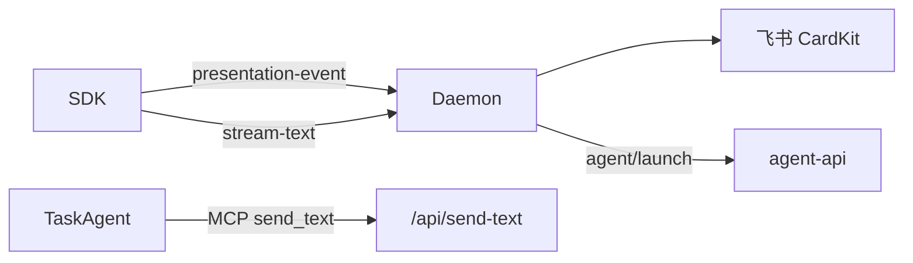

# HTTP 与 MCP 服务

## 一、能力范围

Daemon HTTP、MCP（`/mcp` Agent 工具）、Presentation/MergeBatch/Agent API。无 poll-message；MCP 管理走 `/api/mcp`。

## 二、设计决策与取舍

- **StreamableHTTP 每请求新建 McpServer**（daemon.ts `/mcp`）。
- **Agent MCP 工具转调本地 HTTP**：`send_text` 等 POST `/api/send-text`。
- **IM SDK-only**：无 blocking poll 保活；任务 Agent 仍可用 MCP send。
- **调度/斜杠转发**：`forwardElectronAgentApi`（launch/dispatch）、`forwardElectronCommandApi` → `POST /api/command/execute`。
- **Presentation 单入口**：SDK POST `/api/presentation-event` → CardKit 渲染。

## 三、服务端规则

- 群聊须 @ 入队；斜杠 `executeSlashCommand` 即时 reply（`/merge` 例外；**仅** `dual|electron` 可写 `.fcmd`）。
- 合并卡 SSOT：`handleMergeBatchAction`（按钮/斜杠/HTTP 三入口）。
- ack 删队列；DONE 在 ack 路径（T7 无 poll）。
- MergeBatch：`merge-batch/action`；collecting 静默窗口内禁止 orchestrator claim。
- **launch/dispatch 失败**：IM/HTTP 共用 `handleLaunchFailure`；release+有限重试（3 次）；未耗尽不 ack；详见 [04](../../业务域/消息桥接/04-消息队列与路由.md) §三。

## 四、客户端流程

## 五、接口

### MCP Agent 工具（`/mcp`）

| 工具 | 说明 |
|---|---|
| send_text / send_image / send_file | 文本/媒体回复（任务路径） |

### MCP 管理（HTTP / 斜杠）

`POST /api/mcp`（list/add/delete/enable/disable/info）；IM `/mcp` 子命令同语义。`/mcp-admin` 已移除（410）。

### HTTP 路由（节选）

| 方法 | 路径 | 说明 |
|---|---|---|
| GET | /health | 健康检查 |
| POST | /api/presentation-event | Presentation 入站 |
| POST | /api/merge-batch/action | 合并卡控制 |
| POST | /api/orchestrator/claim-and-merge | claim 合并批次 |
| POST | /api/agent/launch | 转发 agent-api launch |
| POST | /api/agent/dispatch | 转发 dispatch（失败策略见 §三） |
| POST | /api/session-agent-phase | Agent 阶段 |
| POST | /api/stream-text | 流式出站 |
| POST | /api/send-text | 文本出站 |
| GET/POST | /api/mcp | list；POST add/delete/enable/disable/info |
| GET | /api/queue-events | SSE |
| GET | /commands/skip-check\|executed-ids | **仅 dual** 斜杠去重（claim 前 skip-check；5s 缓存） |
| GET/POST | /commands* | **仅 dual/electron** 遗留 fcmd poll |
| POST | /api/command/execute | Electron agent-api 同步转发 |
| POST | /api/workflow-signal | 工作流 resume 信号（`daemon-http-workflow-signal.ts`） |
| POST | /api/mcp/status-map | Electron `fetchElectronMcpStatusMap` |

## 六、数据

- 队列：`.qmsg/.claimed`（APP_DATA_DIR）。
- **会话路由**：`session-routing.json`（v1；TTL 30d；`daemon-session-routing-persist.ts`）。
- 内存：`mergeBatchBySession`、`sessionAgentPhaseMap`、`sessionProgressMap`（**不**落盘；重启清空）。

## 七、非功能与可观测

- SSE 队列事件；MCP 连接数影响 agentRunning。
- Presentation 失败 WARN `presentation_failed`。
- `slash_exec` JSON 含 `command`/`ok`/`exec_path`；dual 去重 `markSlashMessageIdExecuted`+`skip-check`。

## 八、推送

SSE；stdout `__WECHAT_QR__` 等供 Electron 解析。

## 九、已知限制与 TODO

- poll-message 404；`/mcp-admin` 已移除；**默认 `SLASH_EXEC_MODE=daemon`**；显式 `dual` 保留 poll 兼容。

## 十、变更记录

2026-07-12：斜杠稳态默认 daemon、`/mcp-admin` 移除（20260712144931）；HTTP dispatch retry（20260712144755）；session-routing（20260712113356）；斜杠/workflow/merge（20260712113307 等）。
2026-06-27：Presentation/merge API（20260627162620）。
