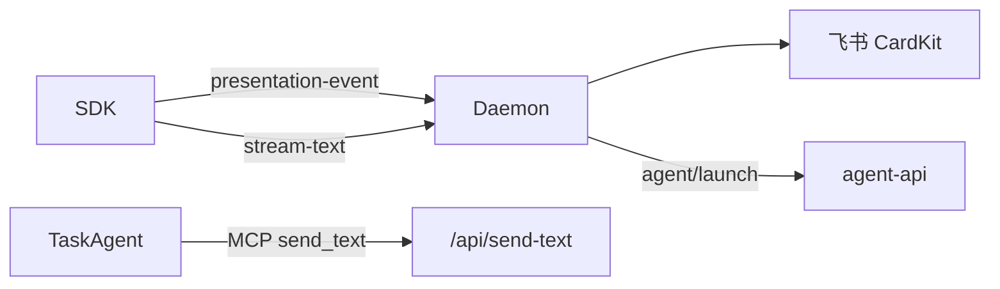

# HTTP 与 MCP 服务

## 一、能力范围

Daemon HTTP、MCP（`/mcp`、`/mcp-admin`）、Presentation/MergeBatch/Agent API。无 poll-message。

## 二、设计决策与取舍

- **StreamableHTTP 每请求新建 McpServer**（daemon.ts `/mcp`）。
- **Agent MCP 工具转调本地 HTTP**：`send_text` 等 POST `/api/send-text`。
- **IM SDK-only**：无 blocking poll 保活；任务 Agent 仍可用 MCP send。
- **调度/斜杠转发**：`forwardElectronAgentApi`（launch/dispatch）、`forwardElectronCommandApi` → `POST /api/command/execute`。
- **Presentation 单入口**：SDK POST `/api/presentation-event` → CardKit 渲染。

## 三、服务端规则

- 群聊须 @ 入队；斜杠 `executeSlashCommand` 即时 reply（`/merge` 例外；`dual|electron` 可写 `.fcmd`）。
- 合并卡 SSOT：`handleMergeBatchAction`（按钮/斜杠/HTTP 三入口）。
- ack 删队列；DONE 在 ack 路径（T7 无 poll）。
- MergeBatch：`merge-batch/action`；collecting 静默窗口内禁止 orchestrator claim。
- **IM launch 编排**失败走 `releaseClaimedMessages`+有限重试（见 [01-概览](./01-概览.md) §九）；dispatch HTTP 旁路债同 §九。

## 四、客户端流程

## 五、接口

### MCP Agent 工具（`/mcp`）

| 工具 | 说明 |
|---|---|
| send_text / send_image / send_file | 文本/媒体回复（任务路径） |

### MCP Admin（`/mcp-admin`）

manage_*（T10 废弃中；`manage_mcp`→`/api/mcp`）。

### HTTP 路由（节选）

| 方法 | 路径 | 说明 |
|---|---|---|
| GET | /health | 健康检查 |
| POST | /api/presentation-event | Presentation 入站 |
| POST | /api/merge-batch/action | 合并卡控制 |
| POST | /api/orchestrator/claim-and-merge | claim 合并批次 |
| POST | /api/agent/launch | 转发 agent-api launch |
| POST | /api/agent/dispatch | 转发 agent-api dispatch（旁路债见 01 §九） |
| POST | /api/session-agent-phase | Agent 阶段 |
| POST | /api/stream-text | 流式出站 |
| POST | /api/send-text | 文本出站 |
| GET/POST | /api/mcp | list；POST add/delete/enable/disable/info |
| GET | /api/queue-events | SSE |
| GET | /commands/skip-check | dual：`?messageId=` → `{ executed }`；poll **claim 前**去重 |
| GET | /commands/executed-ids | dual：已执行 id 列表；poll 5s 批量缓存 |
| GET/POST | /commands* | dual/electron 遗留 fcmd |
| POST | /api/command/execute | **Electron agent-api**；Daemon forward 同步调用 |
| POST | /api/workflow-signal | 工作流外部信号；`action=resume` + `instanceId`；handler `daemon-http-workflow-signal.ts` → `resumeWorkflowAndEmit`；400/404/409 |
| POST | /api/mcp/status-map | **Electron agent-api**；`fetchElectronMcpStatusMap` 健康列 |

## 六、数据

- 队列：`.qmsg/.claimed`（APP_DATA_DIR）。
- **会话路由**：`session-routing.json`（v1；`activeSessions`/`fallbackSessions` + `lastTouchedAt`；TTL 30d；`daemon-session-routing-persist.ts`；debounce 500ms 原子写）。
- 内存：`mergeBatchBySession`、`sessionAgentPhaseMap`、`sessionProgressMap`（**不**落盘；重启清空）。

## 七、非功能与可观测

- SSE 队列事件；MCP 连接数影响 agentRunning。
- Presentation 失败 WARN `presentation_failed`。
- `slash_exec` JSON：`command`、`message_id`、`mode`、`ok`、`source`（`im|menu`）、`exec_path`（`skip|local|mcp|electron`）。
- dual 去重：`markSlashMessageIdExecuted`（60s）+ claim 前 `skip-check`；失败保守跳过。

## 八、推送

SSE；stdout `__WECHAT_QR__` 等供 Electron 解析。

## 九、已知限制与 TODO

- poll-message 404；`/mcp-admin` 待 T10 废弃；默认 `SLASH_EXEC_MODE=dual`。
- dispatch 旁路债见 [01-概览](./01-概览.md) §九。

## 十、变更记录

2026-07-12：`session-routing.json` 持久化 active/fallback 映射（archive 20260712113356）。
2026-07-12：`POST /api/workflow-signal`（resume；loopback 信任域同 `/api/mcp`）（archive 20260712113344）。
2026-07-12：T-FIX R1–R3；斜杠 SSOT、command/status-map API（archive 20260712113307）。
2026-07-12：`/merge` 三入口（archive 20260712113253）。
2026-06-27：Presentation/merge API（archive 20260627162620）。
