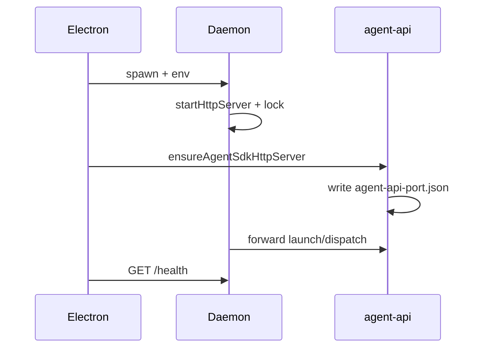

# 进程模型与部署

## 一、能力范围

Daemon 启动入口、Electron spawn、环境变量、端口与锁文件、**agent-api 端口发现**、日志、stdout 协议、**退出/孤儿回收**、**父进程监护**。

## 二、设计决策与取舍

- **Electron 作 Node 运行时**：`ELECTRON_RUN_AS_NODE` spawn bundle 入口（`daemon-manager.ts`）。
- **双端口模型**：Daemon HTTP（lock.port）+ Electron agent-api（`agent-api-port.json`）。
- **调度 SSOT**：Daemon dispatch 读 agent-api-port 转发 launch/dispatch。
- **注入 no-op**：Daemon 就绪不再写 workspace rules/MCP（inject 函数返回 true）。
- **双路径回收**：完全退出 Electron `daemon-process-kill`；强杀由 `daemon-parent-watch` 自退出。
- **stdin pipe**：spawn `stdio: ["pipe",...]`，Electron 退出时 stdin 关闭触发监护。

## 三、服务端规则

- 至少一通道写入 `CLAW_CHANNELS_JSON`。
- `APP_DATA_DIR` 与 Electron userData 一致。
- 正常退出：`/shutdown`、SIGINT/SIGTERM → `stopDaemonScheduledTasks`、`removeLockFile`。
- 父进程监护：stdin 断管/EPIPE 或 ppid 轮询（2s）→ 5s 后清 lock 并 `exit(0)`（`daemon-parent-watch.ts`）。
- stdin EPIPE 经 `isBrokenPipeError` 触发监护，与 stderr EPIPE 加固兼容。

## 四、客户端流程

### 退出与孤儿回收

| 场景 | Daemon 行为 |
|---|---|
| Electron 完全退出 | `/shutdown` + SIGTERM/SIGKILL + 删 lock |
| 托盘/关窗常驻 | `isQuitting=false`，Daemon 继续 |
| Electron 强杀 | parent watch 5s 内自退出清 lock |

启动前 `cleanupStaleDaemonLock` 清残留 lock。

### 环境变量

| 变量 | 说明 |
|---|---|
| CLAW_CHANNELS_JSON | 通道配置 |
| LARK_WORKSPACE_DIR | 默认工作区 |
| APP_DATA_DIR | 队列/锁/agent-api-port |
| DAEMON_LOG_PATH | Electron 注入的 daemon.log 绝对路径（Profile 可配，见 `daemon-log-path.ts`） |
| LARK_DAEMON_PORT | 期望 Daemon 端口 |
| SDK_RESIDENT_AGENT | 长驻 Agent（Electron 侧） |
| MERGE_QUIET_MS | 合并静默窗口（Daemon） |

### stdout 协议

| 前缀 | 含义 |
|---|---|
| `__IND_LAUNCH__:` | 独立/定时 Agent |
| `__BIND_RESULT__:` | 绑定成功 |
| `__WECHAT_QR__:` | 微信扫码 |

## 五、接口

Electron → Daemon：`/health`、`/shutdown`、`/channel-bind`。

Daemon → Electron agent-api：`/api/agent/launch`、`/api/agent/dispatch`（经 agent-api-port.json）。

## 六、数据

**daemon.lock.json**：pid、port、version、startedAt、workspaceDir。

**agent-api-port.json**（userData）：`{ port }`。

日志由 `daemon-logging.ts` `createDaemonLogger` 写入：Electron 注入 `DAEMON_LOG_PATH`（Profile `daemonLogPath`）；未注入时兜底 `{APP_DATA_DIR}/daemon.log` 或 cwd。2MB 轮转；关键字文案不变。

## 七、非功能与可观测

- 非主动 stop 时 3s 延迟重启，60s 内最多 5 次。
- 父进程监护 5s 退出延迟、2s ppid 轮询；`startDaemonParentWatch` 幂等。

## 八、推送

Daemon 不推 Electron；Electron statusInterval 轮询。

## 九、已知限制与 TODO

- agent-api 未就绪时 dispatch notify「请确保 Cursor Claw 已运行」。
- T12：Electron 退化为 spawn-only 后端口发现可能调整。

## 十、变更记录

2026-07-12：父进程监护（stdin+ppid）与孤儿回收双路径；spawn stdin pipe（变更 20260712221030）。
2026-07-12：日志落点迁至 `createDaemonLogger`（archive 20260712170438）。
2026-07-05：Profile 可配 daemon.log，经 `DAEMON_LOG_PATH` 与 Electron 对齐（archive 20260705141336）。
2026-06-27：agent-api 转发、inject no-op（archive 20260627162620）。
2026-06-27：kb-sync 初始建立。
