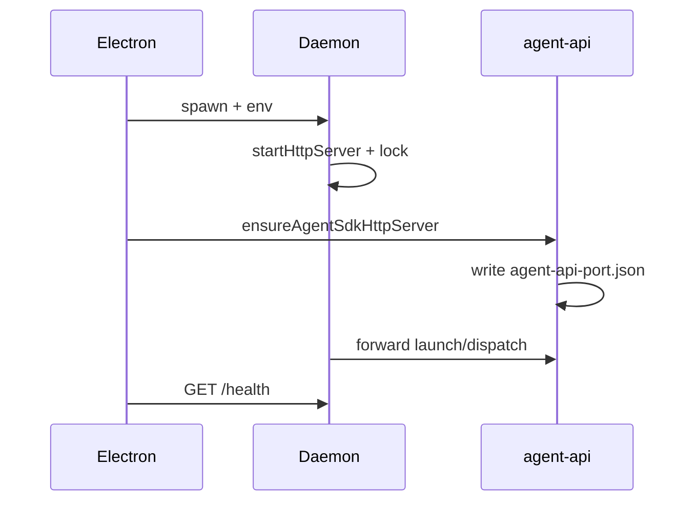

# 进程模型与部署

## 一、能力范围

Daemon 启动、Electron spawn、端口/锁、agent-api 发现、日志、stdout、退出/孤儿回收、父进程监护。

## 二、设计决策与取舍

- **Electron 作 Node**：`ELECTRON_RUN_AS_NODE` spawn（`daemon-manager.ts`）。
- **双端口**：Daemon HTTP（lock.port）+ agent-api（`agent-api-port.json`）。
- **调度 SSOT**：dispatch 经 agent-api-port 转发 launch/dispatch。
- **注入 no-op**：Daemon 就绪不再写 workspace rules/MCP。
- **双路径回收**：完全退出 `daemon-process-kill`；强杀 `daemon-parent-watch` 自退出。
- **stdin pipe**：spawn `stdio: ["pipe",...]`，主进程退出触发监护。

## 三、服务端规则

- 至少一通道写入 `CLAW_CHANNELS_JSON`。
- `APP_DATA_DIR` 与 Electron userData 一致。
- 正常退出：`/shutdown`、SIGINT/SIGTERM → 停定时任务、删 lock。
- 父进程监护：stdin 断管/EPIPE 或 ppid 轮询（2s）→ 5s 后清 lock 并 `exit(0)`。
- stdin EPIPE 经 `isBrokenPipeError` 触发监护。

## 四、客户端流程

### 退出与孤儿回收

| 场景 | Daemon 行为 |
|---|---|
| Electron 完全退出 | `/shutdown`+信号+删 lock |
| 托盘/关窗 | `isQuitting=false`，继续 |
| Electron 强杀 | parent watch 5s 内自退出 |

启动前 `cleanupStaleDaemonLock` 清残留 lock。环境变量见下表。

| 变量 | 说明 |
|---|---|
| CLAW_CHANNELS_JSON | 通道 |
| LARK_WORKSPACE_DIR | 工作区 |
| APP_DATA_DIR | 队列/锁/port |
| DAEMON_LOG_PATH | daemon.log |
| LARK_DAEMON_PORT | 期望端口 |
| SDK_RESIDENT_AGENT | 长驻 Agent |
| MERGE_QUIET_MS | 合并静默窗口 |

### stdout 协议

`__IND_LAUNCH__`/`__BIND_RESULT__`/`__WECHAT_QR__`。

## 五、接口

Electron→Daemon：`/health`、`/shutdown`、`/channel-bind`。Daemon→agent-api：`/api/agent/launch|dispatch`（经 agent-api-port.json）。

## 六、数据

**daemon.lock.json**：pid、port、version、startedAt、workspaceDir。**agent-api-port.json**：`{ port }`。

日志：`createDaemonLogger`；2MB 轮转。stderr 断管：`stderrBroken` 后仅写文件；uncaught EPIPE 早退。

## 七、非功能与可观测

非主动 stop 3s 延迟重启（60s 内≤5 次）。父进程监护 5s 延迟、2s ppid 轮询；`startDaemonParentWatch` 幂等。

## 八、推送

无；Electron statusInterval 轮询。

## 九、已知限制与 TODO

agent-api 未就绪时 dispatch 提示运行 Cursor Claw。

## 十、变更记录

2026-07-12：stderr EPIPE 加固（20260712215746）；孤儿回收双路径（20260712221030）。
2026-07-12：日志迁至 `createDaemonLogger`（20260712170438）。
2026-06-27：agent-api 转发、kb-sync。
