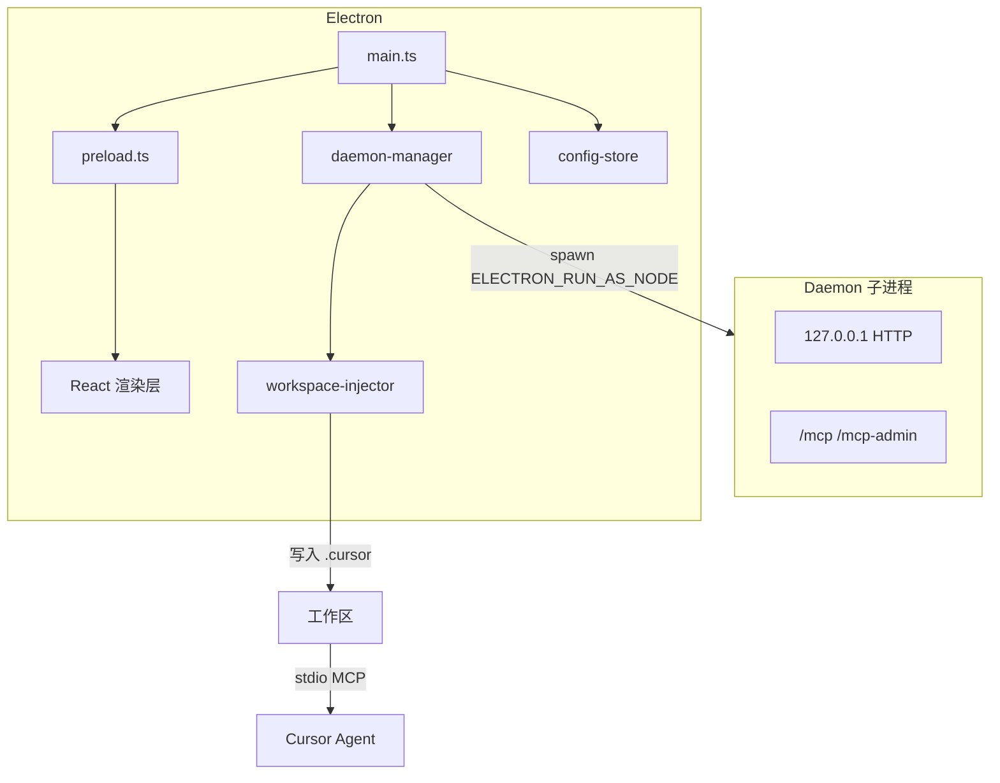
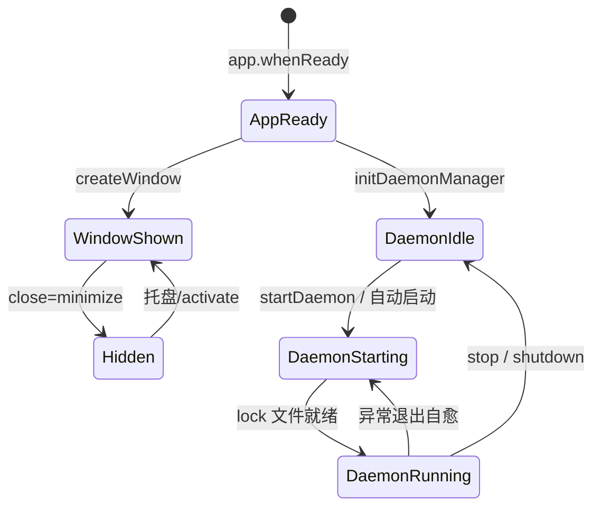
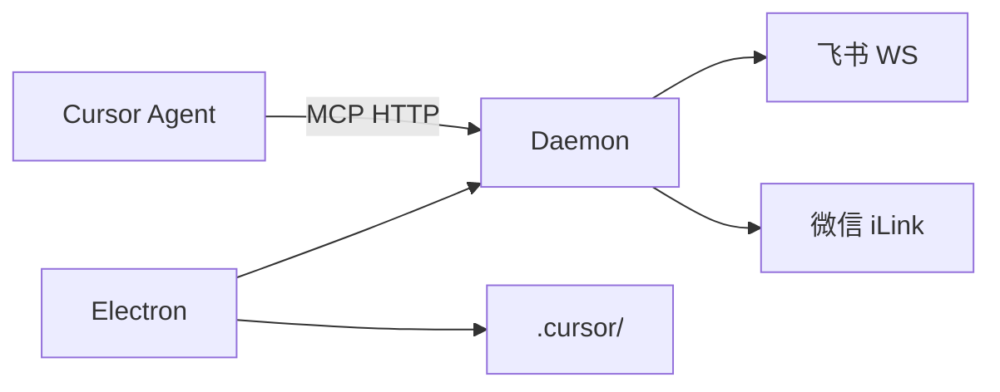

# Electron 桌面应用 · 概览

## 一、模块定位与边界

Cursor Claw 桌面端：可视化配置、spawn Daemon、Rules/Skills 管理；MCP 诊断在 Dashboard 活跃会话详情，Settings MCP Tab 按通道绑定引擎分块展示。IPC 驱动 React UI；消息桥接与 MCP HTTP 由 Daemon 承担。

## 二、整体架构

## 三、核心状态机/主流程

## 四、子模块清单

| 子模块 | 职责 | 文档 |
|---|---|---|
| 主进程与 IPC | 窗口、ipcMain、Daemon 生命周期 | [02-主进程与IPC.md](./02-主进程与IPC.md) |
| 渲染端界面 | Dashboard、Settings、向导 | [03-渲染端界面.md](./03-渲染端界面.md) |
| 配置与更新 | electron-store、托盘、updater | [04-配置与更新.md](./04-配置与更新.md) |

## 五、关键约束

- 渲染进程 `contextIsolation: true`，仅 `window.electronAPI`。
- `--profile=xxx` 隔离 userData。
- Daemon 仅 `127.0.0.1`；默认端口 19528。
- Claude Agent：`claude-agent-sdk-*` optional dep；asarUnpack 解包二进制。

## 六、术语表

| 术语 | 含义 |
|---|---|
| Agent 资源 | SDK/CC 凭据 |
| 消息通道 | 飞书/微信接入配置 |
| profile | `--profile=` 多开隔离 |
| 工作区注入 | 写入 `.cursor/` 模板 |

## 七、依赖关系

## 八、全局非功能与可观测

- 主进程未捕获异常写入 UI 日志；Daemon stdout 特殊前缀由 daemon-manager 解析广播。
- Daemon 60s 内异常退出最多自动重启 5 次。
- **双引擎 watchdog 超时 IM 对称**：CC/SDK 超时各发 `formatUserSdkFailureMessage({ isTimeoutFailure: true })` + `stop_progress`，phase→idle；**不写** `failedCooldowns`。
- **CC watchdog idle/absolute 解耦**：idle 默认 300s（`CC_IDLE_TIMEOUT_MS`）；absolute 默认 7min（`CC_ABSOLUTE_TIMEOUT_MS`/`PLATFORM_RUN_LIMIT_MS` 等），**≠ idle**。共用 `NEVER_CANCEL_ON_DURATION`（默认 true）：`armCcWatchdog` 传 `timeoutMs=Number.MAX_SAFE_INTEGER`，idle 走 `onTick`+`lastActivityAt`；关闭 never-cancel 时 absolute 硬 cap 仅在 `onTick`（`runStartedAt`）。
- **CC hook 可观测**：`hooks`+`includeHookEvents` 刷新活动；UI 日志 `hook_event=`（可含 `agent_type=`/`tool_name=`）；禁止 hook 原文 IM。

## 九、全局已知限制

- README 向导与 UI 三步清单并存。
- 部分 IPC handler 在 daemon-manager 注册。

## 十、文档入口

1. [02-主进程与IPC.md](./02-主进程与IPC.md)
2. [03-渲染端界面.md](./03-渲染端界面.md)
3. [04-配置与更新.md](./04-配置与更新.md)

## 十一、变更记录

2026-07-02：Settings MCP Tab 按通道引擎动态分块；Rules/Skills 同步引擎感知（archive 20260702131851）。
2026-06-30：MCP 诊断迁至 Dashboard 活跃会话；Settings 无 MCP Tab（archive 20260630104251）。
2026-06-30：§八 CC watchdog（idle/absolute 解耦、NEVER_CANCEL 对齐 SDK、超时 IM 对称、hook 可观测）（archive 20260630100827）。
2026-06-30：Claude Agent SDK optional dep+asarUnpack（archive 20260630002838）。
2026-06-27：kb-sync 初始建立。
