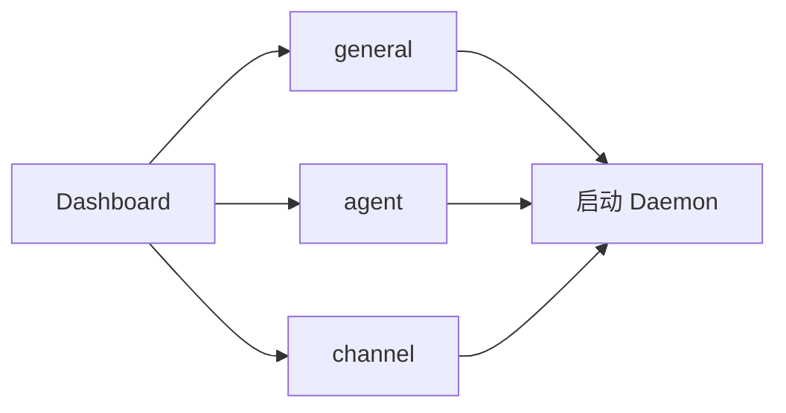

# 渲染端界面

## 一、能力范围

React + Tailwind 渲染层：`App.tsx` 路由 Dashboard/Settings；组件含 TitleBar、ChannelPanel、WorkflowPanel、各类 Modal。通过 `window.electronAPI` 与主进程通信。

## 二、设计决策与取舍

- **双页 hide 切换**：非 React Router，用 CSS `hidden` 保留 Settings 状态（`src/renderer/App.tsx`）。
- **Dashboard 三步引导**：工作目录 → Agent 资源 → 消息通道；对应 Settings Tab（依据：`Dashboard.tsx` onboard 块）。
- **Settings 11 Tab**：通用、网络、Agent、消息通道、MCP、Rules、Skills、定时任务、工作流、帮助引导、关于（`Settings.tsx` TABS）。
- **自动保存**：general/setup Tab 字段 500ms debounce 写 config。

## 三、服务端规则

无；配置校验在 main（如通道非空、workspaceDir 必填）才允许 startDaemon。

## 四、客户端流程

### Settings general Tab

主工作目录（`workspaceDir`）与崩溃分析目录（`crashAnalysisDir`）：目录选择器 + autoSave；留空 crashAnalysisDir 跳过归档（见 02 §七）。

### 初始化引导（Dashboard）

1. 选择主工作目录 → `general`
2. 配置 Agent（CLI 登录或 SDK Key）→ `agent`
3. 添加飞书/微信通道并绑定资源 → `channel`
4. 回 Dashboard 点「启动 Daemon」

帮助引导 Tab 列相同三步与飞书权限 JSON。

通道编辑 `ChannelModelSection`：CC Profile 无 listModels，模型在 Profile 层；Cursor 保留通道级模型。

### Dashboard 功能区

Daemon 启停、通道/队列/活跃 Agent、实时日志；CLI 安装/登录入口。

## 五、接口

渲染层仅调用 preload 暴露的 Promise API，无直接 HTTP。关键调用：

| UI 动作 | API |
|---|---|
| 启动/停止 Daemon | `startDaemon` / `stopDaemon` |
| 通道绑定 | `startChannelBind` / `onBindResult` |
| MCP 管理 | `getMcpServers` / `toggleMcp` / `getMcpTools` |
| 更新 | `checkAppUpdate` / `applyAppUpdate` |

## 六、数据

UI 状态本地 React state；持久化经 `saveConfig` 写入 electron-store。类型定义与 preload 一致（`AppConfig` 含 `crashAnalysisDir`、`DaemonStatus` 等）。

## 七、非功能与可观测

- 日志面板保留最近 300 行。
- `UpdateDownloadBanner` 监听 `onUpdaterStatus/Progress`。
- `AppModalHost` 渲染主进程 `app:modal-request`（更新确认等）。

## 八、推送

通过 IPC 事件：`onDaemonStatus`、`onDaemonLog`、`onSessionAgents`、`onWorkflowInstanceUpdate` 等。

## 九、已知限制与 TODO

开发模式 Tray/Updater 与打包版不同；Agent 见 `AgentPanel.tsx`。

## 十、变更记录

2026-06-29：通道编辑资源类型联动 UI（20260629231225）。
2026-06-28：Settings general 增崩溃分析目录，绑定 `crashAnalysisDir` autoSave。
2026-06-27：kb-sync 初始建立
