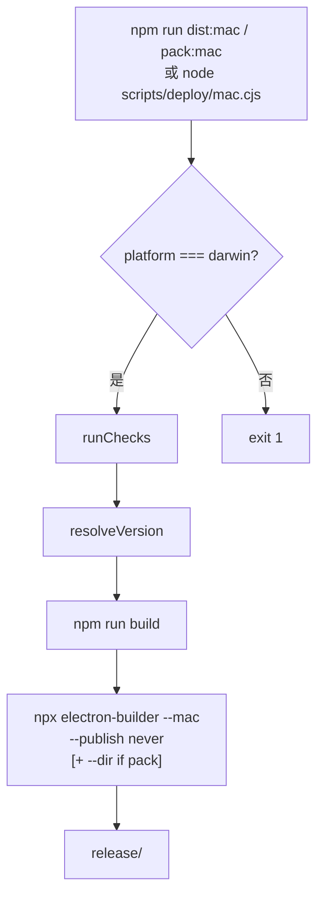

# 构建与打包

## 一、能力范围

macOS 本地出包入口（`scripts/deploy/mac.cjs`）、npm 薄封装、打包前检查与版本覆盖。编排 `npm run build` → `electron-builder --mac`，产出 `release/`（依据：`electron-builder.yml` `directories.output`）。

**不负责**：Win/Linux 打包、CI（不经 deploy）、签名/公证配置、`afterPack`。

## 二、设计决策与取舍

- **单文件 inline**：检查与编排均在 `mac.cjs`，不建 `lib/`（依据：`scripts/deploy/AGENTS.md`）。
- **CommonJS `.cjs`**：与仓库 `"type": "module"` 并存；`ROOT = path.join(__dirname, '..', '..')`。
- **版本覆盖不写盘**：`--version` 经 `extraMetadata.version` 传给 electron-builder，不修改 `package.json`（依据：`mac.cjs` `resolveVersion` / `runPipeline`）。
- **签名可选 warn**：未设 CSC/Apple 环境变量时继续无签名打包并提示 Gatekeeper（依据：`runChecks`）。
- **与 CI 隔离**：GitHub Actions 仍直接 `npm run build` + `npx electron-builder --mac --publish never`。
- **dev 多 profile 端口隔离**：`npm run dev:multi -- --profile=<名>` 启动第二实例；`electron.vite.config.ts` 解析 `--profile=`，Vite 端口 `5173 + profilePortOffset(name)`（0–49 稳定 hash），`strictPort: true`（依据：`electron.vite.config.ts`、`package.json` `dev:multi`）。

## 三、服务端规则

无。

## 四、客户端流程

开发者 macOS 本地出包主链路：



| 模式 | npm 命令 | CLI `--mode` | electron-builder | 典型产出 |
|---|---|---|---|---|
| dist（默认） | `npm run dist:mac` | `dist` | `--mac` | dmg（x64 + arm64，见 yml） |
| pack | `npm run pack:mac` | `pack` | `--mac --dir` | 未封装 `.app` 目录 |

## 五、接口

### CLI（`scripts/deploy/mac.cjs`）

| 选项 | 说明 |
|---|---|
| `--mode=dist\|pack` | 默认 `dist`；无效值 exit 1 |
| `--version=<semver>` | 覆盖版本；须 semver.valid；不写回磁盘 |
| `--no-install` | 仅打包，不安装到 `/Applications`、不启动 |
| `--profile=<name>` | 启动参数 `--profile=`，**默认 `swg`** |
| `--no-profile` | 启动时不传 profile |
| `--help` / `-h` | 打印用法 |

**默认**：打包成功后安装到 `/Applications/Cursor Claw.app`，`xattr -cr` 后以 `open -n -a "Cursor Claw" --args --profile=swg` 启动（`-n` 强制新实例，避免激活已有进程）。

直接调用示例：

```bash
node scripts/deploy/mac.cjs
node scripts/deploy/mac.cjs --no-install
node scripts/deploy/mac.cjs --mode=pack
node scripts/deploy/mac.cjs --version=1.2.3-test
```

### npm scripts（`package.json`）

| 脚本 | 实现 |
|---|---|
| `dev:multi` | `electron-vite dev --`（第二实例：`npm run dev:multi -- --profile=<名>`） |
| `dist:mac` | `node scripts/deploy/mac.cjs --mode=dist` |
| `pack:mac` | `node scripts/deploy/mac.cjs --mode=pack` |

## 六、数据

- **版本来源**：默认读 `package.json` `version`；显式 `--version` 覆盖打包元数据。
- **产出目录**：`release/`（`electron-builder.yml`）。
- **配置 SSOT**：打包目标、asar、extraResources、mac target 均在 `electron-builder.yml`，deploy 脚本不重复定义。

## 七、非功能与可观测

### runChecks 必检（失败 exit 1）

| 检查项 | 规则 |
|---|---|
| 平台 | 仅 `process.platform === 'darwin'` |
| Node | 满足 `package.json` `engines.node`（缺省 `>=18.0.0`） |
| 依赖 | 存在 `node_modules/` 与 `node_modules/.bin/electron-builder` |

### 可选 warn

未配置 `CSC_LINK`、`CSC_NAME`、`APPLE_ID`、`APPLE_APP_SPECIFIC_PASSWORD` 时 `console.warn`，不阻断。

### 子进程

`spawn` + `stdio: 'inherit'` + `cwd: ROOT`；非零退出码 reject。

## 八、推送

无。

## 九、已知限制与 TODO

- 脚本仅 macOS；Win/Linux 仍用 `dist:win` / `pack:win` / `pack:linux` 直连 electron-builder。
- 整目录 `node_modules` 缺失时，脚本顶部 `require("semver")` 可能在 `runChecks` 前失败（无中文提示）。
- 完整 dmg/dir E2E 产出需本地手工确认。

## 十、变更记录

- 2026-06-30：§二 补 dev 多 profile Vite 端口隔离；§五 增 `dev:multi` script。
- 2026-06-27：新增 macOS 本地打包统一入口 `scripts/deploy/mac.cjs` 与 npm 薄封装。
- 2026-06-27：默认打包后自动安装到 `/Applications` 并启动；`--no-install` 可跳过。
- 2026-06-27：默认启动 `--profile=swg`；`--profile=` / `--no-profile` 可覆盖。
